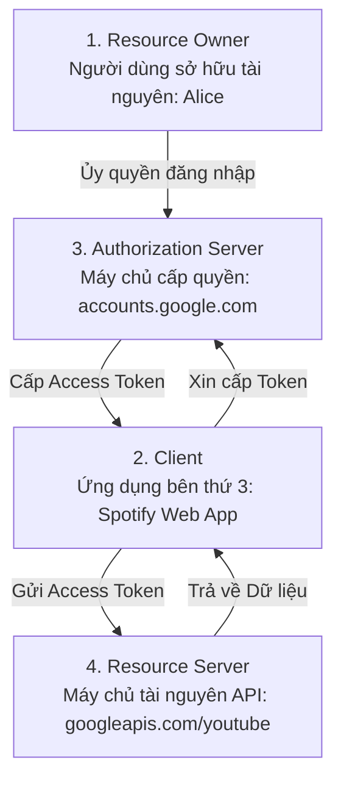

# OAuth 2.0 Roles & Grant Types

OAuth 2.0 (RFC 6749) là một khung làm việc (Authorization Framework) cho phép một ứng dụng của bên thứ ba (Third-party Application) có được quyền truy cập giới hạn vào tài nguyên HTTP của người dùng mà không cần người dùng phải tiết lộ tên đăng nhập và mật khẩu.

---

## 1. Bốn Vai Trò Trong Hệ Sinh Thái OAuth 2.0

1. **Resource Owner**: Người dùng cuối (User) có quyền cấp quyền truy cập vào tài nguyên của chính mình.
2. **Client**: Ứng dụng muốn truy cập vào tài nguyên (ví dụ: Website, Mobile App, Backend Service).
3. **Authorization Server**: Máy chủ xác thực danh tính người dùng và cấp phát Token sau khi người dùng đồng ý ủy quyền (Consent).
4. **Resource Server**: Máy chủ API lưu trữ dữ liệu thực sự (ví dụ: Google Drive, GitHub Repos, Spotify Playlist). Máy chủ này chấp nhận và kiểm tra `access_token` để phục vụ dữ liệu.

---

## 2. Các Luồng Cấp Quyền (Grant Types) Hợp Lệ

### 2.1 Authorization Code Flow (Tiêu Chuẩn Cho Web & Server-Side)
- Người dùng được chuyển hướng tới trang đăng nhập của Authorization Server.
- Sau khi đăng nhập, Authorization Server trả về một mã tạm thời (**Authorization Code**) qua Redirect URI.
- Backend của Client gửi Authorization Code kèm `client_secret` trực tiếp tới Auth Server qua kênh mạng an toàn Back-channel để đổi lấy `access_token` và `refresh_token`.

### 2.2 Client Credentials Flow (Machine-to-Machine / M2M)
- Dành riêng cho giao tiếp giữa hai dịch vụ nội bộ (Microservice A $\rightarrow$ Microservice B) mà không có sự tham gia của người dùng cuối.
- Client trực tiếp gửi `client_id` và `client_secret` lên Auth Server để lấy Token đại diện cho chính dịch vụ đó.

### 2.3 Device Authorization Flow (TV & Smart Devices - RFC 8628)
- Dành cho các thiết bị không có bàn phím hoặc trình duyệt hoàn chỉnh (Smart TV, Apple TV, Máy chơi game console).
- Thiết bị hiển thị một mã ngắn (User Code - ví dụ: `WDJB-HGTR`) và link `google.com/device`. Người dùng dùng điện thoại/laptop mở link và nhập mã để cấp quyền.

---

## 3. Tại Sao Khai Tử Implicit Grant và ROPC trong OAuth 2.1?

Dự thảo **OAuth 2.1** chính thức loại bỏ hoàn toàn hai luồng cấp quyền lỗi thời:

1. **Implicit Grant (Bị Khai Tử)**:
   - Trước đây dùng cho Single Page Apps (SPAs): Auth Server trả thẳng `access_token` trên thanh địa chỉ URL thông qua URL Fragment (`https://app.com/#access_token=XYZ`).
   - **Lỗ hổng chết người**: Token bị lưu vào lịch sử trình duyệt, rò rỉ qua Referer Header khi người dùng bấm link ngoài, hoặc bị đánh cắp bởi mã độc XSS.
   - **Thay thế bằng**: **Authorization Code với PKCE**.
2. **Resource Owner Password Credentials - ROPC (Bị Khai Tử)**:
   - Client hiển thị form yêu cầu người dùng nhập trực tiếp username/password của Auth Server rồi gửi lên.
   - **Tác hại**: Phá vỡ hoàn toàn nguyên lý cốt lõi của OAuth (Ứng dụng bên thứ 3 không bao giờ được chạm vào mật khẩu gốc của người dùng); không hỗ trợ MFA/SSO.
