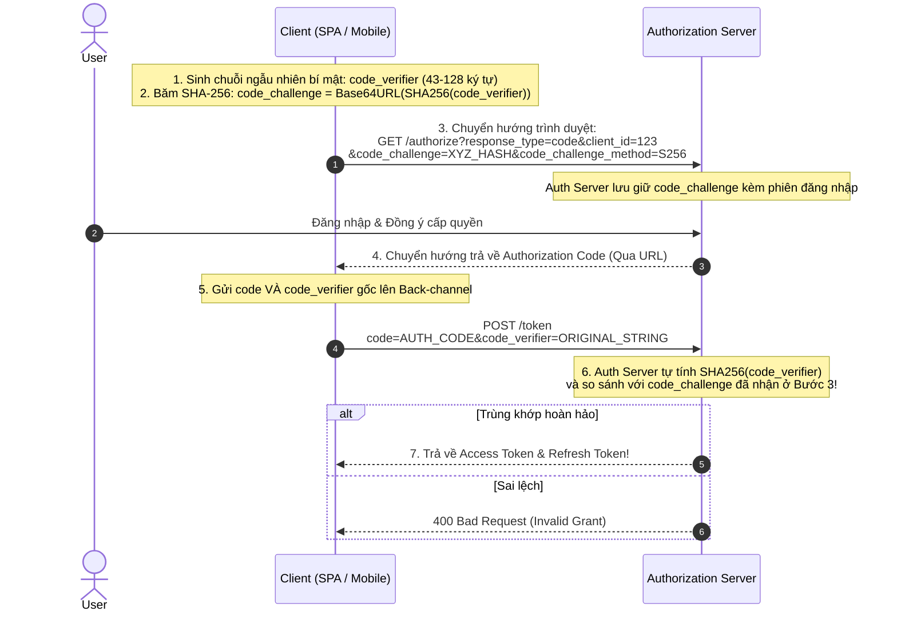

# Authorization Code Flow with PKCE (Proof Key for Code Exchange)

Trong các ứng dụng chạy trên trình duyệt (Single Page Apps - React/Vue/Angular) hoặc ứng dụng di động (iOS/Android), mã nguồn và gói nhị phân (Binary) hoàn toàn có thể bị người dùng hoặc tin tặc dịch ngược (Reverse Engineering). Những ứng dụng này được xếp vào loại **Public Clients** (Không thể giữ bí mật `client_secret`).

Giao thức **PKCE (RFC 7636)** sinh ra để bảo vệ các Public Client khỏi các cuộc tấn công đánh cắp mã Authorization Code.

---

## 1. Mối Đe Dọa: Đánh Cắp Authorization Code Trên Điện Thoại

Trên hệ điều hành di động (Android / iOS), các ứng dụng thường đăng ký **Custom URL Schemes** (ví dụ: `myapp://oauth-callback`) để đón nhận Redirect URI chứa `code`:
- Kẻ tấn công cài đặt một ứng dụng độc hại trên máy nạn nhân và đăng ký trùng Custom URL Scheme `myapp://`.
- Khi trình duyệt di động chuyển hướng trả về `code`, hệ điều hành có thể mở nhầm ứng dụng độc hại!
- Ứng dụng độc hại cướp được `code` và gửi lên Auth Server để lấy trộm `access_token`.

---

## 2. Cơ Chế Hoạt Động Của PKCE

PKCE thay thế `client_secret` tĩnh bằng một cặp **mật mã động được sinh mới cho từng phiên đăng nhập**:



### Tại Sao PKCE Triệt Tiêu Hoàn Toàn Nguy Cơ Đánh Cắp Code?
Nếu ứng dụng độc hại có cướp được `code` ở Bước 4, nó **không thể đổi lấy token** ở Bước 5 vì nó không hề biết chuỗi `code_verifier` ban đầu (chuỗi này được lưu trong bộ nhớ RAM riêng tư của ứng dụng hợp lệ).

---

## 3. Thuật Toán Tạo Code Verifier & Code Challenge

### 3.1 Code Verifier
- Một chuỗi ký tự ngẫu nhiên bảo mật cao có độ dài từ 43 đến 128 ký tự.
- Chỉ chứa các ký tự an toàn: `[a-zA-Z0-9]`, `-`, `.`, `_`, `~`.

### 3.2 Code Challenge
- Luôn sử dụng phương thức băm **S256** (SHA-256). Tuyệt đối không dùng phương thức `plain` (gửi bản rõ).
$$\text{code\_challenge} = \text{Base64UrlEncode}(\text{SHA256}(\text{code\_verifier}))$$

```javascript
import crypto from 'node:crypto';

export function generatePkcePair() {
  // 1. Sinh code_verifier ngẫu nhiên 64 bytes
  const code_verifier = crypto
    .randomBytes(64)
    .toString('base64url');

  // 2. Băm SHA-256 và mã hóa Base64URL
  const hash = crypto.createHash('sha256').update(code_verifier).digest();
  const code_challenge = hash.toString('base64url');

  return { code_verifier, code_challenge };
}
```
