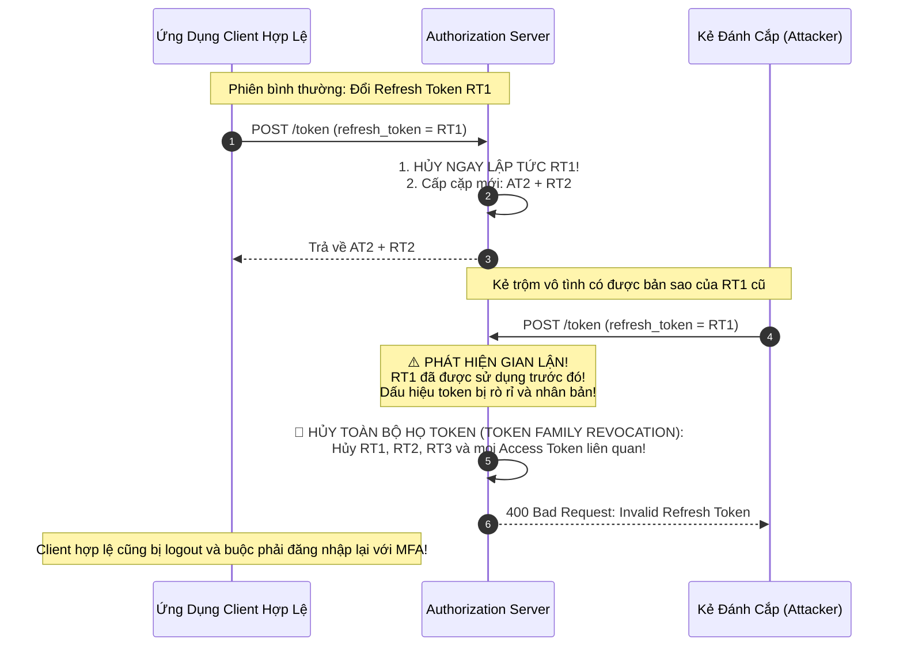

# Refresh Token Rotation & OAuth Attack Vectors

Vì `access_token` thường có thời gian sống rất ngắn (ví dụ: 15 phút) để hạn chế thiệt hại khi bị lộ, ứng dụng sử dụng `refresh_token` dài hạn (ví dụ: 30 ngày) để liên tục xin cấp phát `access_token` mới mà không bắt người dùng phải đăng nhập lại.

Tuy nhiên, nếu `refresh_token` bị kẻ tấn công đánh cắp, chúng sẽ có quyền truy cập vĩnh viễn vào tài khoản của nạn nhân.

---

## 1. Refresh Token Rotation (RTR) & Phát Hiện Đánh Cắp

Refresh Token Rotation biến mỗi Refresh Token thành một **vật phẩm dùng một lần (Single-Use Token)**.

### Nguyên Lý "Họ Token" (Token Family Revocation)
- Mọi Refresh Token sinh ra từ một chuỗi đăng nhập ban đầu thuộc về cùng một `FamilyID`.
- Khi Auth Server phát hiện một Refresh Token **đã từng bị sử dụng** lại xuất hiện lần thứ 2:
  - Máy chủ không thể phân biệt đâu là client thật, đâu là kẻ trộm.
  - Hành động phòng thủ an toàn nhất là: **Lập tức thu hồi toàn bộ FamilyID** đó.
  - Kẻ trộm bị chặn đứng; người dùng thật bị đăng xuất và nhận được email cảnh báo bảo mật.

---

## 2. Các Cuộc Tấn Công OAuth Kinh Điển & Cách Phòng Vệ

### 2.1 CSRF Tấn Công Quá Trình Đăng Nhập & Tham Số `state`
- **Mục tiêu của kẻ tấn công**: Lừa nạn nhân liên kết tài khoản của nạn nhân với tài khoản ngân hàng hoặc Facebook của chính... kẻ tấn công!
- **Kỹ thuật tấn công**: Kẻ tấn công bắt đầu luồng OAuth, chặn lấy URL chuyển hướng có chứa `code` của chính mình, rồi lừa nạn nhân bấm vào link đó.
- **Tuyến Phòng Thủ Bắt Buộc: Tham Số `state`**:
  - Client sinh một chuỗi ngẫu nhiên bí mật `state = randomBytes()` và lưu vào Cookie an toàn của trình duyệt trước khi chuyển hướng sang Auth Server.
  - Client gửi kèm `state` trong URL `/authorize`.
  - Auth Server bắt buộc phải trả lại nguyên vẹn chuỗi `state` đó trong Redirect URI.
  - Client so sánh `state` trả về với `state` trong Cookie; nếu không khớp $\rightarrow$ Hủy giao dịch ngay lập tức.

### 2.2 Redirect URI Poisoning (Đầu Độc URL Chuyển Hướng)
- Nếu Auth Server cho phép sử dụng ký tự đại diện (Wildcard) trong Redirect URI (ví dụ: `https://*.company.com/callback`):
- Kẻ tấn công chỉ cần tìm một subdomain bị lỗ hổng Open Redirect hoặc XSS (ví dụ: `https://marketing.company.com/redirect?url=evil.com`).
- Chuyển hướng `code` tới domain của kẻ tấn công và cướp quyền truy cập.
- **Quy tắc vàng**: **Strict Exact Matching** (Khớp chính xác từng ký tự, không bao giờ dùng Wildcard `*` cho Redirect URI).
