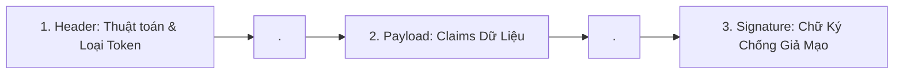

# JWT Anatomy & Encoding

JSON Web Token (JWT - RFC 7519) là một chuẩn mở định nghĩa phương thức truyền tải thông tin an toàn, nhỏ gọn giữa các bên dưới dạng một đối tượng JSON có chữ ký số.

---

## 1. Cấu Tạo Ba Phần Của Chuỗi JWT

Một chuỗi JWT gồm 3 phần được phân tách bằng dấu chấm (`.`):
$$\text{JWT} = \mathbf{Header} \ . \ \mathbf{Payload} \ . \ \mathbf{Signature}$$



### 1.1 Header
Chứa thông tin về kiểu token và thuật toán ký:
```json
{
  "alg": "HS256",
  "typ": "JWT",
  "kid": "key-2026-v1"
}
```
Được mã hóa thành chuỗi Base64URL: `eyJhbGciOiJIUzI1NiIsInR5cCI6IkpXVCJ9`

### 1.2 Payload (Claims)
Chứa các thông điệp dữ liệu thực tế (Claims):
```json
{
  "sub": "usr_99812",
  "name": "Alice Developer",
  "role": "ADMIN",
  "iat": 1710000000,
  "exp": 1710003600
}
```
Được mã hóa thành chuỗi Base64URL: `eyJzdWIiOiJ1c3JfOTk4MTIiLCJyb2xlIjoiQURNSU4ifQ`

### 1.3 Signature
Chữ ký được tính bằng cách băm chuỗi nối của Header và Payload kèm Khóa bí mật:
$$\text{Signature} = \text{HMAC-SHA256}(\text{Base64Url}(\text{Header}) \parallel "." \parallel \text{Base64Url}(\text{Payload}), \ \text{SecretKey})$$

---

## 2. Hiểu Lầm Chết Người: "JWT Được Mã Hóa"

> [!WARNING]
> **Base64URL KHÔNG PHẢI LÀ MÃ HÓA (Encryption)! Nó chỉ là một định dạng biểu diễn dữ liệu (Encoding)!**

Bất kỳ ai (kể cả kẻ tấn công đứng giữa mạng) khi cầm được chuỗi JWT đều có thể copy và ném vào trang `jwt.io` hoặc chạy lệnh `Buffer.from(payload, 'base64url')` để đọc toàn bộ nội dung bên trong dưới dạng bản rõ!
- **Quy tắc vàng**: **Tuyệt đối KHÔNG BAO GIỜ lưu thông tin nhạy cảm vào JWT Payload**:
  - Không lưu: Mật khẩu, số thẻ tín dụng, số căn cước/SSN, API Secret Keys.
  - Chỉ lưu: Định danh người dùng (`sub`), vai trò (`roles`), phạm vi quyền (`scopes`), và thời gian hết hạn (`exp`).

---

## 3. Các Registered Claims Tiêu Chuẩn

RFC 7519 quy định các trường chuẩn có tên viết tắt 3 ký tự:
- **`sub` (Subject)**: Định danh duy nhất của chủ thể token (thường là User ID).
- **`iss` (Issuer)**: Địa chỉ URL của máy chủ cấp phát token.
- **`aud` (Audience)**: Đối tượng thụ hưởng token (tên API hoặc Service).
- **`exp` (Expiration Time)**: Thời điểm hết hạn (Unix epoch tính bằng giây). **Bắt buộc phải có!**
- **`nbf` (Not Before)**: Token không có hiệu lực trước thời điểm này.
- **`iat` (Issued At)**: Thời điểm token được sinh ra.
- **`jti` (JWT ID)**: Mã định danh ngẫu nhiên duy nhất của token, dùng để phòng chống tấn công phát lại (Replay Attacks) và phục vụ Blacklist.
