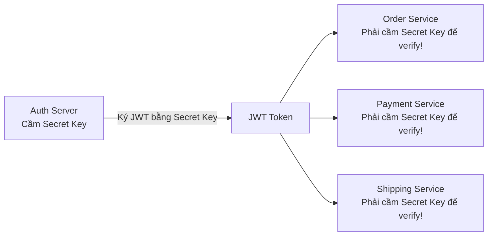
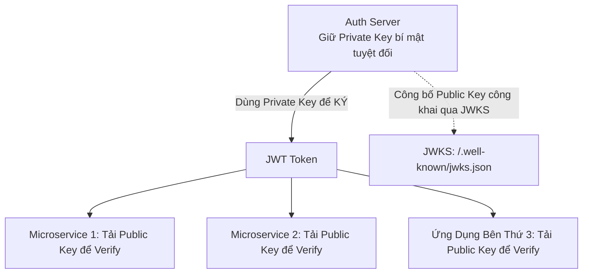

# Symmetric vs Asymmetric JWT Signing

Việc lựa chọn giữa thuật toán ký đối xứng (Symmetric) và bất đối xứng (Asymmetric) quyết định mô hình bảo mật và kiến trúc phân tán của toàn bộ hệ thống microservices.

---

## 1. Ký Đối Xứng: HS256 (HMAC with SHA-256)

Ký đối xứng sử dụng **duy nhất MỘT chuỗi bí mật (Shared Secret Key)** cho cả hai thao tác: Tạo chữ ký (Sign) và Kiểm tra chữ ký (Verify).

### 1.1 Rủi Ro Trong Kiến Trúc Microservices
- Để các dịch vụ con (Order, Payment, Shipping) có thể kiểm tra xem JWT có hợp lệ hay không, bạn buộc phải chia sẻ `Secret Key` sang toàn bộ các dịch vụ đó.
- **Rủi ro nghiêm trọng**:
  - Nếu bất kỳ một microservice con nào (ví dụ: Shipping Service do một nhóm outsource phát triển) bị lộ mã nguồn hoặc bị hack, kẻ tấn công có được `Secret Key`.
  - Với `Secret Key` trong tay, kẻ tấn công có thể **tự ký ra bất kỳ JWT nào chúng muốn** (ví dụ: tự cấp quyền `role: "SUPERADMIN"`) và lừa toàn bộ hệ sinh thái!
- **Kịch bản phù hợp**: Ứng dụng nguyên khối (Monolith) đơn lẻ nơi chỉ có 1 backend service duy nhất vừa tạo vừa kiểm tra token.

---

## 2. Ký Bất Đối Xứng: RS256 (RSA) & ES256 (ECDSA)

Ký bất đối xứng sử dụng **MỘT CẶP KHÓA (Key Pair)**:
- **Private Key (Khóa Bí Mật)**: Chỉ được lưu duy nhất tại máy chủ xác thực trung tâm (**Auth Server**). Chỉ Private Key mới có khả năng tạo ra chữ ký JWT.
- **Public Key (Khóa Công Khai)**: Được công bố rộng rãi trên mạng (qua JWKS endpoint). Bất kỳ ai cũng có thể dùng Public Key để kiểm tra tính hợp lệ của chữ ký, nhưng **hoàn toàn không thể dùng Public Key để tạo chữ ký mới**!

### 2.1 Lợi Ích Tuyệt Đối Cho Hệ Thống Phân Tán
- **Nguyên tắc Zero Trust**: Các microservices con không cần và không bao giờ được phép chạm vào Private Key.
- Nếu một microservice con bị chiếm quyền điều khiển, kẻ tấn công chỉ lấy được Public Key (vốn dĩ đã công khai) và hoàn toàn không thể giả mạo token để leo thang đặc quyền.

---

## 3. So Sánh RS256 vs ES256

| Đặc Điểm | RS256 (RSA-SHA256) | ES256 (ECDSA P-256 with SHA-256) |
| :--- | :--- | :--- |
| **Nền Tảng Toán Học** | Phân tích thừa số nguyên tố lớn | Đường cong Elliptic (Elliptic Curve Cryptography) |
| **Độ Dài Khóa Khuyến Nghị** | 2048-bit hoặc 4096-bit | **256-bit** (Cực kỳ nhỏ gọn) |
| **Kích Thước Chữ Ký** | Lớn (256 bytes Base64) | Rất nhỏ (64 bytes Base64) |
| **Tốc Độ Xử Lý** | Verify nhanh, Sign chậm | Verify và Sign đều rất nhanh, tiết kiệm CPU di động |
| **Mức Độ Phổ Biến** | Tiêu chuẩn truyền thống được hỗ trợ ở 100% thư viện | Xu hướng hiện đại được khuyên dùng cho Cloud & Mobile |
