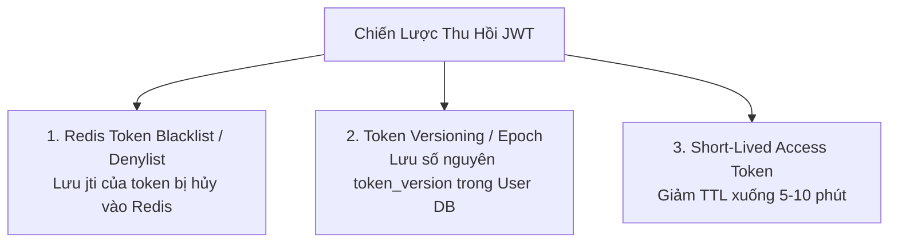

# JWKS Key Rotation & Token Revocation Strategies

Trong các hệ sinh thái quy mô lớn (Auth0, Okta, Firebase, AWS Cognito), máy chủ xác thực cần định kỳ đổi khóa ký mới (Key Rotation) mà không làm gián đoạn các token cũ đang lưu hành, đồng thời phải có cơ chế thu hồi token tức thì khi phát hiện rò rỉ.

---

## 1. JSON Web Key Set (JWKS - RFC 7517)

JWKS là một chuẩn định dạng JSON biểu diễn một tập hợp các khóa công khai (Public Keys) của hệ thống.

### 1.1 Cấu Trúc File `/.well-known/jwks.json`
```json
{
  "keys": [
    {
      "kty": "RSA",
      "use": "sig",
      "alg": "RS256",
      "kid": "key-2026-v1",
      "n": "u1W...[Modulus RSA]...",
      "e": "AQAB"
    },
    {
      "kty": "RSA",
      "use": "sig",
      "alg": "RS256",
      "kid": "key-2026-v2",
      "n": "v8T...[Modulus RSA mới]...",
      "e": "AQAB"
    }
  ]
}
```

### 1.2 Vai Trò Của `kid` (Key ID) Trong Việc Xoay Vòng Khóa
- Mỗi khi Auth Server sinh JWT, nó gắn mã định danh của khóa hiện tại vào Header:
  `{"alg": "RS256", "kid": "key-2026-v2"}`
- Khi Resource Server nhận JWT:
  1. Đọc trường `kid` trong Header.
  2. Tra cứu trong bộ nhớ Cache danh sách keys lấy từ JWKS.
  3. Chọn chính xác Public Key có `kid: "key-2026-v2"` để kiểm tra chữ ký.
- **Quy trình xoay vòng không downtime**:
  - Auth Server xuất bản khóa mới lên JWKS endpoint trước 24 giờ.
  - Khi bắt đầu ký token bằng khóa mới, các token cũ (đang dùng `key-2026-v1`) vẫn được verify bình thường cho đến khi tự hết hạn!

---

## 2. Bài Toán Nan Giải: Thu Hồi (Revoke) Stateless JWT

Vì JWT mang tính chất tự trị (Self-contained / Stateless), một khi token đã được cấp phát với hạn 1 giờ, về mặt nguyên lý nó **hoàn toàn có hiệu lực cho đến giây cuối cùng**. Nếu người dùng bấm Đăng Xuất, hoặc quản trị viên khóa tài khoản, làm sao vô hiệu hóa token ngay lập tức?



### 2.1 Giải Pháp 1: Redis Token Blacklist (Danh Sách Đen)
- Mỗi JWT bắt buộc phải có trường `jti` (JWT ID - chuỗi UUID duy nhất).
- Khi người dùng bấm Đăng Xuất:
  - Ứng dụng lấy `jti` và thời gian còn lại của token: $\text{RemainingTTL} = \text{exp} - \text{now}()$.
  - Ghi vào Redis: `SET blacklist:jti:<uuid> "1" EX <RemainingTTL>`.
  - Khi hết `RemainingTTL`, Redis tự động giải phóng bộ nhớ.
- Khi API Gateway kiểm tra request:
  - Kiểm tra chữ ký JWT $\rightarrow$ Nếu chữ ký đúng, truy vấn Redis: `EXISTS blacklist:jti:<uuid>`.
  - Nếu có trong Blacklist $\rightarrow$ Trả về `401 Unauthorized`.

### 2.2 Giải Pháp 2: Token Versioning (Cho Đăng Xuất Mọi Thiết Bị)
- Thêm trường `token_version: 1` vào bảng `users` trong Database và đính kèm vào JWT Payload.
- Khi người dùng đổi mật khẩu hoặc phát hiện bị hack:
  - Tăng `token_version = token_version + 1` trong DB.
  - Mọi token cũ mang `token_version = 1` sẽ bị từ chối ngay lập tức khi đối chiếu với DB/Cache!
