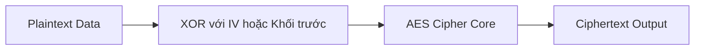
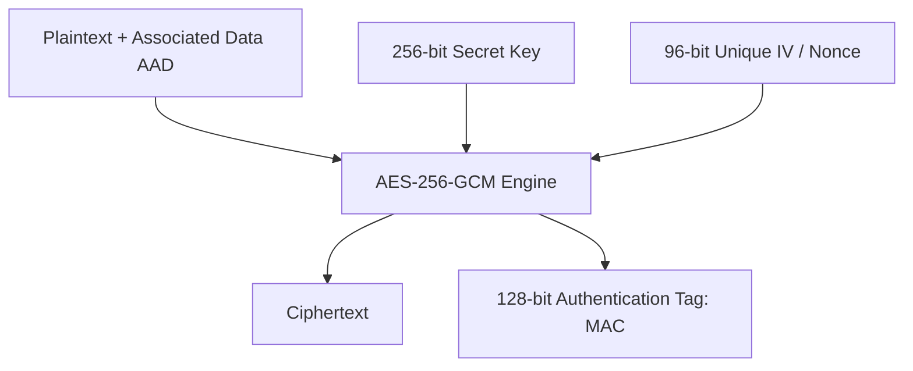

# Symmetric Encryption: AES-GCM vs AES-CBC & AEAD

Mã hóa đối xứng (Symmetric Encryption) sử dụng cùng một khóa bí mật duy nhất để mã hóa dữ liệu (Plaintext $\rightarrow$ Ciphertext) và giải mã dữ liệu (Ciphertext $\rightarrow$ Plaintext). Thuật toán chuẩn công nghiệp toàn cầu là **AES (Advanced Encryption Standard)** với độ dài khóa 256-bit (**AES-256**).

---

## 1. Cạm Bẫy Của AES-CBC & Tấn Công Padding Oracle

Trong chế độ Cipher Block Chaining (**CBC**), dữ liệu được chia thành các khối 16 bytes:
- Khối trước được XOR với khối sau.
- Nếu dữ liệu không tròn 16 bytes, thuật toán thêm các bytes đệm theo chuẩn **PKCS#7 Padding**.

### Điểm Yếu Chết Người: Thiếu Xác Thực Tính Toàn Vẹn
AES-CBC chỉ đảm bảo **Tính Bí Mật (Confidentiality)**, nhưng **KHÔNG ĐẢM BẢO Tính Toàn Vẹn (Integrity)**:
- Kẻ tấn công có thể sửa đổi các bit trong Ciphertext (*Bit-Flipping Attack*).
- **Tấn công Padding Oracle (POODLE / Lucky Thirteen)**: Bằng cách gửi các Ciphertext đã bị sửa đổi từng byte lên server và quan sát thông báo lỗi padding trả về, kẻ tấn công có thể giải mã toàn bộ bản rõ mà **không cần biết khóa bí mật**!

---

## 2. Tiêu Chuẩn Hiện Đại: AES-GCM (Authenticated Encryption - AEAD)

Chế độ Galois/Counter Mode (**GCM**) là tiêu chuẩn mã hóa được khuyến nghị tuyệt đối trong mọi hệ thống hiện đại (TLS 1.3, SSH, WireGuard, IPsec).

### 2.1 Bản Chất AEAD (Authenticated Encryption with Associated Data)
AES-GCM không chỉ mã hóa dữ liệu thành Ciphertext, mà còn đồng thời tạo ra một mã thẻ xác thực **128-bit Authentication Tag (Auth Tag)**:
- **Nguyên tắc hoạt động**: Khi giải mã, AES-GCM tính toán lại Auth Tag. Nếu có bất kỳ byte nào trong Ciphertext, Nonce, hoặc Dữ liệu liên kết (AAD) bị kẻ tấn công thay đổi dù chỉ 1 bit, **quá trình giải mã sẽ quăng lỗi và từ chối xử lý ngay lập tức**!
- Loại bỏ $100\%$ các cuộc tấn công Padding Oracle và Bit-Flipping.

### 2.2 Quy Tắc Bất Tử: Tuyệt Đối Không Bao Giờ Tái Sử Dụng Nonce!
Trong AES-GCM:
- Nonce (Initialization Vector - IV) có độ dài chuẩn là **96 bits (12 bytes)**.
- > [!CAUTION]
  > **Tuyệt đối KHÔNG BAO GIỜ mã hóa hai thông điệp khác nhau bằng cùng một cặp (Key, Nonce)!**
  > Nếu tái sử dụng Nonce (Nonce Reuse), kẻ tấn công có thể thực hiện phép XOR hai Ciphertext với nhau để khôi phục lại bản rõ và trích xuất khóa xác thực GHASH, phá hủy toàn bộ hệ thống mật mã!
- **Giải pháp**: Luôn sinh Nonce ngẫu nhiên qua `crypto.randomBytes(12)` cho mỗi lần mã hóa và lưu Nonce công khai kèm theo Ciphertext.
