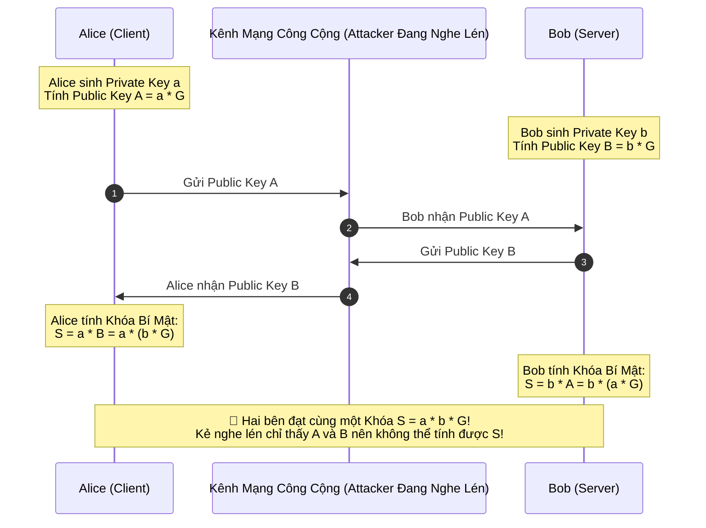

# Asymmetric Encryption: RSA, ECC & Diffie-Hellman Key Exchange

Mật mã bất đối xứng (Asymmetric Cryptography / Public-Key Cryptography) giải quyết bài toán phân phối khóa: Cho phép hai thực thể trao đổi thông tin bí mật một cách an toàn qua một kênh truyền thông công cộng bị kẻ thù theo dõi, mà không cần phải chia sẻ trước một khóa bí mật nào.

---

## 1. RSA (Rivest–Shamir–Adleman)

RSA dựa trên độ khó của bài toán **phân tích một số nguyên khổng lồ thành tích của hai số nguyên tố rất lớn** ($N = p \times q$):
- **Tạo cặp khóa**:
  - Chọn 2 số nguyên tố lớn $p$ và $q$. Tính $N = p \times q$ (Modulus).
  - Chọn số mũ công khai $e$ (thường là $65537$).
  - Tính số mũ bí mật $d$ sao cho $d \times e \equiv 1 \pmod{\phi(N)}$.
  - **Public Key**: $(e, N)$. **Private Key**: $(d, N)$.

### Quy Tắc Mã Hóa RSA
- Không bao giờ mã hóa trực tiếp bản rõ bằng "Textbook RSA" (dễ bị tấn công toán học).
- Luôn luôn sử dụng **OAEP (Optimal Asymmetric Encryption Padding)** kết hợp hàm băm SHA-256 để thêm tính ngẫu nhiên vào bản rõ.

---

## 2. Mật Mã Đường Cong Elliptic (Elliptic Curve Cryptography - ECC)

ECC dựa trên độ khó của bài toán **Logarit rời rạc trên đường cong Elliptic (Elliptic Curve Discrete Logarithm Problem - ECDLP)**:
$$y^2 = x^3 + ax + b$$

```mermaid
graph LR
    P[Điểm Cơ Sở G trên Đường Cong] -->|Nhân với Số Nguyên Bí Mật d (Private Key)| Q[Điểm Công Khai Q = d * G (Public Key)]
```
- Phép nhân điểm $Q = d \times G$ tính toán rất nhanh (vài micro-giây).
- Nhưng từ điểm $Q$ và $G$ đã biết, việc tìm ngược lại số nguyên bí mật $d$ đòi hỏi thời gian tính toán hàng triệu năm trên siêu máy tính!

### Bảng So Sánh Cấp Độ Bảo Mật: RSA vs ECC

| Mức Độ Bảo Mật (Security Bits) | Độ Dài Khóa RSA Tương Đương | Độ Dài Khóa ECC Tương Đương |
| :---: | :---: | :---: |
| 80 bits (Đã lỗi thời) | 1024 bits | 160 bits |
| **128 bits (Tiêu chuẩn hiện nay)** | **3072 bits** | **256 bits (NIST P-256, Curve25519)** |
| 192 bits | 7680 bits | 384 bits (NIST P-384) |
| 256 bits (Tối mật quân sự) | 15360 bits | 512 bits (Ed448) |

> [!TIP]
> Khóa **ECC 256-bit** cung cấp độ an toàn tương đương khóa **RSA 3072-bit**, nhưng kích thước khóa nhỏ hơn gấp 12 lần và tốc độ tính toán nhanh hơn hàng chục lần, giúp tiết kiệm băng thông và pin trên điện thoại di động.

---

## 3. Trao Đổi Khóa Diffie-Hellman (ECDH: Elliptic Curve Diffie-Hellman)

ECDH cho phép Alice và Bob cùng tạo ra một **Khóa Bí Mật Chung (Shared Secret)** để mã hóa đối xứng (AES) mà kẻ nghe lén trên đường truyền không tài nào biết được:


- Sau khi có Shared Secret $S$, hai bên dùng hàm dẫn xuất khóa (**HKDF - HMAC-based Extract-and-Expand Key Derivation Function**) để tạo ra khóa phiên mã hóa AES-256-GCM.
