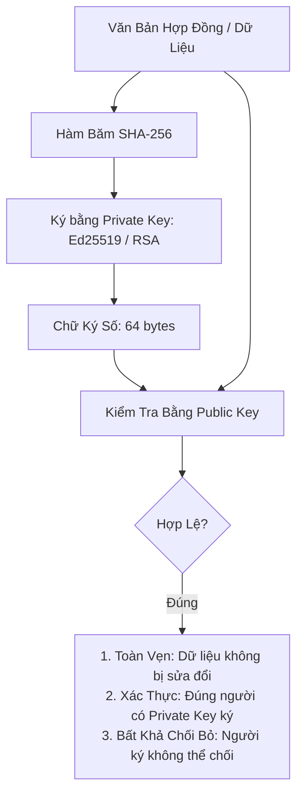
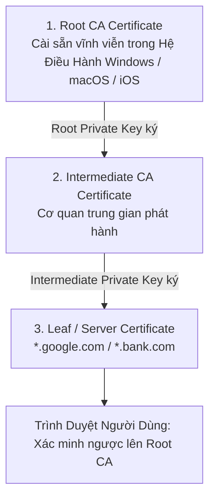

# Digital Signatures & Public Key Infrastructure (PKI)

Mặc dù mật mã bất đối xứng giải quyết được bài toán bí mật thông tin, nó vẫn có một điểm yếu chí mạng: **Làm sao bạn biết chắc chắn Public Key bạn vừa nhận được là của Google chứ không phải của Hacker đang giả mạo Google (Man-in-the-Middle)?**.

Cơ sở hạ tầng khóa công khai (**PKI**) và **Chứng chỉ số X.509** sinh ra để giải quyết bài toán xác thực danh tính này.

---

## 1. Chữ Ký Số (Digital Signatures: Ed25519 & ECDSA)

Chữ ký số hoạt động ngược lại so với mã hóa công khai:
- **Người ký (Signer)**: Sử dụng **Private Key** của mình để ký một thông điệp.
- **Bất kỳ ai (Verifier)**: Sử dụng **Public Key** của người ký để kiểm tra chữ ký.

---

## 2. Chứng Chỉ Số X.509 & Chuỗi Tin Cậy (Chain of Trust)

Một Chứng chỉ X.509 là một tài liệu điện tử **gắn kết (Bind) một Tên Miền (Domain) với một Public Key cụ thể**, được ký số bởi một bên thứ ba đáng tin cậy gọi là **Certificate Authority (CA)** (như Let's Encrypt, DigiCert, Sectigo).

### 2.1 Quy Trình Kiểm Tra Chuỗi Tin Cậy Trên Trình Duyệt
Khi bạn truy cập `https://bank.com`:
1. Server gửi xuống toàn bộ Chuỗi chứng chỉ (Certificate Chain).
2. Trình duyệt kiểm tra: Chữ ký của `bank.com` có đúng do `Intermediate CA` ký hay không?
3. Trình duyệt kiểm tra tiếp: Chữ ký của `Intermediate CA` có đúng do `Root CA` ký hay không?
4. Trình duyệt đối chiếu: `Root CA` có nằm trong danh sách **Root Trust Store** được Apple, Microsoft, Mozilla cài sẵn trong hệ điều hành hay không?
5. Nếu chuỗi hợp lệ từ đầu đến cuối: Trình duyệt hiển thị biểu tượng **Ổ Khóa Xanh / Bảo Mật**. Nếu chuỗi bị đứt gãy: Cảnh báo đỏ rực: *"Kết nối của bạn không phải là kết nối riêng tư (NET::ERR_CERT_AUTHORITY_INVALID)"*.

---

## 3. Cơ Chế Thu Hồi Chứng Chỉ: CRL vs OCSP Stapling

Nếu Private Key của một máy chủ bị lộ (do nhân viên làm mất laptop hoặc server bị hack), chứng chỉ đó phải bị thu hồi ngay lập tức trước ngày hết hạn tự nhiên.

### 3.1 CRL (Certificate Revocation List)
- CA xuất bản một danh sách đen các số seri chứng chỉ bị hủy.
- Trình duyệt phải tải toàn bộ tệp danh sách này về mỗi khi mở web.
- *Nhược điểm*: Tệp CRL phình to hàng chục Megabytes, làm chậm tốc độ lướt web nghiêm trọng.

### 3.2 OCSP Stapling (Tiêu Chuẩn Tối Ưu Hiện Nay)
- Thay vì bắt trình duyệt gọi hỏi CA, **chính máy chủ web (NGINX/Cloudflare)** sẽ định kỳ (mỗi giờ) gọi lên máy chủ OCSP của CA, xin một "phiếu xác thực chứng chỉ còn sống" đã được CA ký số và có dấu thời gian.
- Khi người dùng truy cập, máy chủ web "kẹp" (Staple) phiếu này vào gói tin TLS Handshake gửi cho trình duyệt.
- Trình duyệt verify chữ ký của phiếu OCSP ngay tại chỗ mà không tốn thêm bất kỳ kết nối mạng nào!
