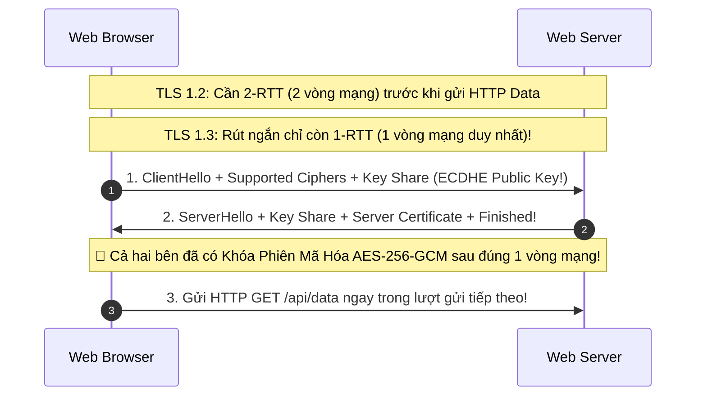

# Transport Layer Security (TLS 1.3) & HSTS

Giao thức TLS (Transport Layer Security - tiền thân là SSL) cung cấp đường truyền mã hóa an toàn ở tầng vận chuyển giữa trình duyệt web và máy chủ, bảo vệ toàn bộ dữ liệu HTTP khỏi bị nghe lén và sửa đổi.

---

## 1. Cuộc Cách Mạng Của TLS 1.3 (RFC 8446)

So với TLS 1.2 (ra đời năm 2008), **TLS 1.3 (chuẩn hóa năm 2018)** mang lại hai cải tiến vĩ đại: **Tốc độ gấp đôi** và **Xóa sổ hoàn toàn các thuật toán mật mã yếu**.



### 1.1 Khai Tử Toàn Bộ Các Mật Mã Lỗi Thời Trong TLS 1.3
TLS 1.3 loại bỏ hoàn toàn các thành phần từng gây ra hàng loạt lỗ hổng bảo mật:
- ❌ Cấm trao đổi khóa bằng RSA thuần (Dễ bị tấn công Bleichenbacher).
- ❌ Cấm các chế độ mã hóa khối CBC (Dễ bị tấn công POODLE padding oracle).
- ❌ Cấm thuật toán băm SHA-1 và MD5.
- ❌ Cấm RC4, 3DES.
- ✅ **Chỉ cho phép 5 bộ mã hóa AEAD hiện đại**:
  - `TLS_AES_256_GCM_SHA384`
  - `TLS_CHACHA20_POLY1305_SHA256`
  - `TLS_AES_128_GCM_SHA256`
  - `TLS_AES_128_CCM_SHA256`
  - `TLS_AES_128_CCM_8_SHA256`

---

## 2. Perfect Forward Secrecy (PFS - Tính Bảo Mật Về Sau)

Trong các giao thức cũ không có PFS (dùng trao đổi khóa RSA cổ điển):
- Nếu kẻ tấn công ghi âm lại (Record) toàn bộ lưu lượng mạng mã hóa của một ngân hàng trong suốt 5 năm.
- Đến năm thứ 6, kẻ tấn công đột nhập vào trung tâm dữ liệu và ăn trộm được **RSA Private Key** của máy chủ.
- Chúng có thể dùng Private Key này để **giải mã hồi tố toàn bộ các phiên truyền tin trong suốt 5 năm qua**!

### Cơ Chế Ephemeral Diffie-Hellman Trong TLS 1.3
- Trong TLS 1.3, mọi phiên kết nối đều sử dụng **Cặp khóa tạm thời (Ephemeral Key Pairs - ECDHE)**:
- Khóa này chỉ sống trong vòng vài chục mili-giây của phiên làm việc đó, sau đó bị **hủy vĩnh viễn khỏi bộ nhớ RAM**.
- Dù sau này Private Key của máy chủ có bị lộ, kẻ tấn công cũng **hoàn toàn không thể giải mã lại các gói tin trong quá khứ**!

---

## 3. HTTP Strict Transport Security (HSTS)

Kẻ tấn công trên mạng Wi-Fi công cộng có thể thực hiện tấn công **SSL Stripping** (Hạ cấp kết nối từ HTTPS xuống HTTP không mã hóa):
- Khi người dùng gõ `bank.com`, trình duyệt gửi request đầu tiên bằng `http://bank.com`.
- Router giả mạo chặn request này, tự giao tiếp HTTPS với ngân hàng, nhưng trả về HTTP cho người dùng.

### Tuyến Phòng Thủ: HSTS Header & Preload List
Máy chủ gửi phản hồi kèm HTTP Header:
```http
Strict-Transport-Security: max-age=31536000; includeSubDomains; preload
```
- `max-age=31536000`: Yêu cầu trình duyệt ghi nhớ trong vòng 1 năm (31,536,000 giây).
- Trong suốt 1 năm đó, kể cả người dùng có cố tình gõ `http://`, trình duyệt cũng sẽ **tự động chuyển thành `https://` nội bộ** ngay trên máy khách trước khi gửi bất kỳ gói tin nào ra card mạng!
- **HSTS Preload**: Tên miền được ghi cứng vào mã nguồn của trình duyệt Chrome/Firefox/Safari. Kể cả lần đầu tiên người dùng mở máy tính mới truy cập, trình duyệt cũng lập tức dùng HTTPS $100\%$.
