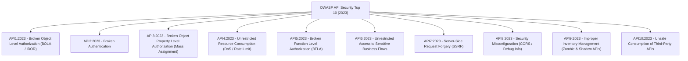

# 01. OWASP API Security Top 10 (2023 Edition)

Các kiến trúc hiện đại (Single Page Applications, Mobile Apps, Microservices, IoT) phụ thuộc $80-90\%$ vào REST/GraphQL API. Khi các giao diện người dùng chuyển về phía client, logic bảo mật bị đẩy toàn bộ về phía backend API, tạo ra các vector tấn công đặc thù được chuẩn hóa trong **OWASP API Security Top 10**.

---

## 1. Bản Đồ OWASP API Security Top 10



---

## 2. Phân Tích Chuyên Sâu Các Lỗ Hổng Nguy Hiểm Nhất

### 2.1 API1:2023 - Broken Object Level Authorization (BOLA)
- **Vấn đề:** Chiếm vị trí số 1 trong các báo cáo lỗ hổng API toàn cầu. Endpoint nhận ID của đối tượng từ URL (ví dụ: `GET /api/v1/invoices/987123`) nhưng máy chủ chỉ kiểm tra *"Người dùng này đã đăng nhập chưa?"* mà quên kiểm tra *"Hóa đơn 987123 này có thuộc về người dùng này hay không?"*.
- **Phòng thủ:**
  ```javascript
  // LỖ HỔNG (Vulnerable):
  const invoice = await db.query('SELECT * FROM invoices WHERE id = ?', [req.params.id]);

  // PHÒNG THỦ CHUẨN (Defense):
  const invoice = await db.query(
    'SELECT * FROM invoices WHERE id = ? AND organization_id = ?',
    [req.params.id, req.user.organizationId]
  );
  if (!invoice) return res.status(404).json({ error: 'Invoice not found' });
  ```

---

### 2.2 API3:2023 - Broken Object Property Level Authorization (Mass Assignment & Excessive Data Exposure)
- Gom hai vấn đề:
  1. **Mass Assignment (Gán thuộc tính hàng loạt):** Client gửi thêm các trường nhạy cảm trong JSON body mà code backend vô tư truyền thẳng vào ORM / Database:
     ```javascript
     // Client gửi: { "name": "Bao", "is_admin": true, "account_balance": 1000000 }
     // Backend nguy hiểm:
     await User.update(req.body, { where: { id: req.user.id } });
     ```
  2. **Excessive Data Exposure:** API trả về toàn bộ đối tượng Database (bao gồm `password_hash`, `ssn`, `internal_notes`) và dựa dẫm vào Frontend để ẩn đi các trường đó.
- **Phòng thủ:** Áp dụng **DTO Whitelisting (Danh sách trắng các trường được phép)** bằng thư viện xác thực schema như Zod / Joi:
  ```javascript
  const UpdateProfileSchema = z.object({
    name: z.string().min(2).max(100),
    bio: z.string().max(500).optional()
  }).strict(); // Từ chối mọi trường lạ như is_admin!
  ```

---

### 2.3 API5:2023 - Broken Function Level Authorization (BFLA)
- Kẻ tấn công chỉ cần đổi phương thức HTTP hoặc đường dẫn để gọi các hàm quản trị viên (Admin functions) mà hệ thống quên phân quyền:
  - Người dùng thông thường: `GET /api/v1/users/me`
  - Kẻ tấn công thử gọi: `DELETE /api/v1/users/456` hoặc `POST /api/v1/admin/export-all-data`
- **Phòng thủ:** Thực thi kiểm tra vai trò (Role/Permission Enforcement) tập trung tại API Gateway hoặc Middleware:
  ```javascript
  function requirePermission(permission) {
    return (req, res, next) => {
      if (!req.user.permissions.includes(permission)) {
        return res.status(403).json({ error: 'Forbidden: Insufficient privileges' });
      }
      next();
    };
  }
  ```

---

### 2.4 API9:2023 - Improper Inventory Management (Zombie & Shadow APIs)
- **Zombie APIs:** Các phiên bản API cũ (như `/api/v1/login`, `/api/beta/checkout`) bị lập trình viên bỏ quên sau khi đã nâng cấp lên `/v2/`. Các endpoint cũ này không có rate limiter, không có MFA, và chứa các lỗ hổng chưa vá.
- **Shadow APIs:** Các endpoint thử nghiệm do dev tự ý triển khai trên môi trường production mà không thông qua đội ngũ bảo mật.
- **Phòng thủ:** Duy trì tài liệu OpenAPI / Swagger tự động cập nhật trong CI/CD, có lịch trình tắt vĩnh viễn (Deprecation & Sunsetting) các phiên bản API cũ.
