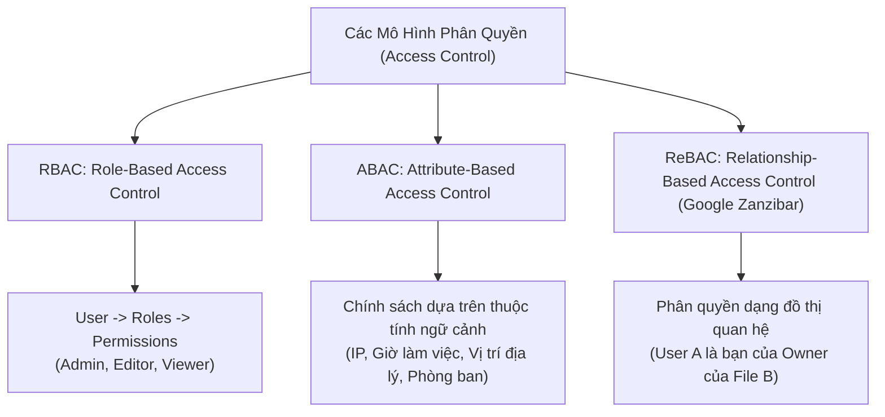

# 02. Modern Access Control Models: RBAC, ABAC & ReBAC (Google Zanzibar)

Phân quyền truy cập (Authorization) trả lời câu hỏi: **"Chủ thể $S$ (Subject) có được phép thực hiện hành động $A$ (Action) trên đối tượng $O$ (Object) trong ngữ cảnh $C$ (Context) hay không?"**

---

## 1. So Sánh 3 Mô Hình Phân Quyền Hiện Đại



| Tiêu chuẩn | RBAC (Role-Based) | ABAC (Attribute-Based) | ReBAC (Relationship-Based) |
| :--- | :--- | :--- | :--- |
| **Thực thể quyết định** | Vai trò tĩnh gán cho người dùng | Thuộc tính của User, Resource, Environment | Mối quan hệ dạng đồ thị giữa các thực thể |
| **Quy mô phù hợp** | Doanh nghiệp nội bộ, SaaS cơ bản | Tài chính, Ngân hàng, Y tế (quy định khắt khe) | Google Drive, GitHub, Figma, Notion, Slack |
| **Độ phức tạp** | Rất thấp (Dễ hiểu, dễ cài đặt bằng SQL) | Trung bình - Cao (Cần Policy Engine OPA) | Cao (Cần Graph database hoặc Zanzibar engine) |
| **Rủi ro bùng nổ** | **Role Explosion:** Cần tạo hàng trăm vai trò đặc biệt khi yêu cầu chi tiết | **Policy Sprawl:** Quá nhiều luật xung đột | Cần tối ưu hóa thuật toán duyệt đồ thị (Graph Traversal) |

---

## 2. ReBAC & Kiến Trúc Google Zanzibar

Google Zanzibar là hệ thống phân quyền quy mô toàn cầu được Google sử dụng cho Google Drive, YouTube, Google Cloud Platform, xử lý hàng nghìn tỷ đối tượng và hàng chục triệu QPS.

### 2.1 Bộ Ba Quan Hệ (Relation Tuples)
Mọi quyền hạn trong hệ thống đều được mô hình hóa dưới dạng một tuple:
$$\langle \text{object} \rangle \# \langle \text{relation} \rangle @ \langle \text{user / userset} \rangle$$

Ví dụ trong Google Drive:
```text
doc:system_design_doc#owner@user:alice
doc:system_design_doc#editor@group:backend_team#member
doc:system_design_doc#viewer@user:bob
```

### 2.2 Kế Thừa Quan Hệ (Relationship Inheritance)
- Nếu `user` là `owner` của một folder, họ tự động là `editor` của toàn bộ các file nằm trong folder đó.
- Thuật toán Zanzibar kiểm tra quyền bằng cách duyệt ngược cây quan hệ (Graph Traversal) để tìm đường đi từ User đến Resource.

---

## 3. Chính Sách Dưới Dạng Mã Nguồn (Policy-as-Code via Open Policy Agent - OPA)

Thay vì viết hàng chục câu lệnh `if-else` lộn xộn trong mã nguồn Java, Go, hay Node.js, doanh nghiệp hiện đại tách biệt logic chính sách sang ngôn ngữ khai báo **Rego** của CNCF Open Policy Agent:

```rego
package authz

default allow = false

# Quy tắc ABAC: Bác sĩ chỉ được xem hồ sơ bệnh án nếu cùng khoa và trong giờ làm việc
allow {
    input.user.role == "doctor"
    input.action == "read"
    input.resource.type == "medical_record"
    input.user.department == input.resource.department
    input.context.time >= "08:00:00"
    input.context.time <= "18:00:00"
}

# Quản trị viên luôn có quyền
allow {
    input.user.role == "super_admin"
}
```
