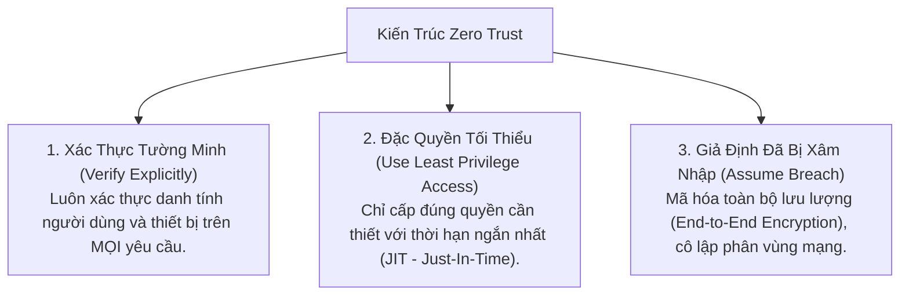
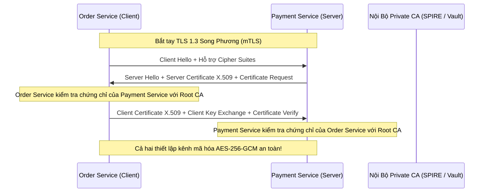

# 03. Zero Trust Architecture & Microservices Mutual TLS (mTLS)

Mô hình bảo mật truyền thống kiểu "Lâu đài và Hào nước" (Castle-and-Moat) giả định rằng: Bất kỳ ai nằm bên ngoài tường lửa (Firewall) đều nguy hiểm, nhưng một khi đã lọt vào mạng nội bộ (VPN / Private Subnet) thì hoàn toàn đáng tin cậy.

Mô hình này đã sụp đổ hoàn toàn trong kỷ nguyên Cloud và Remote Work: Khi kẻ tấn công xâm nhập được vào 1 máy chủ thông qua mã độc hoặc lỗ hổng SSRF, chúng có thể tự do di chuyển ngang (Lateral Movement) và đánh cắp toàn bộ cơ sở dữ liệu.

---

## 1. Ba Nguyên Tắc Cốt Lõi Của Kiến Trúc Zero Trust (NIST SP 800-207)

> **"Never Trust, Always Verify" (Không bao giờ tin tưởng, luôn luôn xác thực)**



---

## 2. Xác Thực Song Phương: Mutual TLS (mTLS) Trong Microservices

Trong TLS thông thường (One-way TLS), chỉ có Client xác thực danh tính của Server thông qua chứng chỉ SSL/TLS (trình duyệt kiểm tra máy chủ `google.com`). Server không hề biết máy khách là ai ở tầng giao vận.

**Mutual TLS (mTLS)** yêu cầu **cả hai bên đều phải xuất trình và kiểm tra chứng chỉ X.509 hợp lệ của nhau:**



---

## 3. Định Danh Chuẩn SPIFFE & Triển Khai SPIRE

Làm sao để một container trong Kubernetes chứng minh được danh tính của mình mà không cần lưu mật khẩu hay API Key tĩnh trên ổ đĩa?

- **SPIFFE (Secure Production Identity Framework for Everyone):** Chuẩn mở của CNCF định nghĩa danh tính dưới dạng URI:
  ```text
  spiffe://prod.internal.company.com/ns/finance/sa/payment-service
  ```
- **SVID (SPIFFE Verifiable Identity Document):** Danh tính được đóng gói thành một chứng chỉ X.509 ngắn hạn (thời hạn sống chỉ 1 giờ) do SPIRE tự động cấp phát và xoay vòng liên tục vào container.
- Khi Order Service gọi Payment Service, Payment Service chỉ cần đọc trường `Subject Alternative Name (SAN)` trong chứng chỉ để biết chính xác pod nào đang gọi đến.

---

## 4. Service Mesh (Istio / Linkerd Envoy Sidecar)

Thay vì buộc các lập trình viên phải tự viết mã mTLS, gia hạn chứng chỉ trong từng ứng dụng Node.js/Go:
- Một **Envoy Proxy Sidecar** được gắn chạy song song bên cạnh mỗi container.
- Envoy tự động đánh chặn toàn bộ lưu lượng mạng vào/ra, tự động mã hóa mTLS và kiểm tra danh tính SPIFFE một cách hoàn toàn trong suốt đối với mã nguồn ứng dụng (Zero-code change).
