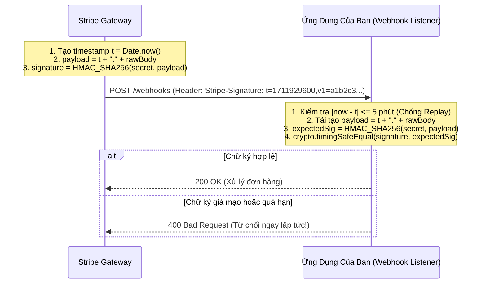

# 04. Secure API Design: Webhook Signatures & CORS Deep Dive

Hai bài toán bảo mật API thường xuyên bị hiểu sai hoặc cài đặt thiếu sót dẫn đến lộ dữ liệu nghiêm trọng trong thực tế là: **Bảo vệ cổng Webhook** và **Cấu hình chia sẻ tài nguyên giữa các nguồn gốc (CORS)**.

---

## 1. Bảo Vệ Webhook: Xác Thực Chữ Ký HMAC & Chống Tấn Công Gửi Lại (Replay Attack)

Khi một bên thứ ba (như Stripe, GitHub, VNPay) gửi thông báo biến động số dư hoặc trạng thái giao dịch về endpoint của bạn (`POST /api/webhooks/payment`):
- Bất kỳ ai trên Internet cũng có thể gửi yêu cầu HTTP POST tới URL này.
- **Giải pháp chuẩn công nghiệp (Stripe Standard):**
  1. Hai bên chia sẻ một bí mật chung (Webhook Signing Secret).
  2. Bên gửi tạo chữ ký HMAC-SHA256 trên nội dung thô (Raw Body) kèm Timestamp hiện tại và gửi trong tiêu đề `X-Hub-Signature-256` hoặc `Stripe-Signature`.
  3. Bên nhận tính toán lại HMAC và so sánh bằng thuật toán **Timing-Safe Comparison**.
  4. Bên nhận kiểm tra khoảng cách thời gian $|t_{\text{current}} - t_{\text{header}}| \le 300\text{s}$ để triệt tiêu hoàn toàn **Tấn công phát lại (Replay Attack)**.



---

## 2. CORS (Cross-Origin Resource Sharing) Deep Dive

> [!WARNING]
> **Hiểu lầm phổ biến:** *"CORS là cơ chế bảo mật bảo vệ Backend khỏi hacker."*
> $\implies$ **SAI!** CORS là chính sách bảo mật phía **TRÌNH DUYỆT (Browser-side policy)** nhằm bảo vệ người dùng không bị các website độc hại đọc trộm dữ liệu nhạy cảm từ các domain khác. Hacker dùng `curl` hay Postman hoàn toàn không bị ảnh hưởng bởi CORS!

### 2.1 Bẫy Nguy Hiểm: Wildcard + Credentials
```http
# CẤU HÌNH TỰ SÁT (Trình duyệt sẽ chặn đứng):
Access-Control-Allow-Origin: *
Access-Control-Allow-Credentials: true
```
- Chuẩn W3C nghiêm cấm việc dùng `*` kèm `Credentials: true` (vì sẽ cho phép mọi website độc hại đọc trộm cookie của người dùng).
- **Lỗ hổng nguy hiểm hơn:** Lập trình viên lách luật bằng cách đọc tiêu đề `Origin` từ request và phản chiếu lại (Reflected Origin):
  ```javascript
  // LỖ HỔNG CHÍ MẠNG:
  res.setHeader('Access-Control-Allow-Origin', req.headers.origin);
  res.setHeader('Access-Control-Allow-Credentials', 'true');
  ```
  $\implies$ Bất kỳ trang web nào (`evil.com`) gửi request đến cũng sẽ được cấp quyền đọc toàn bộ dữ liệu kèm cookie người dùng!

### 2.2 Cấu Hình CORS Chuẩn Mực (Whitelist Validation)
```javascript
const ALLOWED_ORIGINS = new Set([
  'https://mycompany.com',
  'https://app.mycompany.com'
]);

function corsMiddleware(req, res, next) {
  const origin = req.headers.origin;
  if (ALLOWED_ORIGINS.has(origin)) {
    res.setHeader('Access-Control-Allow-Origin', origin);
    res.setHeader('Access-Control-Allow-Credentials', 'true');
    res.setHeader('Access-Control-Allow-Methods', 'GET, POST, PUT, DELETE, OPTIONS');
    res.setHeader('Access-Control-Allow-Headers', 'Content-Type, Authorization');
    res.setHeader('Access-Control-Max-Age', '86400'); // Cache Preflight 24h
  }
  if (req.method === 'OPTIONS') return res.sendStatus(204);
  next();
}
```
