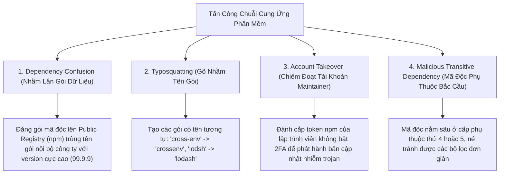

# 01. Software Supply Chain Security & SBOM (CycloneDX & Sigstore)

Các ứng dụng hiện đại hiếm khi được viết mới hoàn toàn từ đầu; $80\% - 90\%$ mã nguồn của một ứng dụng thông thường bao gồm các thư viện mã nguồn mở bên thứ ba (Dependencies qua `npm`, `pip`, `maven`, `cargo`). Kẻ tấn công nhận ra rằng thay vì tấn công trực diện vào bức tường lửa kiên cố của một ngân hàng, việc cấy mã độc vào một thư viện mã nguồn mở phổ biến mà ngân hàng đó sử dụng sẽ mang lại hiệu quả hủy diệt hơn rất nhiều.

---

## 1. Các Hình Thức Tấn Công Chuỗi Cung Ứng Phổ Biến



---

## 2. Danh Mục Thành Phần Phần Mềm: SBOM (Software Bill of Materials)

Tương tự như bảng thành phần dinh dưỡng và nguyên liệu in trên bao bì thực phẩm, **SBOM** là bản kê khai máy có thể đọc được (Machine-readable inventory) ghi nhận toàn bộ các thư viện, phiên bản, giấy phép bản quyền và mã băm băm toàn vẹn (Checksums) của một phần mềm.

### Hai Định Dạng Chuẩn Công Nghiệp
1. **CycloneDX (OWASP Standard):** Thiết kế chuyên biệt cho an ninh phần mềm, phân tích lỗ hổng bảo mật và quản lý rủi ro chuỗi cung ứng.
2. **SPDX (Linux Foundation / ISO Standard):** Thiết kế cho quản lý tuân thủ giấy phép bản quyền nguồn mở (Open Source License Compliance) và xuất xứ thành phần.

```json
{
  "bomFormat": "CycloneDX",
  "specVersion": "1.5",
  "components": [
    {
      "type": "library",
      "name": "jsonwebtoken",
      "version": "9.0.2",
      "purl": "pkg:npm/jsonwebtoken@9.0.2",
      "hashes": [
        { "alg": "SHA-256", "content": "e3b0c44298fc1c149afbf4c8996fb92427ae41e4649b934ca495991b7852b855" }
      ]
    }
  ]
}
```

---

## 3. Khung Tiêu Chuẩn SLSA (Supply-chain Levels for Software Artifacts)

Khung tiêu chuẩn của Google & OpenSSF nhằm ngăn chặn việc can thiệp mã nguồn độc hại giữa các bước viết mã, build và đóng gói:

| Cấp độ | Yêu cầu kỹ thuật cốt lõi | Mối đe dọa bị triệt tiêu |
| :--- | :--- | :--- |
| **SLSA 1** | Tự động hóa quá trình Build và tạo Metadata ghi lại cách thức đóng gói. | Lỗi đóng gói thủ công trên máy cá nhân của developer. |
| **SLSA 2** | Build diễn ra trên dịch vụ CI/CD lưu trữ độc lập (GitHub Actions); Metadata có chữ ký số xác thực. | Can thiệp sửa đổi tệp sau khi đã build xong. |
| **SLSA 3** | Môi trường Build hoàn toàn cô lập (Ephemeral / Isolated), không kết nối mạng tùy tiện. | Mã độc lây nhiễm chéo giữa các phiên build khác nhau. |
| **SLSA 4** | Yêu cầu 2 người thẩm định mã nguồn (Two-party code review) và bản build có tính tái lập tuyệt đối (Hermetic / Reproducible Builds). | Kẻ tấn công nội bộ hoặc tài khoản lập trình viên đơn lẻ bị thỏa hiệp. |

---

## 4. Ký Số Ảnh Container: Sigstore & Cosign

Truyền thống yêu cầu lập trình viên phải tự quản lý khóa bí mật GPG/PGP (dễ bị mất hoặc rò rỉ khóa). **Sigstore** cung cấp cơ chế ký số không cần lưu khóa tĩnh (Keyless Signing):
- Lập trình viên hoặc CI/CD runner xác thực danh tính qua **OpenID Connect (OIDC)** (Google, GitHub, Microsoft).
- Tổ chức phát hành chứng chỉ tạm thời **Fulcio** cấp chứng chỉ X.509 có thời hạn sống chỉ **10 phút**.
- Chữ ký và chứng chỉ được ghi vĩnh viễn vào sổ cái minh bạch công khai **Rekor (Transparency Log)**.
- Khi Kubernetes triển khai ảnh container, **Kyverno** hoặc **OPA Gatekeeper** kiểm tra xem ảnh đã có chữ ký hợp lệ trong Rekor hay chưa trước khi cho phép chạy.
