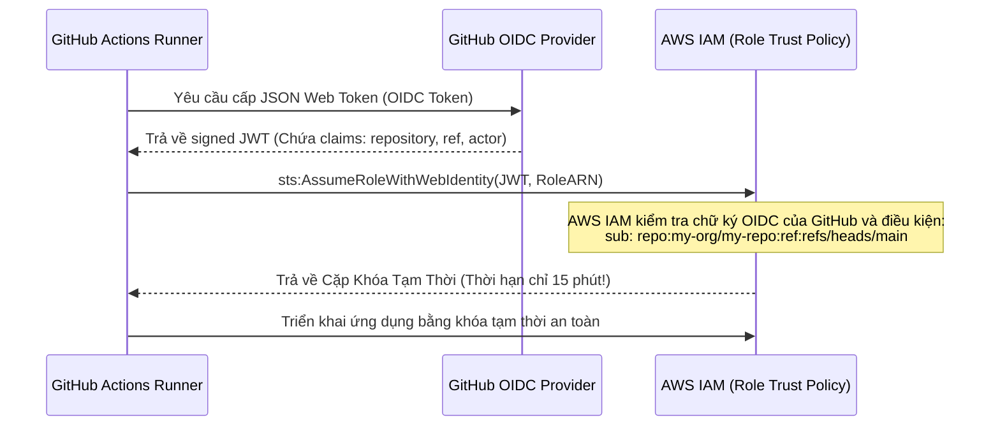

# 02. Secrets Management & Secure CI/CD Pipelines

Một trong những nguyên nhân hàng đầu khiến các hệ thống cloud bị tấn công tống tiền (Ransomware) hoặc đào trộm tiền ảo là do **lộ khóa bảo mật tĩnh (Hardcoded Secrets)** trên Git repositories (như AWS Access Key `AKIA...`, GitHub Personal Access Token `ghp_...`, Private Keys).

---

## 1. Vòng Đời Rò Rỉ Khóa Bí Mật & Bẫy Lịch Sử Git

> [!CAUTION]
> **Hiểm họa lịch sử Git:** Nếu bạn lỡ commit file `.env` chứa mật khẩu database rồi sau đó chạy `git rm .env` và commit lại, mật khẩu đó **VẪN TỒN TẠI VĨNH VIỄN** trong toàn bộ cây lịch sử commit của Git! Các con bot quét tự động của hacker trên GitHub có thể phát hiện và khai thác khóa của bạn trong vòng **chưa đầy 60 giây**.

### Quy Tắc Xử Lý Khẩn Cấp Khi Lộ Khóa:
1. **Lập tức Thu hồi / Vô hiệu hóa (Revoke) khóa đó trên dịch vụ Cloud ngay lập tức!**
2. Xoay vòng (Rotate) sang một khóa mới.
3. Không lãng phí thời gian cố gắng "xóa sạch" commit trên GitHub mà bỏ qua bước thu hồi khóa, vì bot hacker đã cào xong dữ liệu từ trước.

---

## 2. Quét Khóa Tự Động (Shift-Left Secret Detection)

```mermaid
graph LR
    Dev["Developer Máy Cá Nhân"] -->|1. Pre-commit Hook (Gitleaks / Trufflehog)| GitLocal["Local Git Commit"]
    GitLocal -->|2. Pull Request Gate| CICD["GitHub Actions / GitLab CI"]
    CICD -->|3. Secret Scanning Gate| Prod["Môi Trường Production"]
    
    GitLocal -.->|Chặn đứng commit nếu phát hiện regex/entropy cao| Block1["Chặn Ngay Tại Máy Dev!"]
    CICD -.->|Thất bại Pipeline nếu lọt secret| Block2["Chặn Ngay Tại CI/CD!"]
```

- **Bộ lọc phát hiện bí mật (Detection Heuristics):**
  - **Mẫu biểu thức chính quy (Regex Patterns):** Khớp các định dạng khóa đã biết (như `AKIA[0-9A-Z]{16}` cho AWS, `ghp_[0-9a-zA-Z]{36}` cho GitHub).
  - **Độ hỗn loạn Shannon (Shannon Entropy):** Đo lường mức độ ngẫu nhiên của chuỗi ký tự. Mật khẩu mạnh và khóa mã hóa ngẫu nhiên (như Base64) có độ entropy rất cao ($> 4.5$), khác biệt hoàn toàn với từ ngữ thông thường.

---

## 3. Khử Khóa Tĩnh Bằng GitHub Actions OIDC Federation

Truyền thống yêu cầu lập trình viên phải lưu `AWS_ACCESS_KEY_ID` và `AWS_SECRET_ACCESS_KEY` lâu năm vào mục GitHub Secrets. Nếu kho lưu trữ bị hack hoặc pipeline bị đầu độc (Poisoned Pipeline), hacker sẽ lấy được quyền lực vô hạn trên AWS.

**Giải pháp hiện đại: OIDC Federation (Không lưu trữ bất kỳ khóa tĩnh nào!):**



---

## 4. Quản Lý Khóa Tập Trung (HashiCorp Vault & AWS Secrets Manager)

- **Nguyên tắc "Dynamic Secrets":** Thay vì dùng chung một mật khẩu cơ sở dữ liệu cho 50 microservices, ứng dụng kết nối tới HashiCorp Vault để yêu cầu một tài khoản DB tạm thời. Vault tự động tạo tài khoản `user_temp_99` trong PostgreSQL với thời hạn sống 1 giờ và tự động thu hồi khi hết hạn.
- **Mã hóa lúc nghỉ (Encryption at Rest):** Toàn bộ bí mật được mã hóa bằng khóa chủ cứng (HSM - Hardware Security Module).
