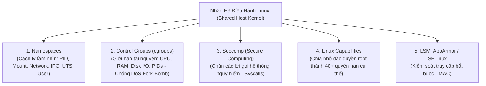

# 03. Container & Kubernetes Hardening (Linux Primitives & Pod Security)

Container không phải là máy ảo (Virtual Machine). Container chỉ là các tiến trình Linux thông thường (Linux Processes) dùng chung Nhân hệ điều hành (Shared Host Kernel) và được cách ly bởi các tính năng hạt nhân: **Namespaces**, **Control Groups (cgroups)**, và các tầng kiểm soát truy cập bảo mật.

Nếu một container chạy dưới quyền `root` bị khai thác lỗ hổng Remote Code Execution (RCE), hacker có thể thoát khỏi container (Container Escape) và kiểm soát toàn bộ máy chủ vật lý của cụm Kubernetes.

---

## 1. Các Nguyên Thủy Bảo Mật Của Nhân Linux (Linux Security Primitives)



### 1.1 Tước Bỏ Đặc Quyền Linux Capabilities (`cap-drop=ALL`)
Mặc định Docker cấp khoảng 14 capabilities cho container (bao gồm quyền can thiệp mạng `NET_RAW`, đổi quyền file `CHOWN`).
- **Quy tắc vàng:** Luôn tước bỏ toàn bộ capabilities và chỉ thêm lại đúng quyền cần thiết:
  ```yaml
  securityContext:
    capabilities:
      drop:
        - ALL
      add:
        - NET_BIND_SERVICE # Chỉ cho phép bind cổng < 1024 nếu thực sự cần
  ```

### 1.2 Chạy Không Cần Quyền Root (Rootless Containers)
- Không bao giờ để tiến trình trong container chạy bằng `UID 0 (root)`.
- Luôn chỉ định `USER 10001` trong Dockerfile và cấu hình trong Kubernetes:
  ```yaml
  securityContext:
    runAsNonRoot: true
    runAsUser: 10001
    allowPrivilegeEscalation: false
    readOnlyRootFilesystem: true
  ```
  - `readOnlyRootFilesystem: true`: Ngăn chặn mã độc tải về và ghi tệp thực thi vào các thư mục `/tmp` hay `/bin`.

---

## 2. Tiêu Chuẩn An Toàn Pod Trong Kubernetes (Pod Security Standards)

Kubernetes phân chia thành 3 cấp độ Pod Security Standards (PSS):

| Cấp độ | Mô tả | Đối tượng áp dụng |
| :--- | :--- | :--- |
| **Privileged** | Không áp dụng bất kỳ hạn chế nào (cho phép pod truy cập trực tiếp phần cứng). | CNI Plugins mạng (Calico, Cilium), Storage CSI drivers. |
| **Baseline** | Ngăn chặn các cấu hình leo thang đặc quyền đã biết. | Các ứng dụng thông thường chưa được tối ưu bảo mật. |
| **Restricted (Khuyến nghị)** | **Khắt khe nhất:** Bắt buộc chạy non-root, cấm leo thang quyền, tước bỏ ALL capabilities, bắt buộc Seccomp profile mặc định. | **Toàn bộ Microservices sản phẩm.** |

---

## 3. Phân Đoạn Mạng Kubernetes Bằng NetworkPolicy (Default Deny)

Mặc định trong cụm Kubernetes, toàn bộ các Pod thuộc mọi Namespace khác nhau đều có thể tự do gửi gói tin tới nhau (Flat Network). Nếu Pod frontend bị hack, hacker có thể kết nối thẳng tới cổng của Pod Database!

```yaml
# Chính sách: Chặn đứng toàn bộ lưu lượng mạng ra/vào (Default Deny All)
apiVersion: networking.k8s.io/v1
kind: NetworkPolicy
metadata:
  name: default-deny-all
  namespace: production
spec:
  podSelector: {}
  policyTypes:
    - Ingress
    - Egress
```
- Sau đó, chỉ mở tường lửa một cách tường minh (Explicit Whitelist): Cho phép `Backend Pods` nhận kết nối từ `Frontend Pods` trên cổng 8080.
