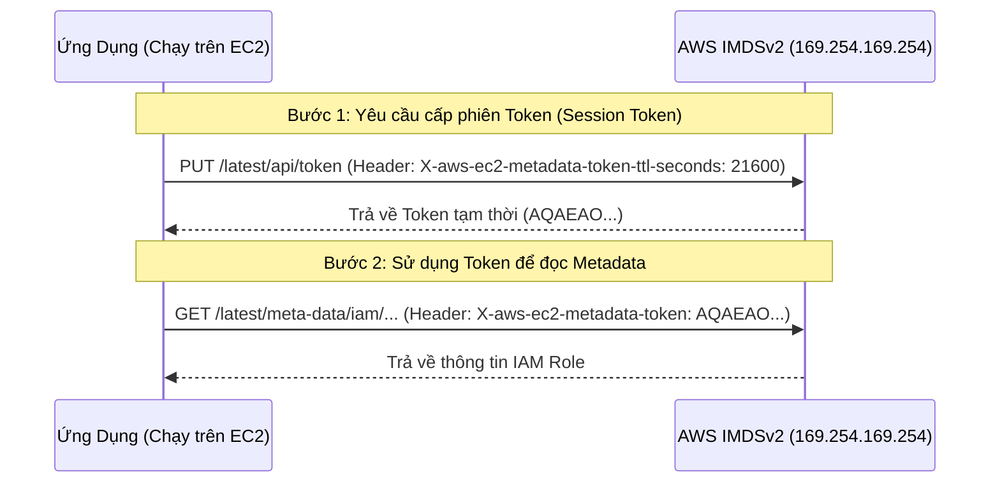
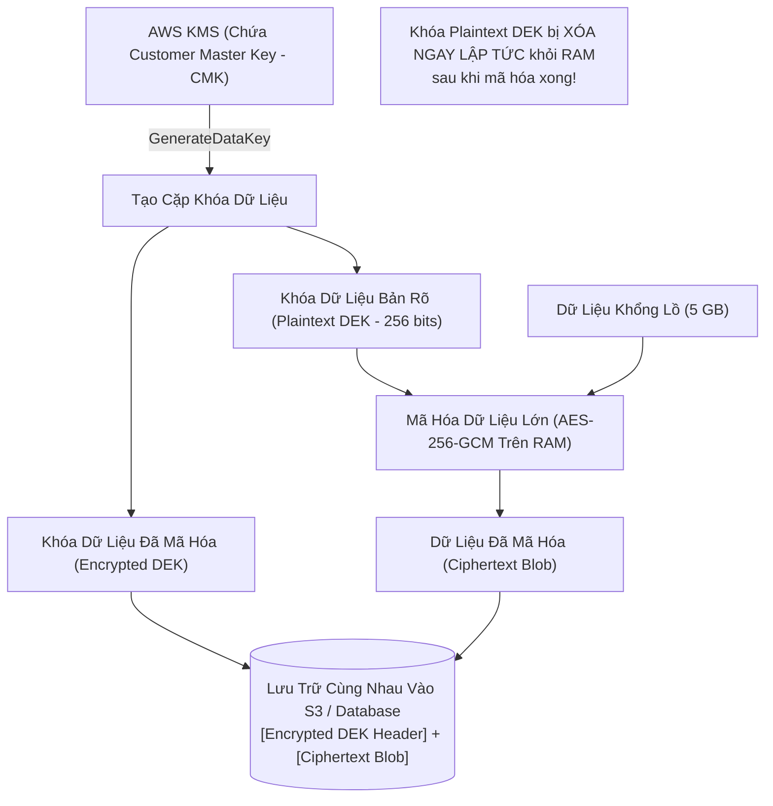

# 04. Cloud Security Posture & IAM Hardening (AWS / GCP)

Điện toán đám mây vận hành dựa trên **Mô hình Trách nhiệm Chung (Shared Responsibility Model)**: Nhà cung cấp cloud (AWS, Google Cloud, Azure) chịu trách nhiệm về "Bảo mật CỦA đám mây" (Security OF the Cloud - hạ tầng vật lý, mạng máy chủ), nhưng khách hàng chịu trách nhiệm hoàn toàn về "Bảo mật TRONG đám mây" (Security IN the Cloud - cấu hình IAM, tường lửa Security Groups, mã hóa dữ liệu).

---

## 1. Triệt Tiêu SSRF Với AWS IMDSv2 (Instance Metadata Service v2)

Trong vụ rò rỉ dữ liệu chấn động ngân hàng **Capital One** (hơn 100 triệu thẻ tín dụng bị đánh cắp), hacker đã khai thác lỗ hổng SSRF trên máy chủ web WAF để gọi tới địa chỉ IP nội bộ:
```http
GET http://169.254.169.254/latest/meta-data/iam/security-credentials/waf-role
```
Trong phiên bản **IMDSv1**, máy chủ trả về ngay lập tức cặp khóa bí mật IAM Role mà không cần bất kỳ xác thực nào!



### Tại sao IMDSv2 lại ngăn chặn được SSRF?
1. **Yêu cầu phương thức HTTP PUT:** Đa số các lỗ hổng SSRF trong ứng dụng chỉ cho phép hacker kích hoạt phương thức HTTP GET (như tải ảnh từ URL hoặc webhook). Chúng không thể gửi HTTP PUT tùy biến.
2. **Cấm chuyển tiếp gói tin (Hop Limit = 1):** Cấu hình `HttpPutResponseHopLimit = 1` của AWS quy định gói tin IP không được phép nhảy qua bất kỳ Proxy hay WAF trung gian nào. Nếu ứng dụng chạy trong container hoặc đứng sau reverse proxy, gói tin sẽ bị hủy ngay lập tức tại ranh giới mạng của EC2.

---

## 2. Thắt Chặt Quyền Hạn Cloud IAM (Least Privilege Enforcement)

### 2.1 Các Mẫu Cấu Hình Tự Sát Trong IAM Policy
```json
// CHÍNH SÁCH NGUY HIỂM CHẾT NGƯỜI:
{
  "Effect": "Allow",
  "Action": "*",
  "Resource": "*"
}
```
- Trao quyền lực vô hạn cho máy chủ ứng dụng. Nếu ứng dụng bị chiếm quyền, hacker có thể xóa sạch cơ sở dữ liệu, tắt toàn bộ server, hoặc tạo hàng ngàn máy ảo đào tiền ảo.

### 2.2 Chính Sách Chuẩn: Phạm Vi Hẹp & Ràng Buộc Điều Kiện (Condition Blocks)
```json
{
  "Version": "2012-10-17",
  "Statement": [
    {
      "Sid": "AllowInvoiceS3BucketAccessOnly",
      "Effect": "Allow",
      "Action": [
        "s3:GetObject",
        "s3:PutObject"
      ],
      "Resource": "arn:aws:s3:::mycompany-invoices-prod/*",
      "Condition": {
        "Bool": { "aws:SecureTransport": "true" },
        "StringEquals": { "aws:PrincipalOrgID": "o-xyz987" }
      }
    }
  ]
}
```
- `aws:SecureTransport: true`: Bắt buộc kết nối phải được mã hóa qua HTTPS/TLS, từ chối mọi yêu cầu HTTP bản rõ.
- `aws:PrincipalOrgID`: Khóa chặt truy cập chỉ cho phép các tài khoản thuộc tổ chức của công ty.

---

## 3. Mã Hóa Phong Bì Dữ Liệu (Envelope Encryption via AWS KMS)

Khi mã hóa tệp dữ liệu dung lượng lớn (video 5GB hoặc file backup), việc gửi trực tiếp 5GB dữ liệu qua đường truyền mạng tới dịch vụ KMS sẽ gây nghẽn băng thông và làm tăng độ trễ nghiêm trọng.


