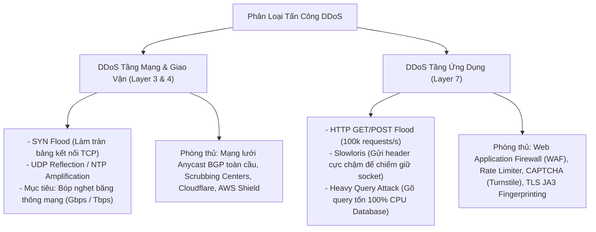

# 02. Web Application Firewall (WAF) & Layer 3/4/7 DDoS Defenses

Tấn công từ chối dịch vụ phân tán (DDoS) và các đợt quét khai thác lỗ hổng hàng loạt (Automated Vulnerability Probing) không nhắm vào việc giải mã mật khẩu hay can thiệp logic kinh doanh, mà nhằm làm tê liệt tính sẵn sàng (Availability) của hệ thống.

---

## 1. Phân Biệt DDoS Tầng Mạng (L3/L4) vs Tầng Ứng Dụng (L7)



---

## 2. Web Application Firewall (WAF): Mô Hình Tích Cực vs Tiêu Cực

- **Mô hình bảo mật tiêu cực (Negative Security Model - Signature Blacklist):**
  - Sử dụng các bộ luật biểu thức chính quy (như **OWASP ModSecurity Core Rule Set - CRS**) để nhận diện các chuỗi nguy hiểm đã biết (`UNION SELECT`, `<script>`, `../../etc/passwd`).
  - *Nhược điểm:* Dễ bị vượt qua bằng kỹ thuật làm rối mã (Obfuscation), và hoàn toàn mù tịt trước các lỗ hổng Zero-day chưa từng xuất hiện.
- **Mô hình bảo mật tích cực (Positive Security Model - Whitelist / Strict Schema):**
  - Chỉ chấp nhận các request thỏa mãn chính xác định dạng OpenAPI (Đúng kiểu dữ liệu, đúng độ dài, không chứa trường thừa). Mọi request khác đều bị từ chối mặc định.

---

## 3. Cơ Chế Nhận Diện Bot Nâng Cao: TLS JA3 / JA4 Fingerprinting

Hacker thường dùng các công cụ tự động (`python-requests`, `curl`, `Go-http-client`) để tấn công cào dữ liệu hoặc brute-force, nhưng chúng có thể dễ dàng làm giả tiêu đề `User-Agent: Mozilla/5.0...` để đánh lừa máy chủ.

**Dấu vân tay TLS JA3/JA4** phân tích các thông số gói tin bắt tay `Client Hello` ở tầng giao vận:
1. Danh sách các bộ mã hóa (Cipher Suites) mà client hỗ trợ.
2. Danh sách các tiện ích mở rộng TLS (Extensions).
3. Các đường cong elip được hỗ trợ (Elliptic Curves).
- Các giá trị này được nối chuỗi và băm bằng MD5/SHA256 để tạo thành một chuỗi Hash duy nhất.
- Trình duyệt Chrome thật trên Windows có vân tay JA3 hoàn toàn khác biệt với thư viện `Python requests` hay `curl`, cho phép WAF phát hiện và chặn đứng bot tự động ngay cả khi bot giả mạo $100\%$ tiêu đề HTTP!

```
Vân tay của Python Requests:  ja3 = 45e3f...  ===> [CHẶN ĐỨNG / BẮT GIẢI CAPTCHA]
Vân tay của Chrome 124:       ja3 = b3230...  ===> [CHO PHÉP TRUY CẬP]
```
