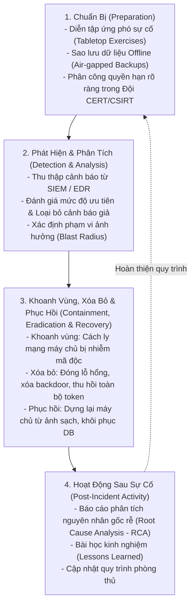

# 04. Security Auditing, SIEM & Incident Response (NIST SP 800-61)

Khi một sự cố an ninh nghiêm trọng (Security Breach) xảy ra, sự hoảng loạn và xử lý cảm tính có thể biến một vụ xâm nhập nhỏ thành thảm họa xóa sạch dữ liệu và phá hủy bằng chứng điều tra số (Digital Forensics).

Quy trình ứng phó sự cố an ninh mạng được chuẩn hóa theo tiêu chuẩn **NIST Special Publication 800-61 (Computer Security Incident Handling Guide)**.

---

## 1. Vòng Đời Ứng Phó Sự Cố 4 Bước (NIST Incident Response Lifecycle)



---

## 2. Nhật Ký Kiểm Toán Chống Can Thiệp (Tamper-Evident Audit Logging)

Hành vi đầu tiên của một hacker chuyên nghiệp sau khi xâm nhập được vào hệ thống là: **Xóa sạch toàn bộ log trong `/var/log` hoặc Database để che giấu dấu vết phạm tội.**

### Hai Nguyên Tắc Bảo Vệ Nhật Ký Kiểm Toán
1. **Lưu trữ WORM (Write Once, Read Many):** Gửi log theo thời gian thực về một kho lưu trữ độc lập (như AWS S3 Object Lock hoặc CloudWatch Logs) nơi chính sách khóa cứng cấm mọi thao tác sửa hoặc xóa log trong vòng $N$ năm, ngay cả tài khoản Root cũng không xóa được!
2. **Móc xích băm mã hóa (Cryptographic Hash Chaining):** Mỗi bản ghi log $i$ lưu kèm mã băm SHA-256 của bản ghi log trước đó $i-1$:
   $$\text{Hash}_i = \text{SHA256}(\text{Hash}_{i-1} + \text{Timestamp} + \text{Action} + \text{Actor})$$
   - Nếu hacker sửa đổi dù chỉ 1 ký tự trong bản ghi log cũ, toàn bộ chuỗi băm phía sau sẽ bị phá vỡ, giúp phát hiện ngay lập tức hành vi can thiệp nhật ký!

---

## 3. Hệ Thống Chấm Điểm Lỗ Hổng Chuẩn Quốc Tế: CVSS v3.1

Hệ thống đánh giá lỗ hổng bảo mật chung (Common Vulnerability Scoring System - CVSS) lượng hóa mức độ nguy hiểm của một lỗi từ $0.0$ đến $10.0$ dựa trên 3 nhóm chỉ số:

```
CVSS Vector String Chuẩn:
CVSS:3.1/AV:N/AC:L/PR:N/UI:N/S:U/C:H/I:H/A:H ===> Điểm: 9.8 (CRITICAL)
```
- **Attack Vector (AV):** Hướng tấn công (`Network` [N] = 0.85, `Adjacent` [A], `Local` [L], `Physical` [P]).
- **Attack Complexity (AC):** Độ phức tạp (`Low` [L] = 0.77, `High` [H]).
- **Privileges Required (PR):** Đặc quyền yêu cầu (`None` [N] = 0.85, `Low` [L], `High` [H]).
- **User Interaction (UI):** Tương tác người dùng (`None` [N] = 0.85, `Required` [R]).
- **Scope (S):** Phạm vi ảnh hưởng (`Unchanged` [U], `Changed` [C]).
- **Confidentiality / Integrity / Availability (C/I/A):** Tác động tới Bảo mật, Toàn vẹn, Sẵn sàng (`None` [N], `Low` [L], `High` [H]).
