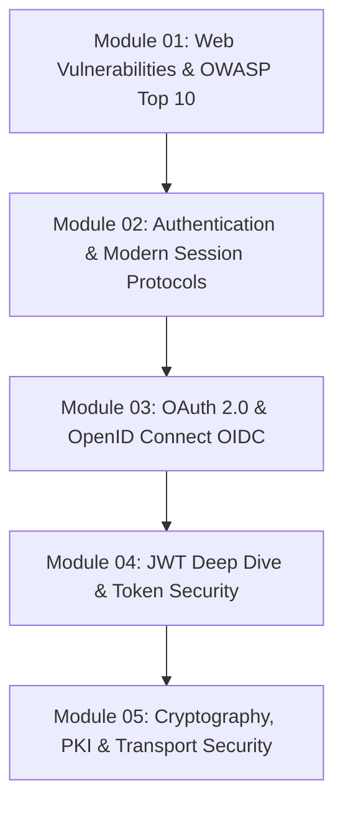

# Web Security, Authentication & Cryptography Revision Guide

Chào mừng bạn đến với kho tài liệu ôn tập và thực hành chuyên sâu **Web Security, Authentication & Cryptography**. Kho tài liệu được thiết kế nhằm trang bị tư duy phòng thủ chiều sâu (Defense-in-Depth), kiến trúc xác thực hiện đại và mật mã học thực chiến.

---

## 🗺️ Lộ Trình 5 Module Chuyên Sâu

### Chi Tiết Từng Module

1. **[01-web-vulnerabilities-and-owasp/](file:///d:/my-project/revision-document/security/01-web-vulnerabilities-and-owasp/README.md)**:
   - Các lỗ hổng OWASP Top 10 kinh điển: SQL Injection (SQLi), Cross-Site Scripting (XSS), Cross-Site Request Forgery (CSRF).
   - Server-Side Request Forgery (SSRF): Tấn công Cloud Metadata `169.254.169.254`, DNS Rebinding, Kỹ thuật chặn IP nội bộ.
   - Broken Object Level Authorization (BOLA / IDOR) & Security Misconfigurations.
   - Cơ chế phòng thủ: Prepared Statements, Contextual Output Encoding, CSP Headers, SameSite Cookies.

2. **[02-authentication-and-sessions/](file:///d:/my-project/revision-document/security/02-authentication-and-sessions/README.md)**:
   - Lưu trữ mật khẩu an toàn: Tại sao MD5/SHA256 là thảm họa? Chuẩn hóa Argon2id, bcrypt, PBKDF2 (Memory cost, Salting).
   - Quản lý phiên Session: Cookie flags (`Secure`, `HttpOnly`, `SameSite`), Session Fixation, Session Hijacking.
   - Xác thực đa yếu tố (MFA): TOTP (RFC 6238 HMAC-SHA1 30s step), FIDO2 / WebAuthn.
   - Chống Brute-force & Credential Stuffing: Account Lockout vs Exponential Backoff.

3. **[03-oauth2-and-oidc/](file:///d:/my-project/revision-document/security/03-oauth2-and-oidc/README.md)**:
   - Các vai trò trong OAuth 2.0: Resource Owner, Client, Authorization Server, Resource Server.
   - Luồng Authorization Code với PKCE (`code_verifier`, `code_challenge` SHA-256) cho SPAs và Mobile.
   - OpenID Connect (OIDC): Tầng định danh, phân biệt `id_token` vs `access_token`, Claims (`sub`, `iss`, `aud`).
   - Refresh Token Rotation (RTR) và phát hiện đánh cắp token theo chuỗi (Token Family Revocation).

4. **[04-jwt-and-token-security/](file:///d:/my-project/revision-document/security/04-jwt-and-token-security/README.md)**:
   - Cấu trúc JSON Web Token (Header, Payload, Signature).
   - Ký đối xứng (HS256 HMAC) vs Bất đối xứng (RS256 RSA, ES256 ECDSA).
   - Các lỗ hổng JWT chí mạng: Lỗ hổng Algorithm Confusion (`alg: "none"`, HMAC-RSA public key confusion), Key Confusion.
   - Phân phối và xoay vòng khóa qua JWKS (JSON Web Key Set: `kid`, `kty`, `alg`).
   - Chiến lược thu hồi token: Redis Blacklist với TTL vs Token Versioning.

5. **[05-cryptography-and-transport-security/](file:///d:/my-project/revision-document/security/05-cryptography-and-transport-security/README.md)**:
   - Mã hóa đối xứng: AES-256-GCM (Authenticated Encryption - AEAD) vs AES-CBC (Lỗ hổng Padding Oracle).
   - Mã hóa bất đối xứng: RSA (OAEP padding) vs Elliptic Curve Cryptography (ECC, Ed25519, ECDSA).
   - Chữ ký số (Digital Signatures) và Tính bất khả chối bỏ (Non-repudiation).
   - Public Key Infrastructure (PKI): Chứng chỉ X.509, Certificate Authority (CA), Chain of Trust, OCSP Stapling.
   - Giao thức TLS 1.3: 1-RTT Handshake, Perfect Forward Secrecy (PFS via ECDHE), HTTP Strict Transport Security (HSTS).

---

## ⚡ Tiêu Chuẩn Thực Hành

Mỗi module bao gồm:
- Toàn bộ lý thuyết an ninh chuyên sâu.
- File code phòng thủ / cryptography algorithms chạy trực tiếp trên Node.js.
- File `practice.mjs` với 5 bài kiểm tra assertions tự động chấm đạt/hỏng.
