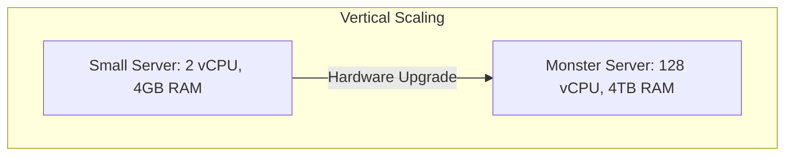
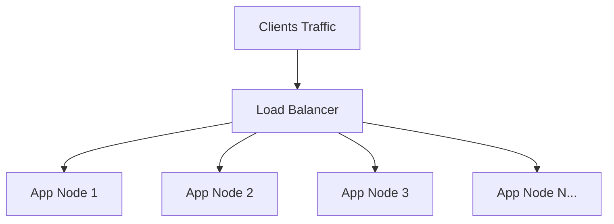

# Vertical vs Horizontal Scaling

Scaling (mở rộng quy mô) là khả năng của một hệ thống xử lý lượng tải ngày càng tăng (traffic, data volume, concurrent transactions) bằng cách bổ sung thêm tài nguyên tính toán.

---

## 1. Mở Rộng Chiều Dọc: Vertical Scaling (Scale-Up)

Vertical Scaling là phương pháp tăng cường năng lực của một máy chủ duy nhất bằng cách nâng cấp phần cứng:
- Bổ sung CPU Cores mạnh hơn, xung nhịp cao hơn.
- Nâng cấp RAM (từ 16GB lên 512GB, 1TB).
- Đổi từ HDD/SATA SSD sang NVMe SSD tốc độ cao.
- Nâng cấp card mạng (NIC) lên 10Gbps / 40Gbps.

### 1.1 Ưu Điểm
- **Đơn giản tối đa**: Không làm thay đổi kiến trúc mã nguồn. Ứng dụng nguyên khối (Monolith) chạy trên 1 node tiếp tục hoạt động bình thường.
- **Không có độ trễ mạng liên-tiến trình (Zero Network Overhead)**: Dữ liệu giao tiếp qua bộ nhớ chia sẻ (Shared Memory) và bus phần cứng thay vì gọi qua mạng (RPC, REST).
- **Tính nhất quán dữ liệu tuyệt đối**: Các giao dịch ACID truyền thống trên RDBMS được đảm bảo mà không cần xử lý phân tán phức tạp.

### 1.2 Nhược Điểm Cốt Tử
- **Giới Hạn Trần Phần Cứng (Hardware Hard Ceiling)**: Không có phần cứng nào là vô tận. Khi máy chủ đạt ngưỡng tối đa của bo mạch chủ, bạn không thể scale thêm.
- **Chi Phí Tăng Theo Cấp Số Mũ (Non-linear Cost Growth)**: Một máy chủ 128 vCPU có giá đắt hơn gấp hàng chục lần so với 16 máy chủ 8 vCPU do linh kiện chuyên dụng cao cấp.
- **Điểm Nghẽn Đơn Lẻ (Single Point of Failure - SPOF)**: Nếu máy chủ gặp sự cố phần cứng (cháy nguồn, hỏng RAM, lỗi bo mạch), toàn bộ hệ thống sụp đổ (Downtime 100%).
- **Downtime Để Nâng Cấp**: Nâng cấp phần cứng vật lý hầu như luôn yêu cầu khởi động lại máy chủ.

---

## 2. Mở Rộng Chiều Ngang: Horizontal Scaling (Scale-Out)

Horizontal Scaling là phương pháp phân tán khối lượng công việc sang một tập hợp gồm nhiều máy chủ nhỏ hơn (thường là máy chủ thương mại phổ thông - *Commodity Hardware*) hoạt động đồng bộ với nhau.

### 2.1 Ưu Điểm
- **Quy Mô Vô Hạn Lý Thuyết**: Bạn có thể bổ sung 10, 100 hoặc 10,000 nodes mà không bị giới hạn bởi trần phần cứng của một máy chủ đơn lẻ.
- **Chi Phí Hiệu Quả (Cost Efficiency)**: Sử dụng các máy chủ commodity hardware hoặc các máy ảo đám mây kích thước vừa phải (t2/t3/m5 instances).
- **Tính Sẵn Sàng Cao & Khả Năng Chịu Lỗi (High Availability & Fault Tolerance)**: Khi 1 node sụp đổ, Load Balancer tự động loại bỏ node đó khỏi traffic pool; các node còn lại gánh tải mà người dùng không hề nhận thấy gián đoạn.
- **Mở Rộng Động (Dynamic Elasticity)**: Dễ dàng tăng giảm số lượng node tự động (Auto Scaling) theo biến động tải thực tế trong ngày, tiết kiệm tối đa chi phí hạ tầng.

### 2.2 Thách Thức Kỹ Thuật
- **Yêu Cầu Ứng Dụng Không Trạng Thái (Stateless)**: Phiên người dùng (user sessions) không được lưu cục bộ trên node.
- **Độ Phức Tạp Của Hệ Thống**: Cần thêm Load Balancer, Service Discovery, Distributed Caching (Redis), và hệ thống Centralized Logging/Monitoring.
- **Độ Trễ Mạng (Network Latency)**: Việc gọi RPC/HTTP giữa các dịch vụ làm tăng tổng thời gian phản hồi.
- **Tính Nhất Quán Dữ Liệu Phân Tán**: Không còn giao dịch ACID đơn giản của RDBMS; phải đối mặt với CAP Theorem, Eventual Consistency và Saga Pattern.

---

## 3. Bảng So Sánh Chiến Lược

| Tiêu Chí | Vertical Scaling (Scale-Up) | Horizontal Scaling (Scale-Out) |
| :--- | :--- | :--- |
| **Giới Hạn Tối Đa** | Bị chặn bởi trần phần cứng vật lý | Vô hạn (bổ sung thêm nodes) |
| **Tính Sẵn Sàng (HA)** | Thấp (SPOF trừ khi có Active-Passive stand-by) | Rất cao (N+1 redundancy) |
| **Độ Phức Tạp Code** | Rất thấp (không cần đổi kiến trúc) | Trung bình đến cao (stateless, distributed systems) |
| **Độ Trễ Xử Lý** | Cực thấp (giao tiếp nội bộ RAM/Bus) | Cao hơn (qua lớp mạng LAN/VPC) |
| **Khả Năng Tự Co Giãn** | Kém (thường yêu cầu reboot/cold resize) | Xuất sắc (Auto Scaling Groups, K8s HPA) |
| **Chi Phí** | Rất cao khi đạt ngưỡng cao cấp | Tuyến tính và tối ưu theo tải thực |
