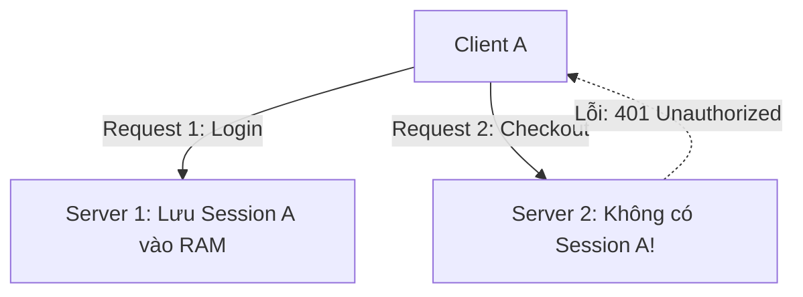
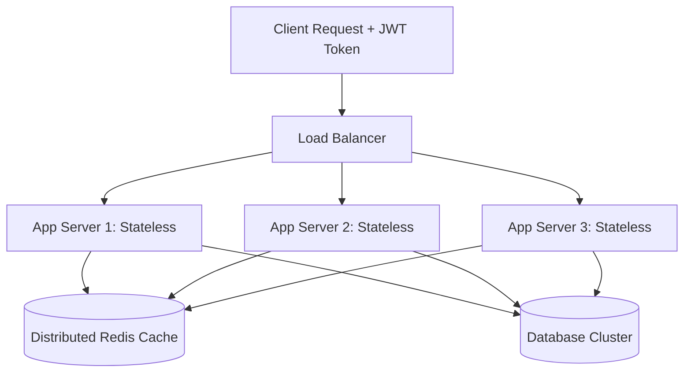

# Stateless vs Stateful Architecture

Trong thiết kế hệ thống phân tán, việc phân biệt giữa kiến trúc có trạng thái (*Stateful*) và không trạng thái (*Stateless*) là điều kiện tiên quyết để mở rộng quy mô theo chiều ngang (*Horizontal Scaling*).

---

## 1. Stateful Architecture (Kiến Trúc Có Trạng Thái)

Hệ thống có trạng thái lưu giữ ngữ cảnh, dữ liệu phiên làm việc (*Session State*), hoặc tiến trình của người dùng ngay trong bộ nhớ cục bộ (*Local In-Memory / File System*) của máy chủ đang xử lý.

### 1.1 Vấn Đề Khi Scale-Out Hệ Thống Stateful
Nếu Client A gửi yêu cầu đăng nhập và được phục vụ bởi `Server 1`, thông tin đăng nhập nằm trong RAM của `Server 1`. Nếu yêu cầu tiếp theo của Client A được Load Balancer điều phối sang `Server 2`, `Server 2` không biết Client A là ai và trả về lỗi chưa xác thực.

### 1.2 Giải Pháp "Chắp Vá": Sticky Sessions (Session Affinity)
Load Balancer sử dụng IP Hash hoặc Set một cookie trên trình duyệt (`SERVERID=node1`) để đảm bảo mọi request tiếp theo từ Client A luôn được gửi tới `Server 1`.
- **Hạn chế nghiêm trọng**:
  - **Mất cân bằng tải (Traffic Imbalance)**: Một vài người dùng tải nặng (Heavy Users) kết nối vào cùng một server có thể khiến server đó quá tải trong khi các server khác nhàn rỗi.
  - **Mất dữ liệu khi node chết (Data Loss)**: Nếu `Server 1` sập, toàn bộ session của hàng chục nghìn người dùng đang kết nối vào `Server 1` biến mất, buộc họ phải đăng nhập lại và mất giỏ hàng.
  - **Cản trở Auto Scaling**: Rất khó để giải phóng một node khi tải giảm, vì phải chờ toàn bộ session trên node đó hết hạn (Connection Draining kéo dài).

---

## 2. Stateless Architecture (Kiến Trúc Không Trạng Thái)

Trong kiến trúc Stateless, các máy chủ ứng dụng (*App Servers*) không lưu bất kỳ trạng thái nào của client giữa các request. Mỗi request đến từ client chứa đầy đủ ngữ cảnh cần thiết để bất kỳ server nào trong cụm đều có thể xử lý thành công.

### 2.1 Các Phương Pháp Xử Lý Session Trong Hệ Thống Stateless

#### Cách 1: Client-Side Encrypted Token (JWT / Self-contained Tokens)
Client giữ toàn bộ thông tin phiên làm việc trong một mã token đã ký số (Cryptographically Signed Token) như JSON Web Token (JWT).
- Mỗi request gửi header: `Authorization: Bearer <token>`.
- Mọi máy chủ ứng dụng chỉ cần dùng Public Key hoặc Secret Key để giải mã và xác thực chữ ký (Signature Verification) mà không cần truy vấn DB/Cache.
- *Nhược điểm*: Kích thước token lớn; khó thu hồi quyền truy cập tức thì (Token Revocation / Blacklisting).

#### Cách 2: Externalized Distributed State (Redis / Memcached)
Phiên làm việc được lưu trong một cụm bộ nhớ dùng chung nằm ngoài tầng ứng dụng:
- Client chỉ giữ một `sessionId` ngẫu nhiên trong Cookie.
- Bất kỳ App Server nào nhận request cũng truy vấn `GET session:<sessionId>` từ cụm Redis phân tán.
- *Ưu điểm*: App Server hoàn toàn vô danh, dễ dàng scale từ 2 lên 200 nodes trong vài giây. Nếu một App Server chết, phiên của người dùng hoàn toàn không bị ảnh hưởng.

---

## 3. Bảng So Sánh Kiến Trúc

| Khía Cạnh | Stateful Architecture | Stateless Architecture |
| :--- | :--- | :--- |
| **Vị Trí Lưu State** | Cục bộ trong RAM / Disk của App Server | External Cache (Redis) hoặc Client Token |
| **Yêu Cầu Load Balancer** | Cần Sticky Sessions / IP Hash | Round Robin, Least Connections đơn giản |
| **Khả Năng Scale-Out** | Phức tạp, dễ nghẽn | Cực kỳ dễ dàng và tự nhiên |
| **Khả Năng Tự Phục Hồi** | Kém (mất session khi node chết) | Hoàn hảo (mọi node đều có thể thay thế nhau) |
| **Độ Trễ Phục Vụ Session** | Rất thấp (đọc thẳng RAM tiến trình) | Thêm ~1-2ms truy vấn mạng tới Redis |
| **Thích Hợp Với** | Multiplayer Games, WebSocket Presence, Real-time Collab | Web APIs, E-commerce, Microservices, Cloud Native |
