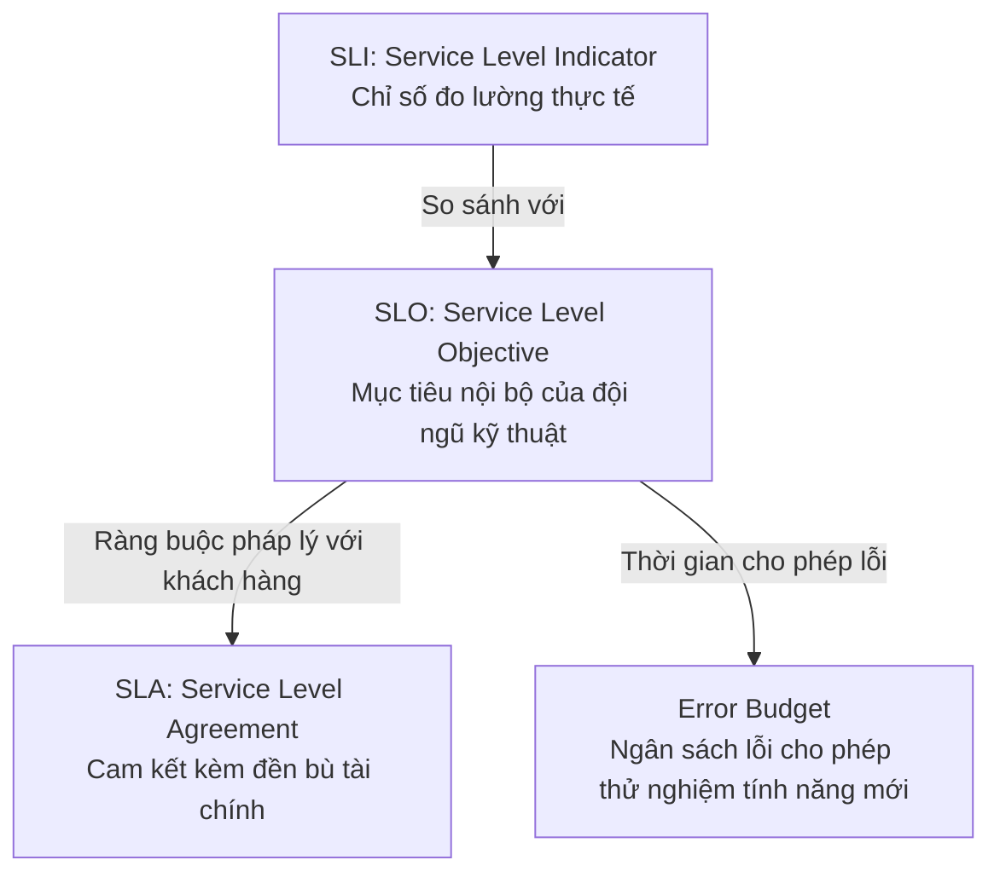

# Availability: Nines, SLA, SLO, SLI & Error Budgets

Độ sẵn sàng (High Availability - HA) là thước đo tỷ lệ thời gian một hệ thống hoạt động ổn định và có khả năng phục vụ yêu cầu của người dùng một cách chính xác trong một khoảng thời gian xác định.

---

## 1. Bảng Đo Lường "Các Chữ Số 9" (The Nines of Availability)

Công thức cơ bản:
$$\text{Availability} = \frac{\text{Tổng thời gian hoạt động (Uptime)}}{\text{Tổng thời gian quan sát}} \times 100\%$$

| Availability Level | Downtime Mỗi Năm | Downtime Mỗi Tháng (30 ngày) | Downtime Mỗi Ngày | Phân Khúc Ứng Dụng |
| :--- | :--- | :--- | :--- | :--- |
| **99% (Two Nines)** | 3.65 ngày | 7.20 giờ | 14.40 phút | Ứng dụng nội bộ, dev/staging, batch processing |
| **99.9% (Three Nines)** | 8.76 giờ | 43.20 phút | 1.44 phút | Tiêu chuẩn các ứng dụng SaaS B2B thông thường |
| **99.99% (Four Nines)** | 52.60 phút | 4.32 phút | 8.64 giây | Thương mại điện tử lớn, cổng thanh toán, sàn chứng khoán |
| **99.999% (Five Nines)** | 5.26 phút | 25.92 giây | 864 mili-giây | Viễn thông quân sự, hệ thống cứu thương khẩn cấp, ngân hàng lõi |

> [!WARNING]
> Chi phí hạ tầng để nâng từ **99.9%** lên **99.99%** thường tăng gấp 3 đến 5 lần (yêu cầu kiến trúc Multi-AZ, tự động failover). Nâng lên **99.999%** đòi hỏi kiến trúc Multi-Region Active-Active với chi phí cực kỳ đắt đỏ.

---

## 2. Hệ Thống Chỉ Số Tin Cậy: SLI, SLO, SLA & Error Budget

Khung làm việc Site Reliability Engineering (SRE) do Google phát triển chuẩn hóa việc quản lý độ tin cậy của dịch vụ:

### 2.1 SLI (Service Level Indicator)
Là **thước đo định lượng trực tiếp** về chất lượng dịch vụ được đo lường theo thời gian thực.
- *Ví dụ*: "Tỷ lệ các HTTP requests có mã trạng thái `< 500` và phản hồi trong thời gian `< 200ms`".
$$\text{SLI} = \frac{\text{Số lượng requests thành công}}{\text{Tổng số requests hợp lệ}} \times 100\%$$

### 2.2 SLO (Service Level Objective)
Là **mục tiêu nội bộ** mà đội ngũ kỹ thuật cam kết duy trì cho chỉ số SLI.
- *Ví dụ*: "SLI độ sẵn sàng của Checkout Service phải đạt $\ge 99.95\%$ trong chu kỳ 30 ngày liên tục".

### 2.3 SLA (Service Level Agreement)
Là **hợp đồng pháp lý** giữa nhà cung cấp dịch vụ và khách hàng. Nếu vi phạm SLA, nhà cung cấp phải bồi thường tiền hoặc cấp phát tín dụng sử dụng dịch vụ (Service Credits).
- *Nguyên tắc thiết kế*: $\text{SLA} < \text{SLO}$. (Ví dụ: Nội bộ nhắm SLO là $99.95\%$, nhưng chỉ cam kết SLA với khách hàng là $99.9\%$. Khoảng chênh lệch $0.05\%$ là vùng đệm an toàn để xử lý sự cố trước khi bị phạt tiền).

### 2.4 Error Budget (Ngân Sách Lỗi)
Là phần bù của SLO: $\text{Error Budget} = 100\% - \text{SLO}$.
- Nếu SLO là $99.9\%$, Error Budget là $0.1\%$ (tương đương 43.2 phút downtime/tháng).
- **Quy tắc vận hành SRE**:
  - Khi Error Budget còn dồi dào: Đội dev được phép đẩy nhanh tiến độ deploy các tính năng mới, thử nghiệm A/B testing.
  - Khi Error Budget cạn kiệt (tiệm cận 0%): **Đóng băng việc release tính năng mới (Code Freeze)**; toàn bộ tài nguyên chuyển sang vá lỗi hệ thống, tối ưu hạ tầng và nâng cao độ ổn định.

---

## 3. Toán Học Độ Sẵn Sàng Hệ Thống Phức Tạp

### 3.1 Các Thành Phần Mắc Nối Tiếp (Series)
Trong chuỗi các dịch vụ phụ thuộc tuần tự (Service A $\rightarrow$ Service B $\rightarrow$ Service C), nếu bất kỳ dịch vụ nào chết, toàn bộ giao dịch thất bại.

$$A_{\text{total}} = A_1 \times A_2 \times \dots \times A_n$$

*Ví dụ*: Một hệ thống gồm Web Server ($99.9\%$), API Gateway ($99.9\%$) và Database ($99.9\%$):
$$A_{\text{total}} = 0.999 \times 0.999 \times 0.999 = 0.997 \approx 99.7\%$$
Hệ thống tổng hợp có độ sẵn sàng **thấp hơn** từng thành phần đơn lẻ!

### 3.2 Các Thành Phần Mắc Song Song (Parallel Redundancy)
Khi các thành phần chạy song song và có thể dự phòng cho nhau (Active-Active hoặc Active-Passive), hệ thống chỉ chết khi **tất cả** các thành phần đều chết đồng thời.

$$A_{\text{total}} = 1 - (1 - A_1) \times (1 - A_2) \dots \times (1 - A_n)$$

*Ví dụ*: Cụm gồm 2 Web Servers dự phòng, mỗi server có độ sẵn sàng $99\%$:
$$A_{\text{total}} = 1 - (1 - 0.99) \times (1 - 0.99) = 1 - (0.01 \times 0.01) = 1 - 0.0001 = 99.99\%$$
Bằng cách thêm dự phòng song song, hệ thống nâng độ sẵn sàng từ Two Nines ($99\%$) lên Four Nines ($99.99\%$)!
