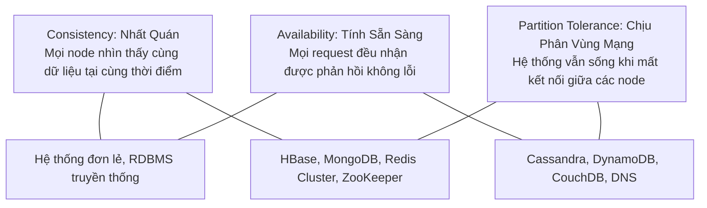
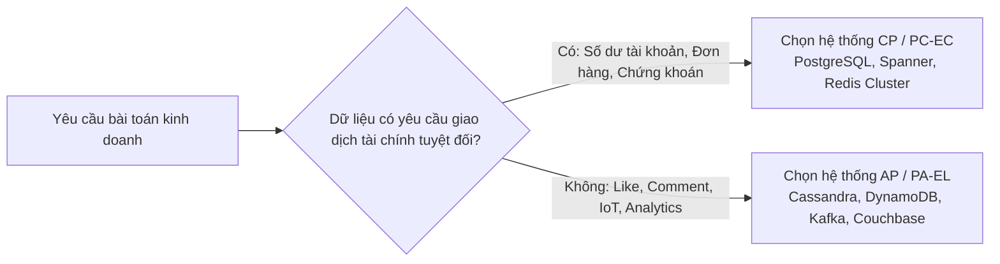

# The CAP & PACELC Theorems

Trong các hệ thống phân tán, các định lý CAP và PACELC là kim chỉ nam giúp các kỹ sư kiến trúc hiểu rõ những đánh đổi tất yếu về mặt toán học và vật lý giữa **tính nhất quán (Consistency)**, **tính sẵn sàng (Availability)**, và **độ trễ (Latency)**.

---

## 1. Định Lý CAP (Eric Brewer, 2000)

Định lý CAP phát biểu rằng một hệ thống phân tán chia sẻ dữ liệu chỉ có thể đồng thời thỏa mãn tối đa **2 trong 3** thuộc tính sau:

### 1.1 Ba Thành Tố Của CAP
1. **Consistency (Linearizability / Strong Consistency)**:
   - Mọi thao tác đọc dữ liệu (*Read*) đều nhận được kết quả của thao tác ghi mới nhất (*Most Recent Write*) hoặc trả về lỗi. Hệ thống hành xử như thể chỉ có một bản sao dữ liệu duy nhất tồn tại trên toàn cầu.
2. **Availability**:
   - Mọi node còn sống trong mạng phân tán đều phải trả về một phản hồi hợp lệ (không phải mã lỗi 500 hoặc timeout) đối với mọi yêu cầu, dù không cam kết dữ liệu đó là mới nhất.
3. **Partition Tolerance**:
   - Hệ thống vẫn tiếp tục vận hành ngay cả khi có hiện tượng đứt kết nối mạng (Network Partition), mất gói tin, hoặc trễ mạng tùy ý giữa các máy chủ.

### 1.2 "Sự Lừa Dối Của Lựa Chọn CA": Tại Sao Chỉ Có CP hoặc AP?
Trong các hệ thống mạng phân tán thực tế (Distributed Networks), dây cáp mạng có thể bị đứt, router có thể sập, hoặc switch có thể bị nghẽn. Do đó:
$$\text{Hiện tượng phân vùng mạng } (P) \text{ là BẮT BUỘC PHẢI CHẤP NHẬN.}$$

Khi xảy ra phân vùng mạng chia cụm node thành 2 nửa cô lập (Partition $P$):
- **Nếu chọn CP**: Để đảm bảo tính nhất quán ($C$), hệ thống phải từ chối ghi hoặc khóa các thao tác ghi ở nửa phân vùng thiểu số nhằm tránh xung đột dữ liệu (*Split-Brain*). Việc từ chối phản hồi này đồng nghĩa với việc hy sinh **Availability ($A$)**.
- **Nếu chọn AP**: Hệ thống cho phép cả hai bên phân vùng tiếp tục ghi và đọc dữ liệu để đảm bảo người dùng luôn nhận được phản hồi ($A$). Tuy nhiên, dữ liệu ở hai bên sẽ bị lệch pha (*Drift*), dẫn đến việc đọc dữ liệu cũ và hy sinh **Consistency ($C$)**.

> [!IMPORTANT]
> Không có hệ thống phân tán thực tế nào là **CA**. Một hệ thống tuyên bố "CA" thực chất là hệ thống chạy trên một máy chủ đơn lẻ (hoặc cụm mạng hoàn hảo trong phòng thí nghiệm); ngay khi mạng vật lý phân tách, hệ thống buộc phải chọn giữa CP hoặc AP.

---

## 2. Định Lý PACELC (Daniel Abadi, 2012)

Định lý CAP chỉ mô tả hành vi của hệ thống **khi có sự cố phân vùng mạng ($P$)**. Nhưng trong thực tế, $99.99\%$ thời gian hoạt động hệ thống ở trạng thái bình thường (Không có phân vùng mạng). Khi đó hệ thống phải đánh đổi điều gì?

Định lý **PACELC** mở rộng định lý CAP:
$$\text{If } \mathbf{P} \text{ (Partition): } [\mathbf{A} \lor \mathbf{C}] \quad \mathbf{E}\text{LSE: } [\mathbf{L} \text{ (Latency)} \lor \mathbf{C} \text{ (Consistency)}]$$

Dịch nghĩa:
- **NẾU có phân vùng mạng ($P$)**: Ta chọn **Availability ($A$)** hay **Consistency ($C$)**?
- **NGƯỢC LẠI (Else - mạng bình thường)**: Ta chọn **Latency ($L$)** thấp hay **Consistency ($C$)** mạnh?

### 2.1 Bốn Nhóm Phân Loại PACELC Kinh Điển

| Phân Loại | Đại Diện Tiêu Biểu | Hành Vi Khi Phân Vùng ($P$) | Hành Vi Khi Bình Thường ($E$) |
| :--- | :--- | :--- | :--- |
| **PC/EC** | **PostgreSQL/MySQL**, Bigtable, MongoDB, HBase | **Consistency**: Chặn ghi ở node phụ, chỉ cho ghi ở Primary | **Consistency**: Chờ dữ liệu đồng bộ tới replica trước khi trả về $\rightarrow$ Chấp nhận độ trễ (High Latency) |
| **PA/EL** | **Apache Cassandra**, Amazon DynamoDB, Riak | **Availability**: Cho phép ghi vào mọi node khả dụng | **Latency**: Phản hồi ngay khi 1 node ghi xong $\rightarrow$ Trả về siêu tốc nhưng đọc có thể bị stale |
| **PA/EC** | **Amazon S3** (từ 2020), MongoDB (với writeConcern `majority`) | **Availability**: Luôn sẵn sàng nhận request | **Consistency**: Đảm bảo Strong Read-After-Write Consistency khi mạng thông suốt |
| **PC/EL** | **Yahoo! PNUTS**, Megastore | **Consistency**: Khóa và hủy giao dịch khi rớt mạng | **Latency**: Tối ưu độ trễ thấp khi mạng bình thường |

---

## 3. Bản Đồ Lựa Chọn Công Nghệ Thực Chiến

- **Khi nào chọn CP / PC/EC?**:
  - Giao dịch ngân hàng, số dư tài khoản, sàn giao dịch crypto/chứng khoán.
  - Quản lý hàng tồn kho Flash Sale (nếu bán quá số lượng - Overselling - sẽ gây thiệt hại tài chính nghiêm trọng).
  - Khóa phân tán (Distributed Locks: etcd, ZooKeeper, Consul).
- **Khi nào chọn AP / PA/EL?**:
  - Mạng xã hội: Số lượt Like, View, Comment, Dòng tin tức (Timeline).
  - Thu thập dữ liệu cảm biến IoT, Clickstream tracking hàng tỷ sự kiện.
  - Giỏ hàng thương mại điện tử (Amazon giữ AP cho giỏ hàng: Khách hàng luôn thêm được hàng; việc giải quyết xung đột để sau khi thanh toán).
