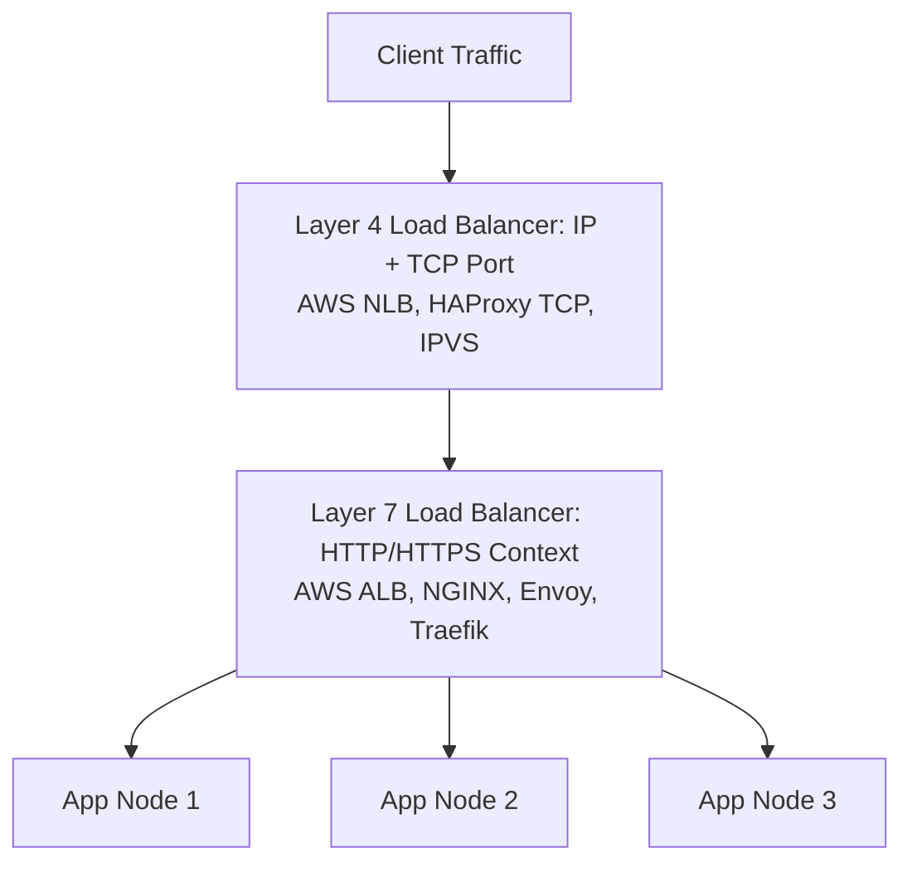
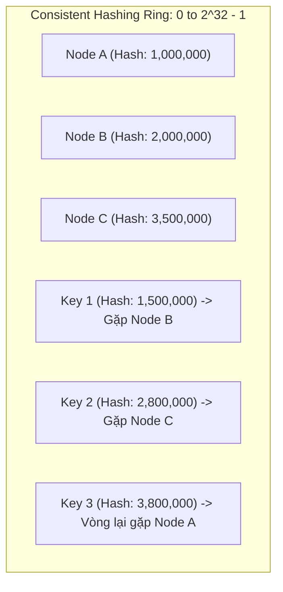

# Load Balancing & Consistent Hashing

Load Balancing (Cân bằng tải) là kỹ thuật phân phối lưu lượng truy cập mạng hoặc ứng dụng trên một nhóm máy chủ phía sau (Server Pool / Farm) nhằm tối đa hóa thông lượng, giảm thiểu độ trễ, tối ưu việc sử dụng tài nguyên và tránh làm quá tải bất kỳ máy chủ đơn lẻ nào.

---

## 1. Phân Tầng Cân Bằng Tải: L4 vs L7

### 1.1 Layer 4 Load Balancing (Transport Layer)
- Hoạt động tại tầng vận chuyển của mô hình OSI (TCP / UDP).
- **Cơ chế**: Không kiểm tra nội dung gói tin ứng dụng; chỉ phân phối dựa trên cặp địa chỉ mạng: `Source IP:Port` và `Destination IP:Port`.
- **Ưu điểm**: Cực nhanh, hiệu năng hàng triệu gói tin/giây với độ trễ micro-giây; không giải mã TLS/SSL.
- **Đại diện**: AWS Network Load Balancer (NLB), HAProxy (chế độ TCP), Linux IPVS.

### 1.2 Layer 7 Load Balancing (Application Layer)
- Hoạt động tại tầng ứng dụng (HTTP / HTTPS / gRPC / WebSockets).
- **Cơ chế**: Giải mã gói tin HTTP, đọc Headers, Cookies, URL Path, Query Parameters để đưa ra quyết định định tuyến thông minh.
- **Tính năng cao cấp**:
  - Path-based routing: `/api/orders` $\rightarrow$ Order Service, `/api/users` $\rightarrow$ User Service.
  - SSL/TLS Termination tại Load Balancer, giải phóng CPU cho App Servers.
  - Rate Limiting, WAF (Web Application Firewall), gRPC streaming routing.
- **Đại diện**: AWS Application Load Balancer (ALB), NGINX, Envoy Proxy, Traefik.

---

## 2. Các Thuật Toán Cân Bằng Tải Cơ Bản

1. **Round Robin**:
   - Gửi tuần tự lần lượt từng request tới từng server trong danh sách: $S_1 \rightarrow S_2 \rightarrow S_3 \rightarrow S_1 \dots$
   - *Hạn chế*: Giả định tất cả server có sức mạnh bằng nhau và mọi request tiêu tốn CPU/RAM ngang nhau (thực tế hiếm khi đúng).
2. **Weighted Round Robin**:
   - Gán trọng số (*Weight*) theo năng lực phần cứng. Server mạnh nhận nhiều request hơn (ví dụ: Node A weight 3 nhận 3 request, Node B weight 1 nhận 1 request).
3. **Least Connections**:
   - Định tuyến request mới đến server hiện đang có ít kết nối TCP hoạt động nhất.
   - *Lý tưởng*: Các kết nối có thời gian tồn tại dài (Persistent Connections, WebSockets, DB connection pools).
4. **IP Hash**:
   - Tính toán `hash(client_ip) % N` để chọn server. Đảm bảo một client IP luôn được gửi tới cùng một server (Session Affinity).

---

## 3. Vấn Đề Modulo Hashing Khi Scale Cache Server

Giả sử bạn có $N = 4$ cache servers. Mỗi key được lưu tại server:
$$\text{Server Index} = \text{hash}(\text{key}) \pmod N$$

Nếu 1 server bị lỗi hoặc bạn thêm 1 server mới ($N$ đổi từ 4 thành 5):
- Công thức trở thành $\text{hash}(\text{key}) \pmod 5$.
- Gần như **$100\%$ các keys** sẽ bị băm sang vị trí server mới khác hoàn toàn!
- **Hậu quả**: Toàn bộ dữ liệu cache bị miss (*Total Cache Miss*). Hàng triệu request đồng loạt lao thẳng vào Database phía sau gây sập toàn bộ hệ thống (*Database Meltdown*).

---

## 4. Giải Pháp: Consistent Hashing Ring (Vòng Băm Nhất Quán)

Consistent Hashing giải quyết triệt để bài toán này bằng cách ánh xạ cả **Servers** và **Keys** lên cùng một không gian băm hình tròn (thường là từ $0$ đến $2^{32} - 1$).

### 4.1 Cơ Chế Hoạt Động
1. Băm địa chỉ IP / ID của các server lên vòng tròn.
2. Khi cần lưu hoặc đọc một `key`, tính `hash(key)`.
3. Đi theo chiều kim đồng hồ (*Clockwise*) trên vòng tròn băm; server đầu tiên gặp được chính là server phụ trách lưu trữ key đó.
4. **Khi thêm một server mới**: Chỉ những key nằm giữa server mới và server liền kề phía trước bị chuyển giao; trung bình chỉ có $\frac{K}{N}$ keys bị di dời thay vì $100\%$.

### 4.2 Kỹ Thuật Virtual Nodes (vnodes)
- **Vấn đề Non-uniform Distribution**: Nếu chỉ có 3 server vật lý, khoảng cách giữa các node trên vòng tròn có thể rất chênh lệch, khiến 1 node gánh $70\%$ dữ liệu (*Hotspotting*).
- **Giải pháp Virtual Nodes**: Mỗi server vật lý được băm thành $100 - 300$ vị trí ảo trên vòng tròn (ví dụ: `NodeA#1`, `NodeA#2`, ..., `NodeA#200`).
- **Lợi ích**:
  - Dữ liệu được phân bổ đồng đều tuyệt đối quanh vòng tròn.
  - Khi một node vật lý chết, tải của nó được chia đều cho tất cả các node còn lại thay vì dồn hết vào 1 node láng giềng.
