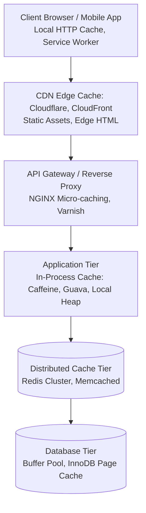

# Caching Layers & Topologies

Một hệ thống phân tán chịu tải lớn không dựa vào một vị trí cache duy nhất, mà thiết lập một chuỗi các tầng đệm (Multi-tier Caching Architecture) từ rìa client đến sâu trong lõi cơ sở dữ liệu.

---

## 1. Toàn Cảnh Chuỗi Các Tầng Caching

### 1.1 Tầng 1: Client / Browser Cache
- **Cơ chế**: Dựa trên các HTTP Headers tiêu chuẩn:
  - `Cache-Control: public, max-age=31536000, immutable` (Dành cho static bundles có hash trong tên file).
  - `ETag` (Entity Tag) và `If-None-Match`: Kiểm tra tính toàn vẹn của resource; nếu không đổi, server trả về `304 Not Modified` với payload 0 byte.
- **Độ trễ**: $0$ ms (đọc thẳng từ đĩa hoặc RAM máy người dùng).

### 1.2 Tầng 2: Content Delivery Network (CDN) Edge Cache
- **Cơ chế**: Mạng lưới hàng trăm máy chủ PoP (Point of Presence) đặt gần người dùng về mặt địa lý (Cloudflare, AWS CloudFront, Fastly).
- **Phù hợp với**: Hình ảnh, video chunks, CSS, JavaScript, và cả các API JSON phản hồi chung (ví dụ: danh mục sản phẩm, bảng giá chứng khoán chậm 1 giây).
- **Độ trễ**: $5 - 20$ ms.

### 1.3 Tầng 3: API Gateway / Reverse Proxy Cache
- **Cơ chế**: NGINX / Varnish lưu kết quả của các endpoint HTTP có tần suất gọi cao trong bộ nhớ ngắn hạn (*Micro-caching* - ví dụ: TTL 1 đến 5 giây).
- **Lợi ích**: Bảo vệ tầng ứng dụng khỏi các đợt bùng nổ traffic bất ngờ mà dữ liệu không yêu cầu tính tức thời từng mili-giây.

### 1.4 Tầng 4: In-Process (Local) Application Cache
- **Cơ chế**: Lưu dữ liệu trực tiếp trong heap bộ nhớ của tiến trình ứng dụng (ví dụ: Caffeine / Guava trong Java, `MemoryCache` trong C#/.NET, `lru-cache` trong Node.js).
- **Ưu điểm**: Tốc độ ánh sáng! Truy cập RAM trực tiếp với độ trễ nanosecond ($< 1 \mu\text{s}$), không tốn chi phí tuần tự hóa (Serialization/Deserialization) và không tốn độ trễ mạng.
- **Nhược điểm**: Mỗi máy chủ có một bản cache riêng; dễ dẫn đến hiện tượng dữ liệu không đồng nhất giữa các node (*Inconsistent State*); tốn RAM ứng dụng.

### 1.5 Tầng 5: Distributed Cache (Redis Cluster / Memcached)
- **Cơ chế**: Một cụm máy chủ chuyên dụng lưu trữ Key-Value trên RAM dùng chung cho toàn bộ các App Servers.
- **Ưu điểm**:
  - Dữ liệu tập trung, nhất quán tuyệt đối giữa hàng trăm app servers.
  - Hỗ trợ các cấu trúc dữ liệu phong phú (Redis Hashes, Sets, Sorted Sets, Bitmaps, HyperLogLog).
  - Khả năng sống sót độc lập khi app servers scale up/down hoặc reboot.
- **Độ trễ**: $0.5 - 2$ ms (chủ yếu là độ trễ mạng TCP nội bộ VPC).

---

## 2. In-Process Cache vs Distributed Cache: Bảng Đánh Đổi

| Tiêu Chí | In-Process (Local Cache) | Distributed (Redis / Memcached) |
| :--- | :--- | :--- |
| **Độ Trễ (Latency)** | Cực thấp ($< 1 \mu\text{s}$ nanoseconds) | Thấp ($0.5 - 2 \text{ms}$ network hop) |
| **Tính Nhất Quán Giữa Các Node** | Thấp (Mỗi node giữ một giá trị khác nhau) | Rất cao (Tất cả node đọc từ một cụm chung) |
| **Khả Năng Chia Sẻ Dữ Liệu** | Không thể (bị cô lập trong tiến trình) | Toàn vẹn (chia sẻ giữa mọi microservices) |
| **Tác Động Lên RAM Ứng Dụng** | Tranh chấp RAM với GC / Process | Độc lập hoàn toàn trên cụm riêng |
| **Hành Vi Khi App Server Crash** | Toàn bộ cache cục bộ mất trắng | Cache vẫn an toàn và phục vụ các node khác |
| **Kịch Bản Sử Dụng Lý Tưởng** | Dữ liệu cấu hình tĩnh, JWT public keys | Session users, giỏ hàng, bảng xếp hạng, rate limiter |
