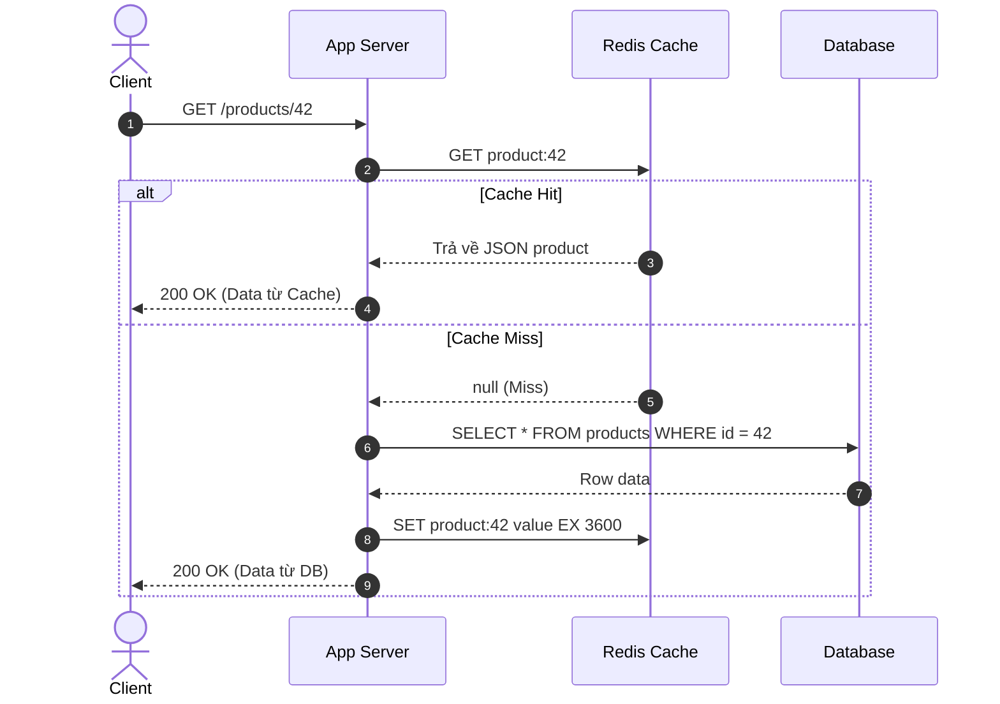
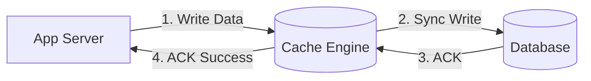

# Caching Strategies & Patterns

Chiến lược đọc và ghi dữ liệu qua bộ nhớ đệm quyết định trực tiếp đến **tính nhất quán (Data Consistency)** và **độ trễ (Latency)** của hệ thống.

---

## 1. Cache-Aside Pattern (Lazy Loading)

Đây là chiến lược phổ biến nhất trong các ứng dụng web hướng dịch vụ. Ứng dụng chịu trách nhiệm trực tiếp trong việc điều phối giao tiếp giữa Cache và Database.



### 1.1 Chiến Lược Ghi Trong Cache-Aside
Khi dữ liệu thay đổi (ví dụ: người dùng cập nhật thông tin sản phẩm):
- **Quy tắc vàng**: **Ghi DB trước, sau đó XÓA (Invalidate) key trong Cache**.
- *Tại sao xóa cache mà không ghi đè giá trị mới vào cache?*:
  1. Tránh ghi vô ích nếu dữ liệu đó ít khi được đọc lại (*Cache Churn*).
  2. Tránh Race Condition: Nếu 2 request cùng ghi vào DB, thứ tự ghi đè vào cache có thể bị đảo lộn, khiến cache lưu giá trị cũ vĩnh viễn.

---

## 2. Read-Through & Write-Through Patterns

Trong các pattern này, ứng dụng coi tầng Cache như một "Cơ sở dữ liệu chính". Thư viện cache hoặc plugin trung gian sẽ tự động tương tác với cơ sở dữ liệu bên dưới.

### 2.1 Read-Through Pattern
- Ứng dụng chỉ gọi: `cache.get(key)`.
- Nếu có dữ liệu (*Hit*): Trả về ngay.
- Nếu không có (*Miss*): Cache provider tự động kích hoạt hàm nạp dữ liệu từ DB, lưu vào cache rồi mới trả về cho ứng dụng.

### 2.2 Write-Through Pattern
Ứng dụng ghi dữ liệu vào Cache. Cache provider thực hiện ghi **đồng bộ (Synchronously)** vào Database trước khi báo thành công cho ứng dụng.



- **Ưu điểm**: Dữ liệu trong Cache và DB luôn nhất quán $100\%$; không bao giờ bị stale data.
- **Nhược điểm**: Độ trễ thao tác ghi cao vì phải chờ cả 2 thao tác I/O hoàn thành.

---

## 3. Write-Behind Pattern (Write-Back)

Trong Write-Behind, ứng dụng ghi trực tiếp vào Cache và nhận được phản hồi thành công **ngay lập tức**. Sau đó, một tiến trình nền trong Cache sẽ bất đồng bộ (Asynchronously) gom nhóm các bản ghi thành các lô (*Batches*) rồi mới xả xuống Database.

```mermaid
graph LR
    App[App Server] -->|1. Fast Write In-Memory| Cache[(Cache Engine)]
    Cache -- 2. Immediate ACK --> App
    Cache -.->|3. Async Batch Flush (e.g. every 5s)| DB[(Database)]
```

### 3.1 Ưu Điểm Tuyệt Đối
- **Tốc độ ghi siêu thanh (Ultra-low Write Latency)**: Tốc độ ghi bằng tốc độ RAM (vài micro-giây).
- **Giảm tải Database khổng lồ (Write Coalescing)**: Nếu một bài viết được cập nhật 1,000 lượt xem trong 1 giây, Cache chỉ cần gom lại thành 1 câu lệnh `UPDATE post SET views = views + 1000` xuống DB thay vì 1,000 câu lệnh đơn lẻ.

### 3.2 Nhược Điểm Chí Tử
- **Rủi Ro Mất Dữ Liệu (Data Loss)**: Nếu máy chủ Cache gặp sự cố mất điện hoặc crash trước khi kịp flush dữ liệu xuống DB, toàn bộ dữ liệu mới ghi trong RAM sẽ mất vĩnh viễn!

---

## 4. Ma Trận Đánh Giá So Sánh

| Chiến Lược | Độ Trễ Đọc (Read) | Độ Trễ Ghi (Write) | Tính Nhất Quán Dữ Liệu | Nguy Cơ Mất Dữ Liệu |
| :--- | :--- | :--- | :--- | :--- |
| **Cache-Aside** | Thấp (khi Hit) / Cao (khi Miss) | Trung bình (ghi DB + xóa Cache) | Eventual (có thể stale nếu TTL dài) | Không |
| **Read-Through** | Thấp (trong suốt) | N/A | Cao | Không |
| **Write-Through** | Rất thấp (luôn có sẵn) | Cao (chờ cả Cache + DB) | Rất cao (đồng bộ tuyệt đối) | Không |
| **Write-Behind** | Cực thấp | Cực thấp (ghi RAM) | Tạm thời lệch pha (Eventual) | **Rất cao khi crash** |
