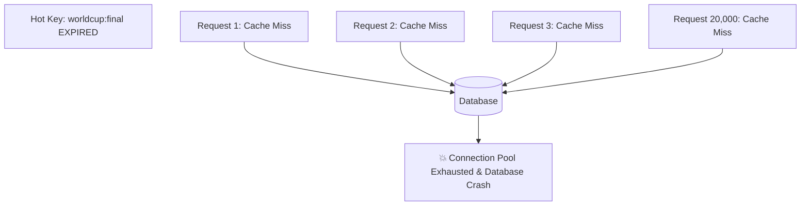

# Cache Invalidation & System Anomalies

Quản lý bộ nhớ đệm trong môi trường tải cao (hàng trăm nghìn request/giây) luôn tiềm ẩn những thảm họa hiệu năng kinh điển nếu không được thiết kế phòng thủ.

---

## 1. Cache Stampede / Thundering Herd (Bầy Thú Dẫm Đạp)

### 1.1 Hiện Tượng
Một key có lưu lượng truy cập cực lớn (Hot Key - ví dụ: bảng tỉ số trận chung kết World Cup) hết hạn (Expired). Tại chính thời điểm mili-giây đó, 20,000 requests đồng thời nhận thấy Cache Miss. Cả 20,000 requests cùng lúc lao thẳng xuống Database để truy vấn và tính toán dữ liệu, dẫn đến cạn kiệt Connection Pool của Database, CPU đạt $100\%$ và toàn bộ hệ thống sụp đổ.



### 1.2 Giải Pháp 1: Distributed Mutex Locking (`SETNX`)
Chỉ cho phép **1 request duy nhất** được quyền truy vấn Database để nạp lại cache; các request khác phải chờ hoặc nhận kết quả cũ tạm thời:

```javascript
async function getProductWithMutex(productId) {
  let val = await redis.get(`product:${productId}`);
  if (val) return JSON.parse(val);

  const lockKey = `lock:product:${productId}`;
  // Cố gắng chiếm khóa với TTL 5 giây (tránh deadlock nếu tiến trình chết)
  const acquired = await redis.set(lockKey, '1', 'NX', 'EX', 5);

  if (acquired) {
    try {
      val = await db.queryProduct(productId);
      await redis.set(`product:${productId}`, JSON.stringify(val), 'EX', 3600);
      return val;
    } finally {
      await redis.del(lockKey); // Giải phóng khóa
    }
  } else {
    // Không chiếm được khóa: Chờ 50ms rồi thử lại từ cache
    await sleep(50);
    return getProductWithMutex(productId);
  }
}
```

### 1.3 Giải Pháp 2: Probabilistic Early Expiration (Thuật Toán XFetch)
Thay vì chờ key hết hạn tuyệt đối mới nạp lại, thuật toán tự động tính toán xác suất để nạp lại key trước khi nó thực sự hết hạn dựa trên thời gian tính toán của DB và tải hiện tại:
$$\text{Recompute if: } -\beta \times \delta \times \ln(\text{rand}()) > \text{Remaining TTL}$$
(Trong đó $\delta$ là thời gian query DB, $\beta > 0$ là hệ số điều chỉnh).

---

## 2. Cache Penetration (Xuyên Thủng Cache)

### 2.1 Hiện Tượng
Kẻ tấn công cố tình gửi hàng triệu request truy vấn các ID không hề tồn tại trong hệ thống (ví dụ: `GET /users/-999999` hoặc mã băm ngẫu nhiên).
- Vì ID không tồn tại $\rightarrow$ Cache luôn bị Miss.
- Hệ thống luôn phải chạy câu lệnh `SELECT * FROM users WHERE id = -999999` xuống DB.
- Tầng Cache hoàn toàn vô tác dụng; Database bị quá tải bởi các truy vấn vô nghĩa.

### 2.2 Giải Pháp
1. **Cache Null / Empty Values**: Khi DB trả về kết quả rỗng, hãy lưu vào Cache giá trị `null` hoặc `{}` kèm một TTL rất ngắn (ví dụ: 60 giây).
2. **Bloom Filter (Bộ Lọc Bloom)**:
   - Đặt một Bloom Filter ở rìa trước tầng Cache.
   - Bloom Filter là một cấu trúc dữ liệu xác suất (Probabilistic Data Structure) sử dụng mảng bit và nhiều hàm băm.
   - **Tính chất**:
     - Nếu Bloom Filter trả lời **"KHÔNG"**: Chắc chắn $100\%$ phần tử đó không tồn tại trong DB $\rightarrow$ Chặn ngay lập tức, không cho gọi xuống Cache hay DB!
     - Nếu Bloom Filter trả lời **"CÓ"**: Khả năng cao phần tử tồn tại (chấp nhận tỷ lệ dương tính giả - False Positive cực nhỏ, ví dụ $< 0.1\%$).

---

## 3. Cache Avalanche (Tuyết Lở Cache)

### 3.1 Hiện Tượng
Hệ thống thiết lập một thời gian sống mặc định (ví dụ: tất cả keys đều có TTL là 2 giờ, hoặc tất cả đều hết hạn vào đúng 00:00 đêm).
- Khi tới thời điểm đó, hàng triệu keys trong Cache đồng loạt biến mất.
- Toàn bộ lưu lượng truy cập của cả hệ sinh thái dội thẳng vào Database như một trận tuyết lở.

### 3.2 Giải Pháp: TTL Jitter (Làm Nhiễu Thời Gian Sống)
Không bao giờ sử dụng một giá trị TTL cố định cho các keys được nạp hàng loạt. Luôn cộng thêm một giá trị ngẫu nhiên (*Random Jitter*):

$$\text{Effective TTL} = \text{Base TTL} + \text{random}(0, \text{Max Jitter})$$

*Ví dụ*: Nếu Base TTL là 3600 giây (1 giờ), ta cộng thêm `random(0, 300)` giây. Các keys sẽ phân rã rải rác trong khoảng thời gian từ 60 đến 65 phút, triệt tiêu hoàn toàn đỉnh nhọn của tải Database.
