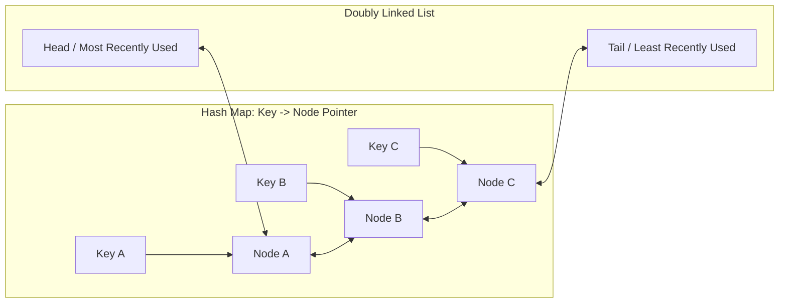

# Cache Eviction Policies: LRU, LFU, FIFO & ARC

Khi bộ nhớ RAM được cấp phát cho Cache đạt ngưỡng dung lượng tối đa (ví dụ: `maxmemory 16gb` trong Redis), Cache Engine bắt buộc phải chọn và loại bỏ (*Evict*) một số dữ liệu cũ để nhường chỗ cho dữ liệu mới.

---

## 1. Least Recently Used (LRU - Ít Được Dùng Gần Đây Nhất)

### 1.1 Nguyên Lý
Loại bỏ phần tử có thời gian kể từ lần truy cập cuối cùng (*Access Time*) là xa nhất trong quá khứ. Giả định: Dữ liệu vừa được đọc/ghi sẽ có xác suất cao được đọc lại trong tương lai gần (*Temporal Locality*).

### 1.2 Cấu Trúc Dữ Liệu Đạt $O(1)$ Cho Cả Read và Write
Một triển khai LRU chuẩn xác $O(1)$ kết hợp giữa **Doubly Linked List (Danh sách liên kết đôi)** và **Hash Map**:

- **Thao tác Đọc (`get(key)`)**:
  1. Tra cứu con trỏ Node trong Hash Map: $O(1)$.
  2. Gỡ Node ra khỏi vị trí hiện tại trong Doubly Linked List và chuyển lên đầu danh sách (*Head*): $O(1)$.
- **Thao tác Ghi (`put(key, value)`)**:
  1. Nếu key đã có: Cập nhật giá trị và chuyển lên đầu (*Head*).
  2. Nếu key mới: Thêm Node mới vào đầu danh sách (*Head*), lưu con trỏ vào Hash Map.
  3. Nếu danh sách vượt quá dung lượng (*Capacity*): Cắt bỏ Node ở cuối danh sách (*Tail* - chính là phần tử cũ nhất) và xóa khỏi Hash Map: $O(1)$.

---

## 2. Least Frequently Used (LFU - Ít Thường Xuyên Được Dùng Nhất)

### 2.1 Nguyên Lý
Đếm số lần một phần tử được truy cập (*Access Frequency Count*). Khi bộ nhớ đầy, phần tử có tần suất truy cập thấp nhất sẽ bị đào thải.

### 2.2 Vấn Đề "Cổ Vật Lịch Sử" (Frequency Starvation & Cache Pollution)
- Một video hot bất ngờ nhận 100,000 lượt xem trong 1 giờ.
- Sau đó nội dung này hoàn toàn nguội lạnh và không ai xem nữa.
- Vì tần suất của nó là 100,000, nó sẽ nằm lì trong RAM suốt nhiều tuần liền và không thể bị đuổi ra ngoài, ngăn cản các nội dung mới có giá trị hơn được nạp vào cache.
- **Giải pháp**: Kỹ thuật **Logarithmic Decay (Phân rã theo thời gian)**: Cứ sau mỗi chu kỳ $T$, bộ đếm tần suất của toàn bộ các phần tử sẽ bị giảm đi một nửa hoặc trừ dần.

---

## 3. Các Chính Sách Khác: FIFO & ARC

### 3.1 FIFO (First-In, First-Out)
- Phần tử nào vào trước thì bị đẩy ra trước, bất kể nó được truy cập thường xuyên hay gần đây đến mức nào.
- Đơn giản trong cài đặt (dùng Queue đơn thuần), nhưng tỷ lệ Cache Miss rất cao trong thực tế.

### 3.2 ARC (Adaptive Replacement Cache)
- Phát minh bởi IBM. Là thuật toán tự động cân bằng động giữa **LRU** (Tính cục bộ thời gian - Recency) và **LFU** (Tính cục bộ tần suất - Frequency).
- Sử dụng hai danh sách kép và hai danh sách bóng (Ghost Lists) để tự điều chỉnh tỷ trọng giữa độ mới và tần suất theo hành vi thực tế của luồng dữ liệu.

---

## 4. Bảng So Sánh Các Chính Sách Eviction

| Thuật Toán | Độ Phức Tạp | Ưu Điểm | Nhược Điểm | Phù Hợp Kịch Bản |
| :--- | :--- | :--- | :--- | :--- |
| **LRU** | $O(1)$ | Đơn giản, tự nhiên, thích ứng nhanh với xu hướng mới | Dễ bị quét sạch bởi một batch query lớn một lần (Scan Pollution) | Web sessions, feed mạng xã hội, e-commerce products |
| **LFU** | $O(1)$ hoặc $O(\log N)$ | Giữ lại các hot keys ổn định theo thời gian dài | Bị kẹt dữ liệu cũ nếu không có cơ chế decay | Video streaming catalogs, top bảng xếp hạng |
| **FIFO** | $O(1)$ | Cực kỳ nhẹ nhàng, không cần cập nhật metadata khi đọc | Hiệu quả thấp, đuổi nhầm các keys quan trọng | Pipeline xử lý hàng đợi tuần tự |
| **ARC** | $O(1)$ | Hiệu năng vượt trội cả LRU và LFU, tự điều chỉnh | Bản quyền bằng sáng chế và logic cài đặt phức tạp | Các hệ thống lưu trữ cấp kernel (ZFS) |
