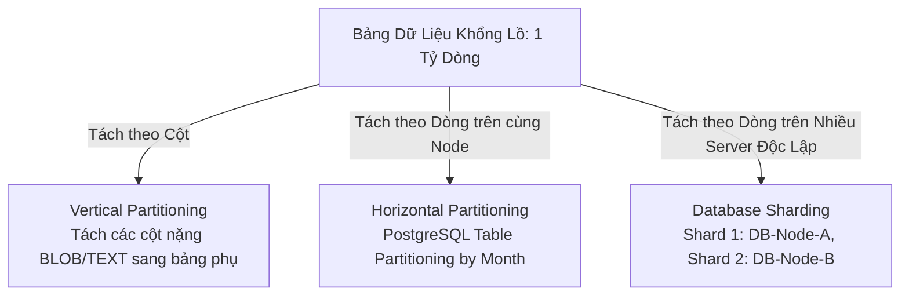

# Database Sharding & Partitioning

Khi dung lượng bảng cơ sở dữ liệu phình to vượt quá hàng tỷ dòng hoặc thông lượng ghi (Write Throughput) làm nghẽn I/O đĩa cứng của Master node, việc phân chia dữ liệu sang nhiều node độc lập là điều bắt buộc.

---

## 1. Phân Biệt Các Khái Niệm Phân Vùng

- **Vertical Partitioning**: Tách các cột ít dùng hoặc dung lượng lớn (ví dụ: `user_profile_bio`, `avatar_blob`) sang bảng khác để giữ bảng chính (`users`: `id`, `email`, `password_hash`) nhỏ gọn, vừa vặn trong RAM Buffer Pool.
- **Horizontal Partitioning (Cục bộ)**: Tách các dòng của cùng một bảng thành nhiều partition vật lý trên cùng 1 server (ví dụ: partition theo tháng).
- **Database Sharding**: Phân chia các dòng dữ liệu sang nhiều **máy chủ cơ sở dữ liệu vật lý riêng biệt** (mỗi máy chủ được gọi là một *Shard*). Mỗi Shard là một Database độc lập.

---

## 2. Các Chiến Lược Chọn Sharding Key

Sharding Key là một hoặc nhiều cột trong bảng dùng để quyết định dòng dữ liệu đó sẽ được lưu trữ tại Shard nào.

### 2.1 Range-Based Sharding (Phân Mảnh Theo Dải)
- Dữ liệu được chia theo khoảng giá trị liên tục (ví dụ: User ID từ 1 đến 1,000,000 ở Shard 1; 1,000,001 đến 2,000,000 ở Shard 2; hoặc chia theo chữ cái A-C, D-F).
- **Ưu điểm**: Dễ hiểu; truy vấn theo khoảng (`SELECT * WHERE user_id BETWEEN 100 AND 500`) cực kỳ nhanh vì chỉ cần đọc đúng Shard 1.
- **Nhược điểm chí tử**: **Write Hotspotting**! Nếu dùng Auto-increment ID hoặc Timestamp, toàn bộ các bản ghi mới ghi đều dồn vào Shard cuối cùng, làm Shard đó quá tải trong khi các Shard cũ nhàn rỗi.

### 2.2 Hash-Based Sharding (Phân Mảnh Theo Băm)
- Áp dụng hàm băm (MD5, MurmurHash, CRC32) lên Sharding Key:
$$\text{Shard Index} = \text{hash}(\text{sharding\_key}) \pmod N$$
- **Ưu điểm**: Dữ liệu và tải ghi được phân bổ hoàn hảo, đồng đều tuyệt đối giữa các Shards.
- **Nhược điểm**:
  - Truy vấn theo khoảng (`BETWEEN`) buộc phải quét toàn bộ các Shards (*Scatter-Gather Query*).
  - Khó thay đổi số lượng Shard nếu không dùng Consistent Hashing.

### 2.3 Directory-Based Sharding (Phân Mảnh Theo Thư Mục Tra Cứu)
- Một dịch vụ tra cứu trung tâm (Lookup Service) giữ bản đồ: `entity_id -> shard_id`.
- **Ưu điểm**: Rất linh hoạt; có thể di dời một khách hàng lớn (VIP / Celebrity) sang một Shard chuyên dụng mà không ảnh hưởng người khác.
- **Nhược điểm**: Dịch vụ tra cứu trở thành điểm nghẽn hiệu năng và điểm chết đơn lẻ (SPOF); thêm 1 network hop cho mỗi truy vấn.

---

## 3. Những "Nỗi Đau" Khi Sharding Hệ Thống

1. **Cross-Shard Joins**:
   - Khi hai bảng nằm ở hai Shard vật lý khác nhau, database engine không thể thực hiện phép `JOIN`.
   - **Giải pháp**:
     - *Denormalization*: Nhân bản thêm dữ liệu vào bảng con để tránh join.
     - Thực hiện ghép dữ liệu tại tầng ứng dụng (Application-level join).
2. **Celebrity Problem (Điểm Nóng Người Nổi Tiếng)**:
   - Nếu Sharding theo `user_id`, tài khoản của Taylor Swift hoặc Elon Musk với hàng chục triệu người theo dõi sẽ khiến Shard chứa tài khoản đó bị nghẽn lưu lượng (*Hotspot*).
   - **Giải pháp**: Kết hợp Sharding Key phức hợp (Compound Key: `user_id + hash(post_id) % 10`).
3. **Re-sharding**:
   - Khi dữ liệu vượt quá dung lượng của cụm hiện tại, việc tăng từ 8 shards lên 16 shards đòi hỏi di dời hàng Terabytes dữ liệu mà không được gây downtime.
