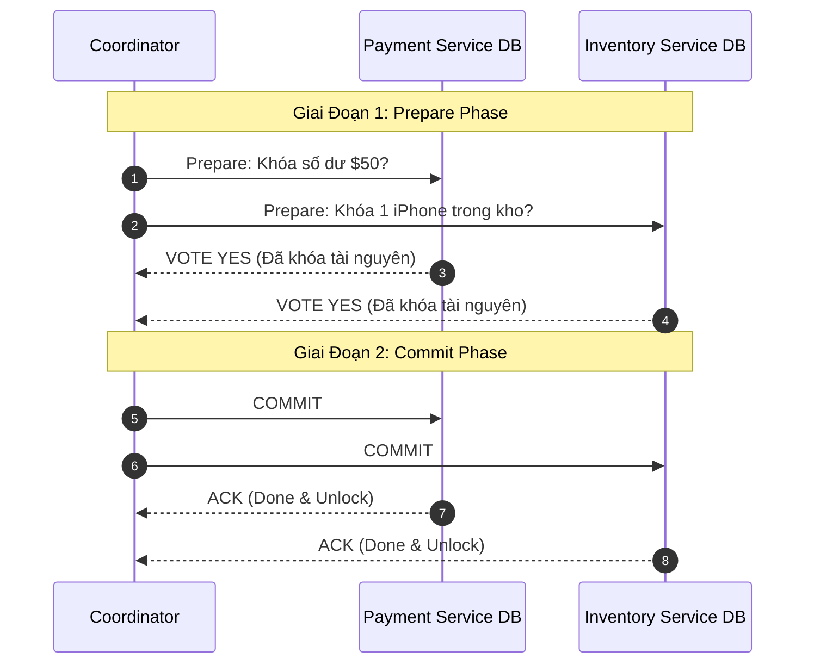
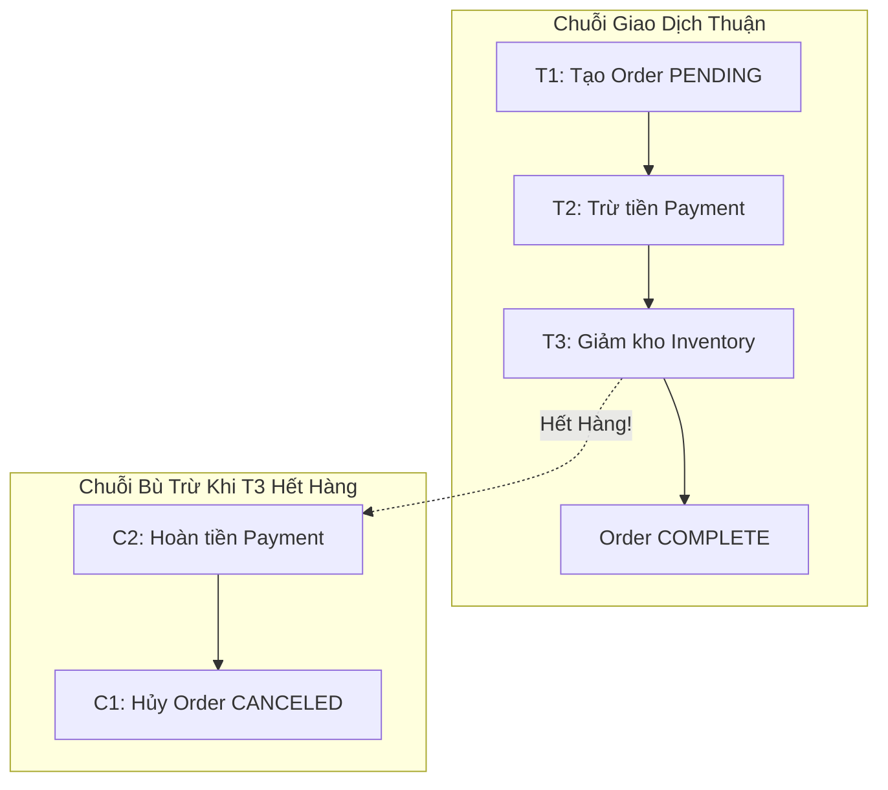

# Distributed Transactions: 2PC vs Saga Pattern

Trong kiến trúc Microservices, mỗi dịch vụ sở hữu cơ sở dữ liệu riêng biệt (*Database-per-Service*). Một nghiệp vụ kinh doanh (ví dụ: Đặt hàng = Trừ tiền ví + Giảm kho + Tạo hóa đơn) đòi hỏi cập nhật nhiều cơ sở dữ liệu phân tán một cách nguyên tử (All-or-Nothing).

---

## 1. Two-Phase Commit (2PC)

2PC là giao thức đồng thuận đảm bảo tính toàn vẹn ACID cổ điển trên nhiều cơ sở dữ liệu, do một tiến trình Điều phối viên (*Coordinator*) dẫn dắt.

### Điểm Nghẽn Chí Mạng Của 2PC
1. **Khóa Chặn Đồng Bộ (Synchronous Blocking Locks)**: Tài nguyên bị khóa suốt từ đầu Prepare cho đến khi Commit hoàn tất. Khi có hàng nghìn giao dịch, hàng đợi khóa gây nghẽn toàn bộ hệ thống (*Lock Contention*).
2. **Coordinator Là Điểm Chết Đơn Lẻ (Single Point of Failure)**: Nếu Coordinator bị crash ở giữa Giai đoạn 1 và Giai đoạn 2, các bên tham gia (Participants) sẽ rơi vào tình trạng lơ lửng (*In-Doubt State*), tài nguyên bị khóa vĩnh viễn và không bên nào dám tự ý rollback hay commit.
3. **Không phù hợp với Microservices trên Cloud**: 2PC vi phạm nguyên tắc lỏng lẻo (Loose Coupling) và làm giảm tính sẵn sàng nghiêm trọng theo CAP theorem.

---

## 2. Saga Pattern (Mô Hình Saga)

Saga giải quyết bài toán giao dịch phân tán bằng cách chia một giao dịch lớn thành một **chuỗi các giao dịch cục bộ độc lập (Local Transactions)**. Mỗi giao dịch cục bộ cập nhật database của chính dịch vụ đó và phát ra một sự kiện (Event).

Nếu một bước trong chuỗi thất bại, Saga sẽ thực thi một chuỗi các **Giao Dịch Bù Trừ (Compensating Transactions)** theo thứ tự đảo ngược để hoàn tác các thay đổi đã thực hiện trước đó.

### 2.1 Hai Cơ Chế Điều Phối Saga

#### A. Saga Choreography (Vũ Đạo Phân Tán)
- Không có nhạc trưởng trung tâm. Các dịch vụ giao tiếp hoàn toàn qua Event Bus (Kafka / RabbitMQ).
- Payment Service nghe sự kiện `OrderCreated` $\rightarrow$ Trừ tiền $\rightarrow$ Bắn sự kiện `PaymentProcessed`.
- Inventory Service nghe sự kiện `PaymentProcessed` $\rightarrow$ Trừ kho.
- *Nhược điểm*: Khó theo dõi luồng nghiệp vụ khi hệ thống có hàng chục dịch vụ (Spaghetti Architecture).

#### B. Saga Orchestration (Nhạc Trưởng Trung Tâm)
- Một dịch vụ Điều Phối (Saga Orchestrator - ví dụ sử dụng AWS Step Functions, Temporal, Camunda) lưu giữ một Máy Trạng Thái (State Machine).
- Orchestrator gửi lệnh trực tiếp tới từng dịch vụ qua gRPC/REST và lắng nghe phản hồi để quyết định bước tiếp theo hoặc kích hoạt rollback bù trừ.
- *Ưu điểm*: Luồng nghiệp vụ minh bạch, dễ audit, xử lý lỗi và timeout tập trung.

---

## 3. Bảng So Sánh 2PC vs Saga

| Đặc Điểm | Two-Phase Commit (2PC) | Saga Pattern |
| :--- | :--- | :--- |
| **Tính Nhất Quán** | Nhất quán mạnh (Strong Consistency / ACID) | Nhất quán cuối cùng (Eventual Consistency / BASE) |
| **Cơ Chế Khóa** | Giữ khóa tài nguyên trên toàn bộ DB suốt giao dịch | Không khóa chéo; chỉ khóa trong từng local transaction |
| **Hiệu Năng & Thông Lượng** | Kém khi có nhiều node | Rất cao (xử lý bất đồng bộ, không nghẽn) |
| **Cơ Chế Rollback** | Tự động rollback qua Transaction Log của DB | Bắt buộc phải viết code nghiệp vụ bù trừ (Compensating) |
| **Khả Năng Cách Ly (Isolation)** | Hoàn hảo | Thấp (Dữ liệu tạm thời có thể bị lộ cho các request khác) |
