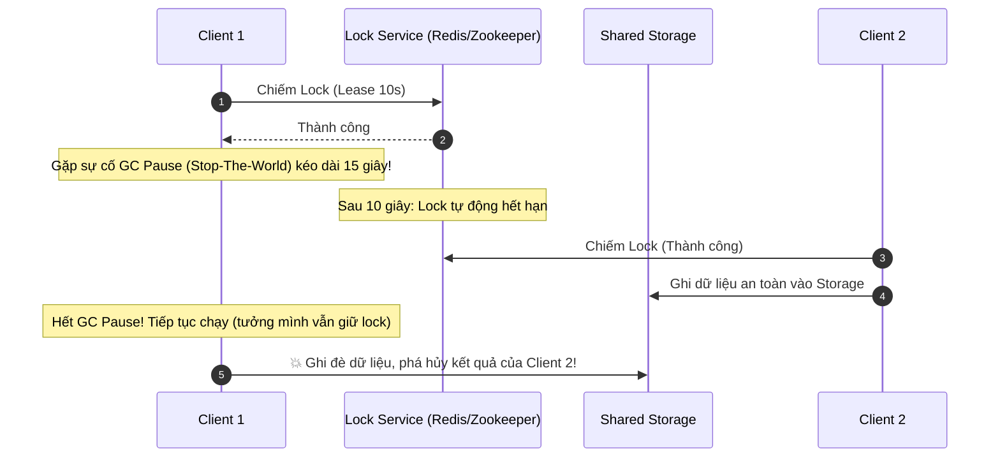

# Distributed Locking & Consensus: Redlock, Fencing & Raft

Trong hệ thống phân tán, khi nhiều máy chủ cùng muốn thực hiện một tác vụ độc quyền (ví dụ: chỉ 1 cron job được gửi email hóa đơn hàng tháng, hoặc chỉ 1 node được ghi vào file lưu trữ chung), chúng ta cần một cơ chế **Khóa Phân Tán (Distributed Lock)**.

---

## 1. Khóa Phân Tán Bằng Redis: Lệnh Đơn Lẻ vs Thuật Toán Redlock

### 1.1 Khóa Đơn Node Bằng Redis `SET key value NX PX`
```bash
SET lock:invoice_cron "random_uuid_client_A" NX PX 10000
```
- `NX`: Chỉ thiết lập nếu key chưa tồn tại.
- `PX 10000`: Hết hạn (TTL) sau 10,000 mili-giây (Tránh deadlock nếu tiến trình chết đột ngột).
- `random_uuid_client_A`: Đảm bảo chỉ client tạo khóa mới có quyền giải phóng khóa (dùng Lua script so sánh giá trị trước khi `DEL`).

### 1.2 Thuật Toán Redlock (Salvatore Sanfilippo)
Khi Redis chạy ở dạng cụm Multi-Master (gồm $N = 5$ node độc lập không nhân bản):
1. Client ghi nhận thời gian bắt đầu $T_1$.
2. Cố gắng chiếm khóa trên lần lượt cả 5 node bằng cùng một key và random token.
3. Nếu client chiếm được khóa trên **quá bán** ($M = \lfloor N/2 \rfloor + 1 = 3/5$ nodes) và thời gian thực thi nhỏ hơn TTL của lock, client được coi là đã chiếm khóa thành công.

---

## 2. Lỗ Hổng Của Lock Lease & Giải Pháp Fencing Tokens (Martin Kleppmann)

Martin Kleppmann (Tác giả cuốn sách kinh điển *Designing Data-Intensive Applications*) đã chỉ ra điểm yếu chí tử của mọi hệ thống khóa dựa trên thời gian (Time-based Leases):



### Giải Pháp Triệt Để: Fencing Tokens (Mã Rào Chắn)
Mỗi lần cấp phát khóa thành công, Lock Service trả về kèm một số nguyên tăng dần đơn điệu (*Monotonically Increasing Token*):
- Client 1 nhận token: `Token = 33`.
- Client 2 nhận token: `Token = 34`.
- Shared Storage chỉ chấp nhận các thao tác ghi có `Token > Highest_Token_Seen`.
- Khi Client 1 tỉnh dậy sau GC Pause và gửi request với `Token = 33`, Storage lập tức từ chối vì đã ghi nhận thao tác của `Token = 34` trước đó!

---

## 3. Thuật Toán Đồng Thuận Consensus: Raft & Paxos

Để duy trì một trạng thái thống nhất tuyệt đối giữa một cụm máy chủ mà không bị chia cắt não (*Split-Brain*), các hệ thống phân tán hàng đầu (etcd, ZooKeeper, CockroachDB, Kafka KRaft) sử dụng các thuật toán Đồng thuận phân tán (Consensus Algorithms).

### 3.1 Ba Trạng Thái Trong Raft
1. **Leader**: Tiếp nhận mọi yêu cầu ghi từ client, ghi vào Log, phát lệnh AppendEntries tới các Follower.
2. **Follower**: Lắng nghe và sao chép Log từ Leader. Nếu không nhận được Heartbeat trong khoảng thời gian ngẫu nhiên (*Election Timeout 150-300ms*), Follower chuyển thành Candidate.
3. **Candidate**: Tự tăng `term` và gửi yêu cầu bỏ phiếu (RequestVote) tới các node khác để bầu Leader mới.

### 3.2 Quy Tắc Quorum Quá Bán (Majority)
Một cụm $N$ nodes có thể chịu được tối đa $\lfloor (N-1)/2 \rfloor$ nodes bị chết:
- Cụm 3 nodes: Chịu được 1 node chết (Quorum = 2).
- Cụm 5 nodes: Chịu được 2 nodes chết (Quorum = 3).
- **Luôn chọn số lượng node lẻ (Odd Numbers)** để tránh tình trạng hòa phiếu trong các cuộc bầu cử.
