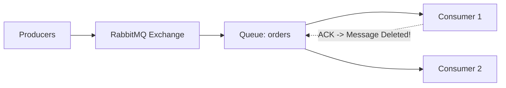
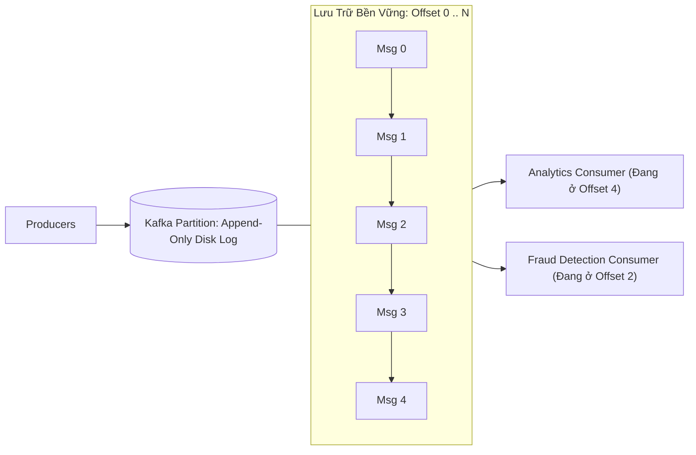

# Message Queues vs Event Streams

Hai giải pháp nền tảng cho kiến trúc bất đồng bộ là **Message Queues (Hàng đợi tin nhắn)** và **Event Streams (Luồng sự kiện phân tán)**. Việc hiểu rõ sự khác biệt về mặt kiến trúc lưu trữ giúp tránh việc chọn sai công nghệ cho hệ thống.

---

## 1. Message Queues (Đại diện: RabbitMQ, ActiveMQ, Amazon SQS)

Message Queue hoạt động theo triết lý **"Smart Broker, Dumb Consumer"**:

### Đặc Điểm Cốt Lõi
1. **Lưu Trữ Tạm Thời (Ephemeral Storage)**:
   - Mục đích duy nhất của queue là chuyển giao tin nhắn từ Producer tới Consumer.
   - Ngay khi Consumer nhận và gửi lại tín hiệu xác nhận (**ACK** - Acknowledgment), tin nhắn sẽ bị xóa vĩnh viễn khỏi hàng đợi để giải phóng RAM/Disk.
2. **Quản Lý Trạng Thái Tập Trung Tại Broker**:
   - Broker chịu trách nhiệm theo dõi tin nhắn nào đã được gửi, tin nhắn nào đang chờ ACK, và tin nhắn nào cần gửi lại nếu timeout.
3. **Mô Hình Tiêu Thụ Cạnh Tranh (Competing Consumers)**:
   - Nhiều consumer cùng lắng nghe 1 queue để chia sẻ tải công việc. Mỗi tin nhắn chỉ được **xử lý bởi một consumer duy nhất**.
4. **Không Thể Xem Lại Lịch Sử (No Replayability)**:
   - Một khi tin nhắn đã bị xóa, không có cách nào để một consumer mới đọc lại các tin nhắn đã qua.

---

## 2. Event Streams (Đại diện: Apache Kafka, Apache Pulsar, AWS Kinesis)

Event Stream hoạt động theo triết lý **"Dumb Broker, Smart Consumer"**:

### Đặc Điểm Cốt Lõi
1. **Nhật Ký Bất Biến Nối Đuôi (Append-Only Immutable Commit Log)**:
   - Tin nhắn mới luôn được ghi nối tiếp vào cuối file trên đĩa cứng (Sequential Disk I/O đạt hàng triệu write/giây).
   - Tin nhắn **KHÔNG bị xóa** sau khi được đọc. Chúng được lưu trữ bền vững theo thời gian cấu hình (Retention Period: ví dụ 7 ngày, 30 ngày, hoặc vĩnh viễn).
2. **Consumer Tự Quản Lý Vị Trí (Consumer Manages Offset)**:
   - Broker không quan tâm ai đã đọc tin nhắn nào. Mỗi Consumer tự lưu con trỏ số nguyên (*Offset*) chỉ vị trí tin nhắn tiếp theo nó muốn đọc.
3. **Khả Năng Tua Lại Thời Gian (Event Replayability)**:
   - Nếu một dịch vụ gặp lỗi logic (bug) hoặc cần huấn luyện mô hình Machine Learning mới, nó chỉ cần **reset offset về 0** và tua lại toàn bộ lịch sử giao dịch trong 30 ngày qua!

---

## 3. Bảng So Sánh Chi Tiết

| Tiêu Chí | Message Queue (RabbitMQ) | Event Stream (Apache Kafka) |
| :--- | :--- | :--- |
| **Mô Hình Dữ Liệu** | Các thông điệp rời rạc, độc lập (Messages) | Dòng chảy sự kiện liên tục theo thời gian (Stream) |
| **Vòng Đời Dữ Liệu** | Xóa ngay sau khi Consumer ACK | Lưu trữ bền vững trên đĩa theo thời gian retention |
| **Thông Lượng (Throughput)** | $10,000 - 50,000$ msgs/giây | Hơn $1,000,000$ msgs/giây trên cụm |
| **Thứ Tự Xử Lý** | FIFO trên 1 consumer (mất thứ tự nếu nhiều consumer) | Thứ tự nghiêm ngặt tuyệt đối **trong từng Partition** |
| **Tua Lại (Replay)** | Không thể | Hoàn toàn tự nhiên bằng cách dịch chuyển Offset |
| **Kịch Bản Phù Hợp** | Tác vụ nền phức tạp (gửi email, xuất PDF, video render) | Event Sourcing, Real-time Analytics, CDC, Microservices Bus |
