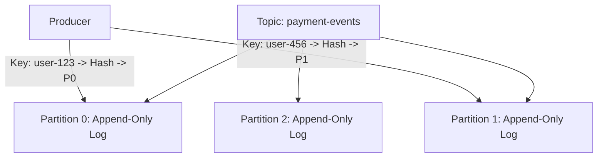
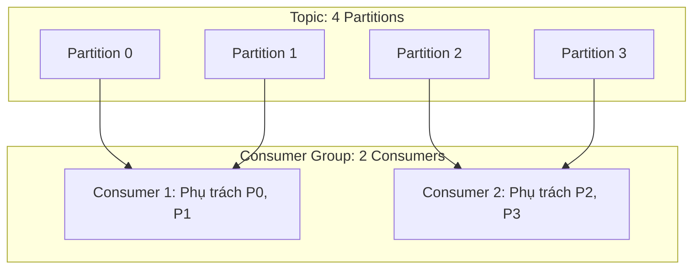

# Kafka Deep Dive: Partitions & Consumer Groups

Apache Kafka đạt được thông lượng xử lý hàng triệu tin nhắn mỗi giây nhờ kiến trúc phân mảnh dữ liệu thành các **Partitions** và mô hình **Consumer Groups**.

---

## 1. Cấu Trúc Topic & Partitions

Trong Kafka, một **Topic** là một danh mục logic để xuất bản tin nhắn. Mỗi Topic được chia nhỏ thành một hoặc nhiều **Partitions**.

### 1.1 Nguyên Tắc Thứ Tự (Ordering Invariant)
- **Kafka CHỈ đảm bảo thứ tự nghiêm ngặt trong cùng một Partition**.
- Không có sự đảm bảo về mặt thứ tự giữa các Partition khác nhau trong cùng một Topic.
- **Quy tắc định tuyến Partition Key**:
  - Nếu Producer gửi kèm `key`: $\text{Partition} = \text{hash}(\text{key}) \pmod {\text{Total Partitions}}$. Mọi tin nhắn của cùng một `user_id` hoặc `order_id` luôn rơi vào cùng 1 partition, đảm bảo việc xử lý tuần tự hoàn hảo.
  - Nếu gửi không kèm `key`: Kafka dùng cơ chế Round-Robin / Sticky Partitioner để phân bổ đều các partition.

---

## 2. Consumer Groups & Cân Bằng Tải Tự Động (Rebalancing)

Một **Consumer Group** là một tập hợp các tiến trình consumer cùng nhau chia sẻ việc xử lý dữ liệu của một Topic.

### 2.1 Định Lý Phân Bổ Partition: Con Số Tối Đa Của Consumers
> [!IMPORTANT]
> **Một Partition tại một thời điểm CHỈ ĐƯỢC PHÉP gán cho tối đa MỘT Consumer trong cùng một Consumer Group**.

- **Nếu số Consumer < số Partition**: Một số consumer sẽ phụ trách nhiều hơn 1 partition (như sơ đồ trên: 2 consumer gánh 4 partition).
- **Nếu số Consumer = số Partition**: Mỗi consumer phụ trách chính xác 1 partition (Hiệu năng song song tối ưu $100\%$).
- **Nếu số Consumer > số Partition**: Các consumer dư thừa sẽ rơi vào trạng thái **nhàn rỗi (IDLE)** và không nhận được bất kỳ tin nhắn nào!

### 2.2 Quy Trình Rebalance (Tái Cân Bằng)
Khi có một Consumer mới gia nhập nhóm, hoặc một Consumer hiện tại bị crash (không gửi được heartbeat định kỳ qua `session.timeout.ms`), Group Coordinator sẽ kích hoạt quy trình **Rebalance** để chia lại các partition cho các consumer còn sống.

---

## 3. Độ Tin Cậy & Chịu Lỗi: ISR & Producer ACKs

Mỗi partition có 1 bản sao chính (**Leader Replica**) và nhiều bản sao phụ (**Follower Replicas**).

### 3.1 In-Sync Replicas (ISR)
ISR là danh sách các Follower đang bám sát Leader và không bị tụt lại quá ngưỡng thời gian (`replica.lag.time.max.ms`).

### 3.2 Bộ Ba Cấu Hình Bất Tử (Zero Data Loss Architecture)
Để đảm bảo không bao giờ mất tin nhắn trong bất kỳ kịch bản thảm họa phần cứng nào:
1. **Producer**: `acks = all` (hoặc `-1`): Leader chỉ trả về thành công khi tin nhắn đã được ghi vào Leader VÀ tất cả các node trong ISR.
2. **Broker**: `min.insync.replicas = 2`: Ép buộc phải có ít nhất 2 bản sao trong ISR xác nhận ghi thành công; nếu số follower sống tụt xuống dưới 2, Producer sẽ nhận lỗi và dừng ghi thay vì ghi liều.
3. **Broker**: `unclean.leader.election.enable = false`: Không bao giờ cho phép một Follower nằm ngoài ISR (đang bị lag dữ liệu) được bầu làm Leader mới khi Leader cũ chết.
