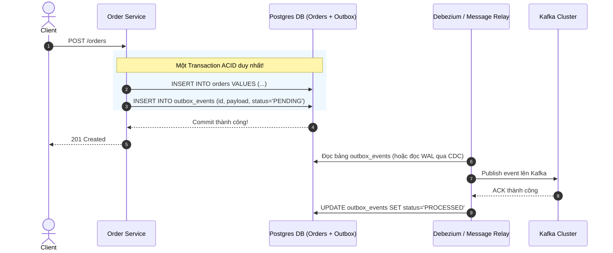

# Delivery Guarantees, Transactional Outbox & Idempotency

Trong mạng máy tính không hoàn hảo, các gói tin có thể bị trễ, trùng lặp hoặc mất kết nối giữa chừng. Việc đảm bảo thông điệp được xử lý chính xác mà không bị mất hay nhân đôi là thách thức sống còn của kiến trúc phân tán.

---

## 1. Ba Mức Cam Kết Phân Phối (Delivery Semantics)

| Mức Cam Kết | Cơ Chế Thực Hiện | Rủi Ro | Phù Hợp Kịch Bản |
| :--- | :--- | :--- | :--- |
| **At-Most-Once** (Tối đa một lần) | Consumer đọc tin nhắn $\rightarrow$ Commit Offset ngay lập tức $\rightarrow$ Bắt đầu xử lý logic. | Nếu tiến trình chết trong lúc xử lý, tin nhắn bị **mất vĩnh viễn**. | Log tracking, metrics thu thập chỉ số hiệu năng |
| **At-Least-Once** (Ít nhất một lần) | Consumer đọc tin nhắn $\rightarrow$ Xử lý logic xong xuôi $\rightarrow$ Mới Commit Offset. | Nếu chết trước khi kịp Commit Offset, tin nhắn sẽ bị **xử lý trùng lặp (Duplicate)**. | Hầu hết các hệ thống thực tế (Bắt buộc Consumer phải Idempotent) |
| **Exactly-Once** (Chính xác một lần) | Kết hợp 2PC / Kafka Transactions giữa Producer và Consumer. | Độ trễ cao, chi phí tính toán lớn, phức tạp. | Hệ thống kế toán, luân chuyển tiền tệ |

---

## 2. Vấn Đề Ghi Kép & Transactional Outbox Pattern

### 2.1 Cạm Bẫy "Dual Write Problem"
Giả sử bạn cần tạo một đơn hàng mới:
```javascript
// ❌ NGUY HIỂM: Bẫy Dual Write
async function createOrder(orderData) {
  await db.insertOrder(orderData); // 1. Ghi Database
  await kafka.publish('orders', orderData); // 2. Bắn sự kiện lên Kafka
}
```
- **Kịch bản 1**: Bước 1 thành công (Order đã lưu vào DB), nhưng mạng chập chờn khiến Bước 2 thất bại $\rightarrow$ Đơn hàng có trong DB nhưng kho không nhận được thông báo để đóng gói!
- **Kịch bản 2**: Đảo ngược thứ tự (Publish Kafka trước, ghi DB sau): Kafka nhận tin nhắn, kho đã trừ hàng, nhưng DB lỗi rollback $\rightarrow$ Mất hàng mà không có đơn!

### 2.2 Giải Pháp: Transactional Outbox Pattern
Tận dụng tính chất giao dịch ACID cục bộ của Database để đảm bảo tính nguyên tử:



- **Thay đổi**: Thay vì bắn trực tiếp sang Kafka, ứng dụng lưu sự kiện vào một bảng phụ có tên `outbox_events` **trong cùng một transaction DB với đơn hàng**.
- **Message Relay**: Một tiến trình riêng biệt (sử dụng Debezium Change Data Capture đọc PostgreSQL WAL hoặc poll định kỳ) chịu trách nhiệm đọc bảng Outbox và bắn lên Kafka với cam kết *At-Least-Once*.

---

## 3. Thiết Kế Consumer Idempotent (Chống Xử Lý Trùng Lặp)

Vì mạng phân tán luôn có thể gửi lại một tin nhắn nhiều lần (At-Least-Once), Consumer **BẮT BUỘC PHẢI CÓ TÍNH CHẤT IDEMPOTENT** (Thực thi 1 lần hay 100 lần kết quả hệ thống vẫn không thay đổi: $f(f(x)) = f(x)$).

### Các Kỹ Thuật Đạt Idempotency Trong Thực Tế

1. **Idempotency Key & Unique Constraint DB**:
   - Mỗi tin nhắn mang một `idempotency_key` duy nhất (ví dụ: `UUID` do Producer tạo ra: `ORDER_ID_EVENT_HASH`).
   - Consumer lưu `idempotency_key` vào một bảng `processed_events` với khóa chính `PRIMARY KEY (event_id)`.
   - Nếu tin nhắn bị gửi lại, câu lệnh `INSERT` sẽ vi phạm `Unique Constraint Violation` $\rightarrow$ Consumer bỏ qua việc xử lý logic và trả về ACK an toàn.
2. **Deterministic Upsert**:
   - Sử dụng `ON CONFLICT DO UPDATE` (PostgreSQL) hoặc `INSERT ... ON DUPLICATE KEY UPDATE` (MySQL) thay vì các phép cộng dồn tương đối (`balance = balance + 10`).
