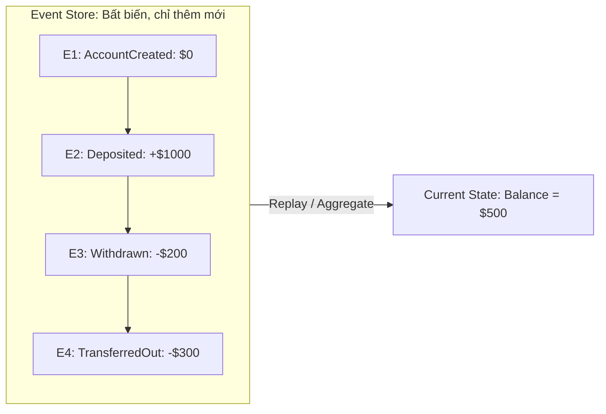
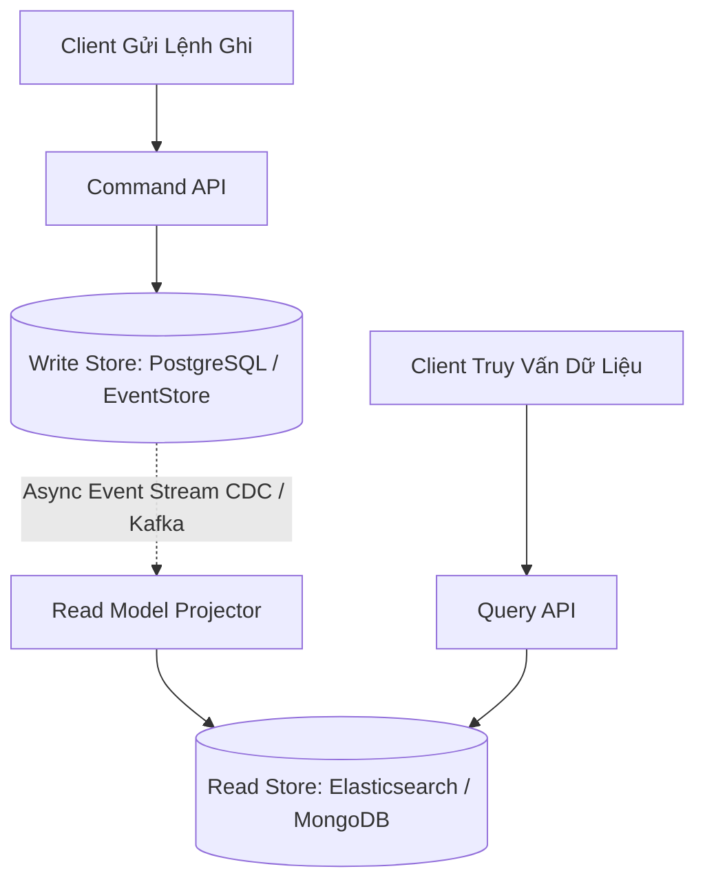
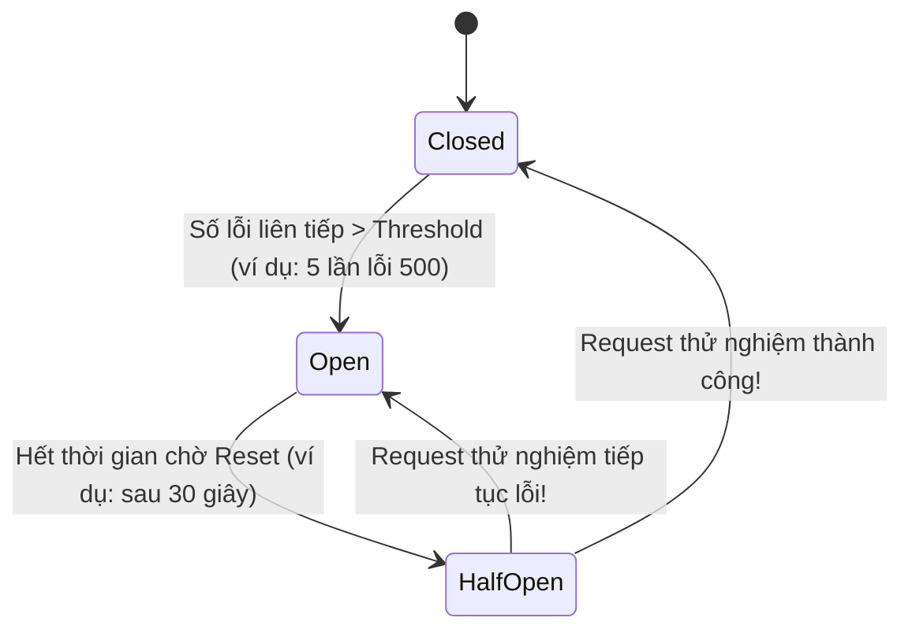

# Event Sourcing, CQRS & Backpressure (Circuit Breakers)

Khi hệ thống phát triển đến quy mô phức tạp, việc chỉ lưu trữ "trạng thái cuối cùng" của thực thể (ví dụ: `balance = 500`) làm mất đi toàn bộ ngữ cảnh lịch sử về lý do tại sao số dư đó lại bằng 500.

---

## 1. Event Sourcing (Nguồn Sự Kiện)

Trong Event Sourcing, chúng ta không lưu trữ trạng thái hiện tại của một đối tượng vào database. Thay vào đó, chúng ta lưu trữ một chuỗi **các sự kiện bất biến đã xảy ra trong quá khứ** theo thứ tự thời gian (*Event Store*).

### Ưu Điểm Tuyệt Đối
- **Audit Trail Hoàn Hảo**: Bạn biết chính xác từng xu trong tài khoản đã đi đâu, do ai thực hiện, vào thời điểm nào. Rất phù hợp với hệ thống kế toán, tài chính và y tế.
- **Khả Năng Du Hành Thời Gian (Time Travel)**: Bạn có thể tái tạo chính xác trạng thái của hệ thống vào ngày 15/04/2023 lúc 14:00 bằng cách replay các sự kiện diễn ra trước thời điểm đó.

---

## 2. CQRS (Command Query Responsibility Segregation)

Event Sourcing rất mạnh để Ghi (Command), nhưng rất chậm để Đọc (Query) vì mỗi lần đọc lại phải replay toàn bộ lịch sử sự kiện. **CQRS** giải quyết vấn đề này bằng cách phân tách hoàn toàn hai mô hình Đọc và Ghi.

- **Mô Hình Ghi (Command Model)**: Tối ưu hóa cho các thao tác nghiệp vụ, bảo vệ tính toàn vẹn và thực thi các quy tắc validation.
- **Mô Hình Đọc (Query Model / Projections)**: Bất đồng bộ tổng hợp dữ liệu từ Event Stream và nạp vào một cơ sở dữ liệu chuyên dụng tối ưu cho việc tìm kiếm (ví dụ: ElasticSearch để full-text search, Redis để cache nhanh).

---

## 3. Backpressure & Circuit Breaker Pattern

Khi một dịch vụ hạ tầng phía sau (Downstream Service) bị chậm chạp hoặc quá tải, nếu dịch vụ phía trước (Upstream) tiếp tục dội thêm requests, cả hai dịch vụ sẽ cùng sụp đổ dây chuyền (*Cascading Failure*).

### Circuit Breaker (Cầu Dao Điện)

1. **Trạng thái Closed (Đóng mạch - Bình thường)**:
   - Các requests được đi qua bình thường. Bộ đếm theo dõi số lần thất bại (Failure Count) trong một cửa sổ thời gian.
2. **Trạng thái Open (Ngắt mạch - Báo động)**:
   - Khi tỷ lệ lỗi vượt ngưỡng cho phép (Threshold), Cầu dao tự động "bật ngắt".
   - Mọi request gửi tới lập tức bị **từ chối ngay tại chỗ (Fail Fast)** mà không gửi bất kỳ gói tin nào sang dịch vụ đang quá tải. Trả về ngay lập tức dữ liệu dự phòng (*Fallback Response*).
   - Cho phép dịch vụ phía sau có thời gian nghỉ để phục hồi bộ nhớ và kết nối.
3. **Trạng thái Half-Open (Nửa mở - Thăm dò)**:
   - Sau khi hết thời gian chờ (*Sleep Window*), cầu dao cho phép một số lượng nhỏ request thử nghiệm đi qua.
   - Nếu các request thử nghiệm thành công: Chuyển về **Closed**.
   - Nếu vẫn thất bại: Chuyển lại về **Open** và kéo dài thời gian chờ.
