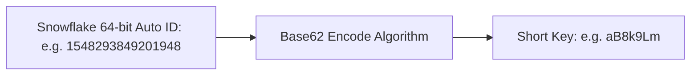
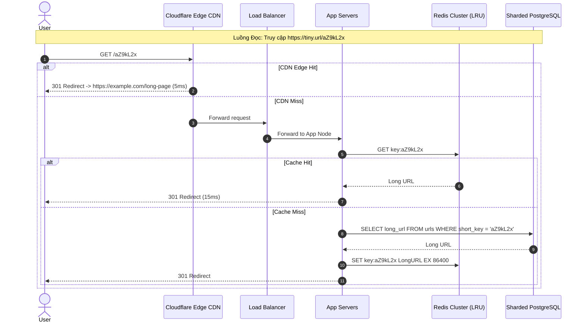

# Designing a URL Shortener (TinyURL)

Bài toán thiết kế dịch vụ rút gọn URL (TinyURL / Bitly) là câu hỏi kinh điển nhất để đánh giá khả năng tính toán quy mô (Back-of-the-envelope estimation), kỹ thuật băm dữ liệu, lưu trữ và caching.

---

## 1. Yêu Cầu Hệ Thống & Ước Lượng Quy Mô (Back-of-the-Envelope)

### 1.1 Yêu Cầu Chức Năng (Functional Requirements)
- Rút gọn một Long URL thành một Short URL ngắn gọn (ví dụ: `https://tiny.url/aZ9kL2x`).
- Khi người dùng truy cập Short URL, chuyển hướng (HTTP Redirect `301` hoặc `302`) về Long URL gốc với độ trễ thấp nhất ($< 20$ ms).
- URL có thể tùy chọn thời gian hết hạn (TTL).

### 1.2 Ước Lượng Quy Mô (Scale Estimation)
- **Tỷ lệ Đọc/Ghi (Read-to-Write Ratio)**: $100 : 1$ (Hệ thống thiên về Đọc cực nặng - Read-Heavy).
- **Lưu lượng ghi mới**: $100$ triệu URLs mới / tháng $\approx 40$ URLs/giây (Ghi).
- **Lưu lượng đọc**: $100 \times 40 = 4,000$ chuyển hướng/giây (Đọc). Đỉnh điểm (Peak): $8,000$ QPS.
- **Lưu trữ dữ liệu trong 10 năm**:
  - $100 \text{ triệu} \times 12 \text{ tháng} \times 10 \text{ năm} = 12 \text{ tỷ bản ghi}$.
  - Mỗi bản ghi: Short URL (7 bytes) + Long URL (500 bytes) + Metadata (100 bytes) $\approx 600$ bytes.
  - Tổng dung lượng đĩa: $12 \text{ tỷ} \times 600 \text{ bytes} \approx \mathbf{7.2 \text{ Terabytes}}$ (Dễ dàng lưu trữ trên vài Shards).
- **Bộ nhớ Cache (Quy tắc 80/20 Pareto)**:
  - $20\%$ các URL hot chiếm $80\%$ lưu lượng truy cập hàng ngày.
  - Lượng request đọc mỗi ngày: $4,000 \times 86,400 \approx 350 \text{ triệu requests}$.
  - $20\%$ của 350 triệu $\approx 70 \text{ triệu URLs cần cache}$.
  - RAM cần thiết: $70 \text{ triệu} \times 600 \text{ bytes} \approx \mathbf{42 \text{ GB RAM}}$ (Dễ dàng vừa vặn trong 1 node Redis trung bình).

---

## 2. Thiết Kế Cơ Chế Sinh Short Key

Bảng chữ cái mã hóa gồm: `[0-9]`, `[a-z]`, `[A-Z]` $\implies 10 + 26 + 26 = \mathbf{62 \text{ ký tự}}$ (**Base62**).
- Với độ dài chuỗi là $7$ ký tự:
$$\text{Số lượng URLs tối đa} = 62^7 \approx \mathbf{3.52 \text{ nghìn tỷ URLs}}$$
(Đủ phục vụ hệ thống hàng trăm năm với 100 triệu URL/tháng mà không lo cạn kiệt không gian tên).

### 2.1 So Sánh Các Phương Pháp Sinh Key

| Phương Pháp | Cơ Chế | Ưu Điểm | Nhược Điểm |
| :--- | :--- | :--- | :--- |
| **MD5 / SHA256 Hash** | Băm Long URL $\rightarrow$ Lấy 7 ký tự đầu | Không cần quản lý ID tập trung | Dễ bị **xung đột băm (Hash Collisions)**; phải retry nối chuỗi salt |
| **Twitter Snowflake ID + Base62** | Sinh số nguyên 64-bit duy nhất $\rightarrow$ Mã hóa Base62 | Hoàn toàn không bao giờ va chạm ($100\%$ Unique), $O(1)$, phân tán | Cần cụm máy chủ Snowflake quản lý Worker ID |

---

## 3. Kiến Trúc Tổng Thể & Luồng Xử Lý

### 301 Redirect vs 302 Redirect: Đánh Đổi Tinh Tế
- **`301 Moved Permanently`**: Trình duyệt client tự động cache địa chỉ chuyển hướng vĩnh viễn. Các lần sau người dùng gõ link, trình duyệt tự bay thẳng tới Long URL mà không thèm gọi lên server TinyURL.
  - *Ưu điểm*: Tiết kiệm tối đa băng thông và CPU của hệ thống.
  - *Nhược điểm*: Bạn hoàn toàn **mất khả năng thu thập Analytics** (số lượt click, vị trí địa lý, thiết bị) cho các lần click tiếp theo.
- **`302 Found (Temporary Redirect)`**: Trình duyệt luôn luôn phải gọi lên server TinyURL mỗi lần click.
  - *Ưu điểm*: Hệ thống theo dõi chính xác $100\%$ số lượt click phục vụ thống kê doanh thu và phân tích người dùng.
