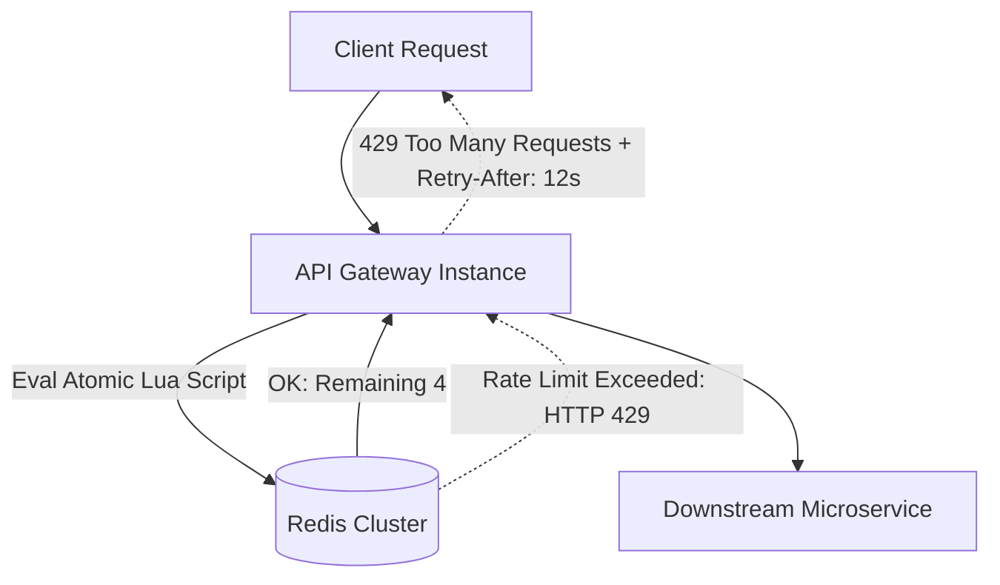

# Designing a Distributed Rate Limiter

Distributed Rate Limiter (Bộ điều tiết lưu lượng phân tán) là chốt chặn phòng thủ tuyến đầu tại API Gateway nhằm bảo vệ hệ thống khỏi các cuộc tấn công DoS, Brute-force mật khẩu, Web scraping quá mức và đảm bảo chia sẻ tài nguyên công bằng giữa các người dùng (Tenant Fair-Share).

---

## 1. So Sánh Các Thuật Toán Giới Hạn Lưu Lượng

| Thuật Toán | Cơ Chế | Ưu Điểm | Nhược Điểm |
| :--- | :--- | :--- | :--- |
| **Fixed Window Counter** | Chia thời gian thành các cửa sổ 1 phút cố định. Đếm số request trong phút đó. | Bộ nhớ cực thấp (chỉ 1 số nguyên) | **Lỗ hổng giáp ranh**: Lưu lượng có thể gấp $2\times$ ngưỡng cho phép tại thời điểm giao thoa giữa 2 phút. |
| **Sliding Window Log** | Lưu timestamp của mọi request vào Redis Sorted Set (`ZADD`). Xóa các log cũ hơn 1 phút (`ZREMRANGEBYSCORE`). | Độ chính xác tuyệt đối $100\%$ | Tốn bộ nhớ khủng khiếp nếu 1 user gửi 10,000 requests/phút. |
| **Sliding Window Counter** | Ước lượng tỷ trọng giữa cửa sổ trước và cửa sổ hiện tại: $\text{Count} = \text{Current} + \text{Prev} \times (1 - \text{TimeFraction})$. | Độ chính xác cao ($\approx 99.9\%$), bộ nhớ cực nhẹ (chỉ lưu 2 số nguyên). | Rất lý tưởng cho hệ thống phân tán sản xuất. |
| **Token Bucket** | Thùng chứa token dung lượng $C$, bổ sung đều đặn $R$ tokens/giây. Request tiêu thụ 1 token. | Cho phép bùng nổ lưu lượng ngắn hạn (Traffic Bursts). | Cần lưu timestamp cập nhật lần cuối. |

---

## 2. Thiết Kế Hệ Thống Phân Tán Trên Redis

Trong hệ thống gồm 100 API Gateways chạy song song, việc kiểm tra và tăng bộ đếm phải diễn ra trên một bộ nhớ tập trung (Redis Cluster) một cách **nguyên tử tuyệt đối (Atomic)** để tránh hiện tượng tranh chấp (Race Condition).



### 2.1 Atomic Redis Lua Script: Sliding Window Counter

```lua
-- KEYS[1]: Key định danh (e.g. rate_limit:user_101:window_120)
-- ARGV[1]: Giới hạn tối đa (Limit - e.g. 100)
-- ARGV[2]: Thời gian sống của key (TTL - e.g. 60 giây)

local current = redis.call('INCR', KEYS[1])
if current == 1 then
    redis.call('EXPIRE', KEYS[1], ARGV[2])
end

if current > tonumber(ARGV[1]) then
    return 0 -- Bị Rate Limit (Từ chối)
else
    return 1 -- Hợp lệ (Cho phép đi qua)
end
```

### 2.2 Các HTTP Headers Tiêu Chuẩn Trả Về Cho Client
Một Rate Limiter chuyên nghiệp luôn thông báo cho client trạng thái lưu lượng thông qua các Header:
- `X-RateLimit-Limit`: Số request tối đa được phép trong một khung thời gian (ví dụ: `100`).
- `X-RateLimit-Remaining`: Số request còn lại được phép gửi trong khung hiện tại (ví dụ: `4`).
- `X-RateLimit-Reset`: Timestamp tính bằng giây khi cửa sổ hiện tại được reset về 0.
- `Retry-After: 15`: Khi bị trả về mã lỗi `429 Too Many Requests`, header này báo cho client biết phải ngủ bao nhiêu giây trước khi được thử lại.

---

## 3. Kiến Trúc Triển Khai Thực Tế Cấp Doanh Nghiệp

1. **Bộ Đệm Cục Bộ (Local In-Memory Batching)**:
   - Thay vì mỗi request đều gọi 1 lệnh mạng qua Redis (tạo ra hàng triệu network hops), API Gateway có thể gom 10 requests của cùng 1 IP trong 100ms rồi mới gửi 1 lệnh `INCRBY 10` lên Redis.
2. **Xử Lý Khi Cụm Redis Chết (Fail-Open vs Fail-Closed)**:
   - **Fail-Open**: Nếu Redis gặp sự cố không thể kết nối, Rate Limiter tạm thời cho phép tất cả requests đi qua để bảo vệ trải nghiệm người dùng (Ưu tiên Availability).
   - **Fail-Closed**: Chặn toàn bộ requests nếu là API thanh toán hoặc API nhạy cảm tài chính (Ưu tiên Security).
