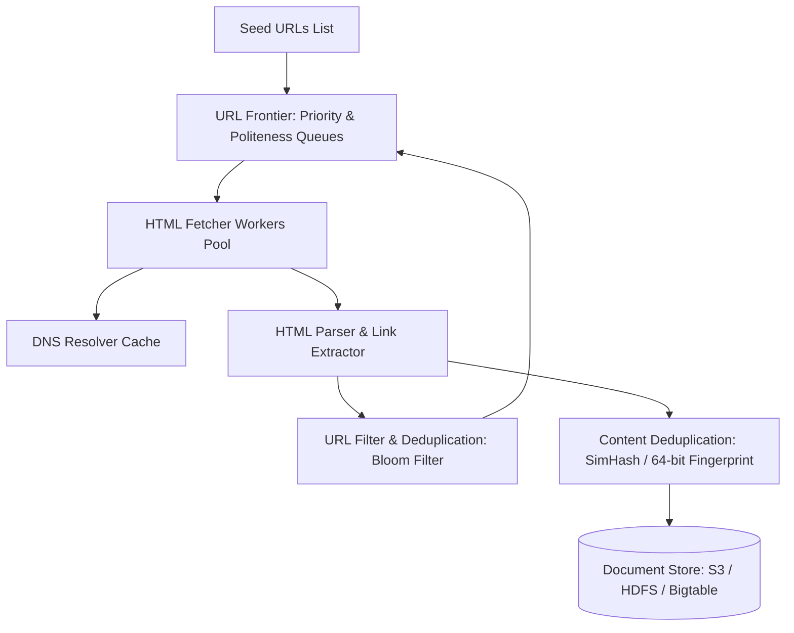

# Designing a Scalable Web Crawler

Một Web Crawler (như Googlebot hay Bingbot) là hệ thống tự động tải xuống và đánh chỉ mục (Index) hàng tỷ trang web trên toàn cầu phục vụ cho công cụ tìm kiếm hoặc huấn luyện mô hình ngôn ngữ lớn (LLMs).

---

## 1. Yêu Cầu Thiết Kế Hệ Thống Cốt Lõi

1. **Scalability (Khả năng mở rộng)**: Hệ thống phải có khả năng thu thập hàng tỷ trang web mỗi tháng với thông lượng hàng nghìn trang/giây.
2. **Politeness (Tính lịch sự)**: Không bao giờ làm quá tải máy chủ đích (tránh DDoS website người khác); tuân thủ tệp `robots.txt` và giãn cách thời gian giữa các lần request tới cùng một domain.
3. **Robo-traps & Redundancy Defense**: Tránh rơi vào các bẫy vòng lặp vô tận (Spider Traps: ví dụ lịch ngày tháng tự sinh URL vô hạn) và phát hiện các nội dung trùng lặp (Duplicate Detection).

---

## 2. Kiến Trúc Tổng Thể

### 2.1 URL Frontier: Cân Bằng Giữa Priority và Politeness
Để vừa ưu tiên các trang web quan trọng (trang chủ báo lớn, Wikipedia) vừa không bắn quá nhiều request vào cùng 1 host:
- **Tầng Ưu Tiên (Priority Queues)**: Phân loại URL theo điểm PageRank / Độ tươi mới (Freshness) vào các hàng đợi ưu tiên từ cao xuống thấp.
- **Tầng Lịch Sự (Politeness Queues)**:
  - Mỗi domain (ví dụ: `wikipedia.org`, `github.com`) được gán riêng một hàng đợi FIFO.
  - Mỗi hàng đợi domain có một bộ định thời (Timer/Delay - ví dụ: tối thiểu 1 giây giữa hai lần fetch tới cùng một domain).
  - Đảm bảo một worker chỉ lấy URL từ 1 domain sau khi đã hết thời gian cooldown.

---

## 3. Các Thuật Toán Khử Trùng Lặp (Deduplication)

### 3.1 Khử Trùng Lặp URL Bằng Bloom Filter
- Trước khi thêm một URL mới trích xuất được từ thẻ `<a href="...">` vào Frontier, URL được kiểm tra qua **Bloom Filter**.
- Nếu Bloom Filter báo đã gặp $\rightarrow$ Bỏ qua ngay lập tức, tiết kiệm tài nguyên mạng.

### 3.2 Khử Trùng Lặp Nội Dung Bằng SimHash (Locality Sensitive Hashing)
Hơn $30\%$ các trang web trên internet là bản sao chép (Mirror, Syndicate) hoặc chỉ khác nhau thanh banner quảng cáo. Các hàm băm mã hóa truyền thống (MD5/SHA256) sẽ thay đổi hoàn toàn nếu nội dung đổi dù chỉ 1 ký tự (*Avalanche Effect*).
- **SimHash**: Tạo ra một mã vân tay 64-bit cho toàn bộ văn bản.
- **Tính chất**: Nếu hai văn bản có nội dung gần giống nhau (Near-Duplicate), khoảng cách Hamming (số lượng bit khác nhau) giữa hai mã SimHash sẽ cực nhỏ (thường $\le 3$ bits khác nhau).
- Giúp hệ thống phát hiện và loại bỏ các trang web đạo nhái mà không cần so sánh từng dòng văn bản.
