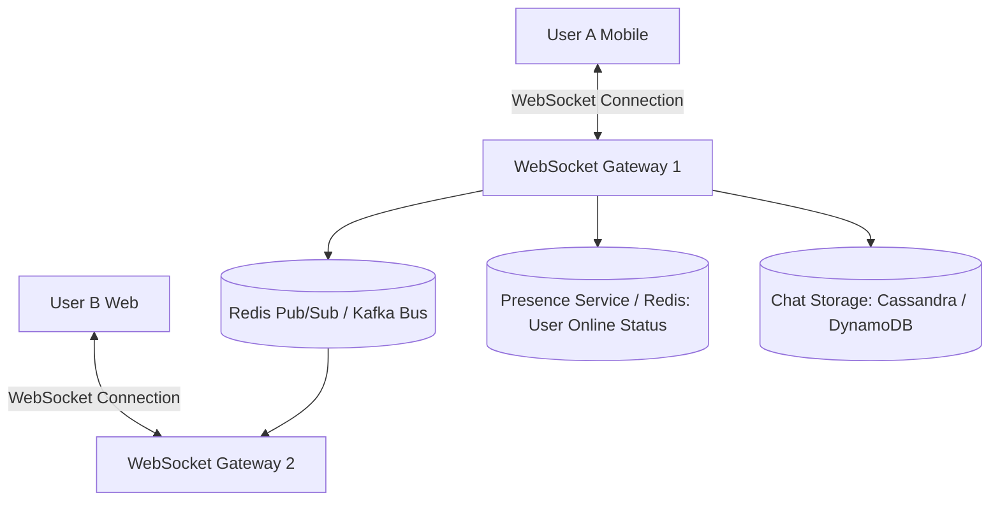
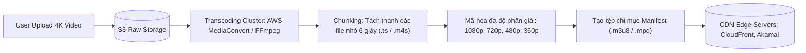

# Designing Real-Time Chat & Video Streaming

Hai bài toán kỹ thuật phân tán tiêu biểu cho lưu lượng cao: Hệ thống tin nhắn thời gian thực (WhatsApp / Discord) và Nền tảng phát video trực tuyến (YouTube / Netflix).

---

## 1. Thiết Kế Hệ Thống Chat Thời Gian Thực (Discord / WhatsApp)

### 1.1 Giao Thức Kết Nối: WebSockets vs Long-Polling
- HTTP thông thường là giao thức đơn công (Half-duplex) do Client khởi xướng. Server không thể chủ động đẩy tin nhắn xuống Client.
- **WebSockets**: Thiết lập kết nối TCP hai chiều liên tục (Full-duplex Persistent Connection) sau cái bắt tay HTTP ban đầu (`Upgrade: websocket`). Tiêu đề gói tin chỉ tốn $2 - 6$ bytes thay vì hàng trăm bytes như HTTP headers.

### 1.2 Quản Lý Trạng Thái Trực Tuyến (Online Presence)
- Client gửi tín hiệu nhịp tim định kỳ (**Heartbeat**) mỗi 5 giây qua WebSocket.
- Nếu Presence Service không nhận được heartbeat sau 15 giây (ví dụ: mất sóng 4G, vào thang máy), người dùng được đánh dấu là `Offline`.

### 1.3 Lưu Trữ Lịch Sử Tin Nhắn (Chat History)
- Tin nhắn chat có đặc điểm: Ghi cực nhiều, chỉ đọc những tin mới nhất gần đây; các tin cũ hiếm khi được mở lại.
- **Công nghệ tối ưu**: NoSQL dạng Column-family như **Apache Cassandra** hoặc **AWS DynamoDB**.
  - Partition Key: `chat_room_id`.
  - Sort Key: `message_timestamp` (hoặc Snowflake ID).
  - Tận dụng cấu trúc LSM-Tree cho tốc độ ghi đĩa tuần tự cực đại.

---

## 2. Thiết Kế Hệ Thống Video Streaming (YouTube / Netflix)

### 2.1 Video Ingestion & Transcoding Pipeline (Đường Ống Nạp & Chuyển Mã)
Một video thô 4K tải lên từ máy quay phim có dung lượng hàng chục Gigabytes và không thể phát trực tiếp trên mạng di động băng thông yếu.

### 2.2 Adaptive Bitrate Streaming (HLS & MPEG-DASH)
- **HLS (HTTP Live Streaming)** do Apple phát triển và **MPEG-DASH** chia video thành các đoạn nhỏ (Chunks) có độ dài từ $2$ đến $6$ giây.
- Mỗi đoạn được nén ở nhiều mức bitrate (chất lượng) khác nhau (360p, 720p, 1080p, 4K).
- Tệp **Master Manifest (`.m3u8`)** chứa danh sách toàn bộ các mức bitrate và URL của từng chunk.
- **Thuật toán phía Client**: Trình phát video trên điện thoại liên tục đo tốc độ mạng hiện tại:
  - Khi mạng Wi-Fi mạnh: Tự động tải chunk 1080p.
  - Khi người dùng đi vào vùng sóng 3G yếu: Trình phát lập tức chuyển sang tải chunk 480p ở giây tiếp theo một cách mượt mà mà không làm khựng video (*Zero Buffering*).

### 2.3 Tối Ưu Hóa Phân Phối Qua CDN
- Video chunks là dữ liệu tĩnh, bất biến (Immutable Static Assets).
- Được lưu đệm rộng khắp tại các cụm CDN Edge gần người xem nhất, giúp $95\%$ lưu lượng xem video không bao giờ phải chạm tới máy chủ gốc của dịch vụ.
