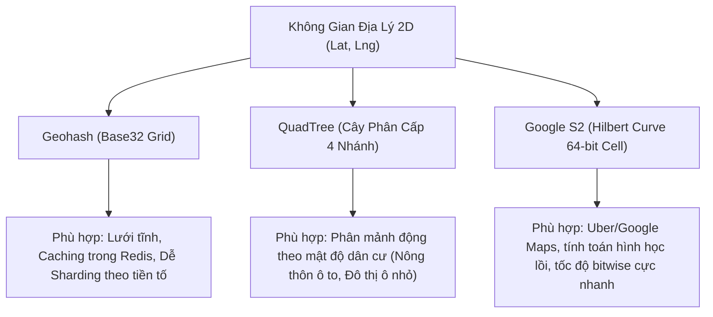
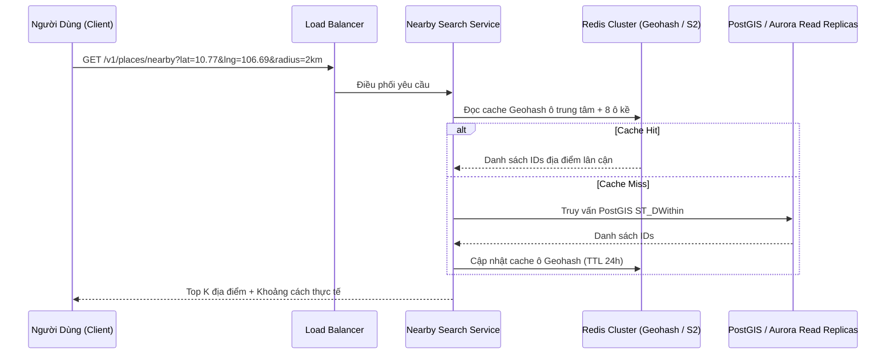

# 01. Proximity Service & Location-Based Services (Yelp / Uber / Nearby)

Dịch vụ định vị vùng lân cận (Proximity Service hay Nearby Search) giải quyết bài toán cốt lõi: **"Tìm kiếm $K$ địa điểm hoặc tài xế gần nhất trong bán kính $R$ km tính từ tọa độ $(lat, lng)$ của người dùng."**

---

## 1. Thách Thức Kỹ Thuật

Một bảng dữ liệu vị trí thông thường:
```sql
CREATE TABLE places (
    id BIGINT PRIMARY KEY,
    name VARCHAR(255),
    latitude DOUBLE PRECISION,
    longitude DOUBLE PRECISION
);
```

Nếu truy vấn bằng SQL truyền thống:
```sql
SELECT id, name FROM places
WHERE latitude BETWEEN :min_lat AND :max_lat
  AND longitude BETWEEN :min_lng AND :max_lng;
```
- **Vấn đề:** Chỉ mục B-Tree 1 chiều chỉ có thể lọc hiệu quả trên một cột (ví dụ `latitude`), sau đó phải quét thủ công (Filter Scan) hàng triệu dòng của cột `longitude`.
- Độ phức tạp tính toán: $O(N)$ khoảng cách Euclid hoặc Haversine với $N$ điểm là bất khả thi khi có 100M+ địa điểm và hàng trăm ngàn QPS.

---

## 2. Giải Pháp Chỉ Mục Không Gian (Geospatial Indexing)



### 2.1 Geohash
- Chia quả địa cầu liên tục thành các nửa kinh độ và vĩ độ dưới dạng nhị phân, xen kẽ bit vĩ độ và kinh độ, sau đó mã hóa bằng Base32 (`0-9, b-z` trừ `a, i, l, o`).
- **Đặc tính tiền tố (Prefix Property):** Hai điểm có chuỗi tiền tố Geohash chung càng dài thì càng nằm gần nhau.
  - Độ dài 5 ký tự: Sai số $\approx \pm 2.4\text{ km} \times 4.9\text{ km}$.
  - Độ dài 6 ký tự: Sai số $\approx \pm 0.61\text{ km} \times 0.61\text{ km}$ ($610\text{ m}$).
  - Độ dài 7 ký tự: Sai số $\approx \pm 76\text{ m} \times 152\text{ m}$.
- **Bẫy biên (Boundary Issue):** Hai điểm nằm sát nhau ở hai bên đường biên giới của ô Geohash sẽ có mã Geohash hoàn toàn khác nhau.
  - **Khắc phục:** Luôn truy vấn ô trung tâm **cộng thêm 8 ô lân cận (8 neighboring cells)**.

### 2.2 QuadTree
- Cấu trúc cây trong đó mỗi node nội bộ chia không gian thành đúng 4 node con (North-West, North-East, South-West, South-East).
- Cơ chế tự chia nhỏ (Auto-split): Khi một ô chứa quá $M$ điểm (ví dụ $M = 100$), ô đó được chia đôi thành 4 ô con. Các thành phố lớn (Tokyo, New York) sẽ có độ sâu cây lớn hơn nhiều so với sa mạc.
- Thường lưu toàn bộ cây QuadTree trong RAM (khoảng vài GB cho toàn cầu) để truy vấn $O(\log_4 N)$.

### 2.3 Google S2 Geometry
- Chiếu bề mặt hình cầu lên 6 mặt của một hình lập phương (Cube), sau đó áp dụng **Đường cong lấp đầy không gian Hilbert (Hilbert Space-Filling Curve)**.
- Mã hóa vị trí thành một số nguyên 64-bit duy nhất (`uint64`).
- Bảo toàn tính lân cận 1D tốt hơn Geohash, cho phép thực hiện phép toán tập hợp (Union, Intersection) siêu nhanh bằng thao tác bitwise.

---

## 3. Kiến Trúc Hệ Thống: Đối Tượng Tĩnh vs Đối Tượng Động



| Tiêu chí | Đối tượng tĩnh (Yelp, Quán ăn, Cây ATM) | Đối tượng di động (Uber Driver, Shipper) |
| :--- | :--- | :--- |
| **Tần suất ghi (Write Rate)** | Cực thấp (Vài lần/năm hoặc khi mở quán mới) | Cực cao (Mỗi tài xế gửi GPS mỗi 3-5 giây) |
| **Kiến trúc lưu trữ** | RDBMS có phần mở rộng không gian (PostGIS) + CDN/Redis | In-Memory Key-Value (Redis Geospatial, Kafka streams) |
| **Độ trễ cập nhật** | Chấp nhận trễ vài phút/giờ | Yêu cầu cập nhật gần thời gian thực (< 2 giây) |
| **Chiến lược tối ưu** | Đánh chỉ mục trước (Pre-indexing) theo Geohash cấp 6 | Sharding theo Geohash cell ID, không ghi vào đĩa từ mà xử lý trên RAM |

---

## 4. Bẫy Phỏng Vấn (Interview Traps & Edge Cases)

1. **Hiệu ứng biến dạng ở hai cực Trái Đất:** Các đường kinh độ hội tụ tại hai cực, khiến ô Geohash ở vùng cực bị méo hình học. Cần dùng thư viện tính khoảng cách trắc địa (Geodesic / Haversine formula) thay vì định lý Pythagoras $a^2 + b^2 = c^2$.
2. **Xử lý tài xế ngắt kết nối (Stale Location):** Nếu tài xế đi vào hầm hoặc mất mạng, vị trí cũ vẫn còn trong bộ nhớ. Cần gắn TTL ngắn (10-15s) hoặc trường `updated_at` và lọc bỏ các tọa độ cũ quá 30 giây khi phân phối cuốc xe.
