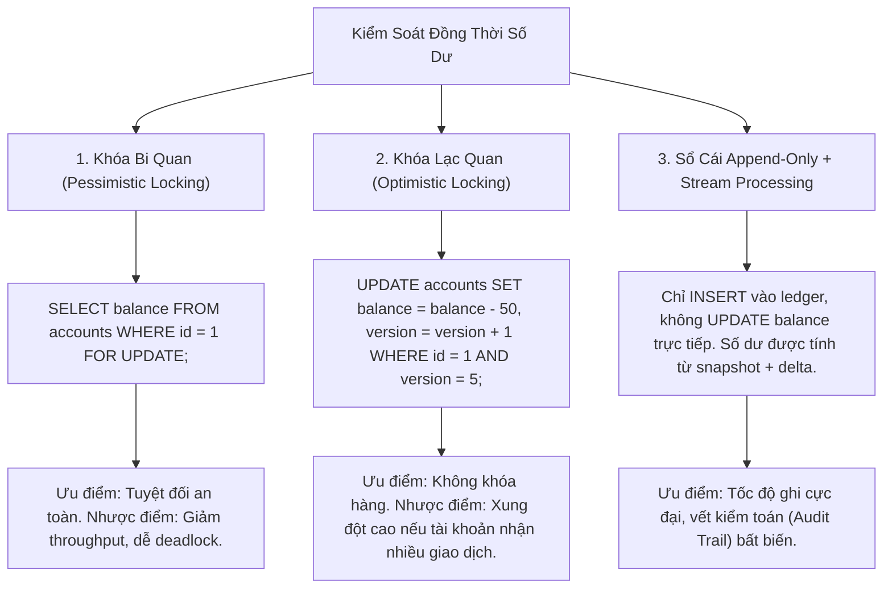
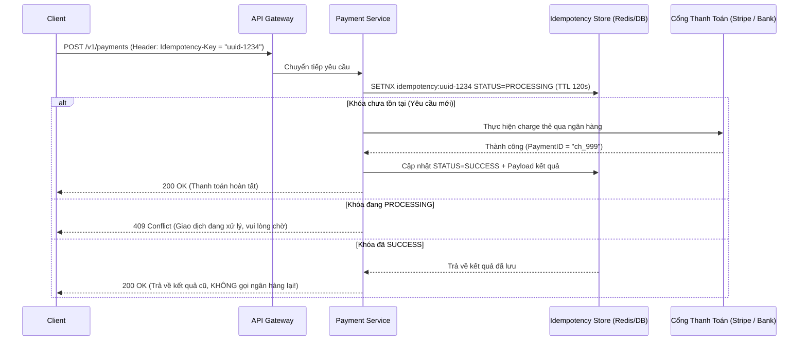

# 02. Payment System & Digital Wallet (Double-Entry Bookkeeping & Ledger)

Thiết kế hệ thống thanh toán (Payment System) và ví điện tử (Digital Wallet) là một trong những bài toán khắt khe nhất trong System Design: **Dữ liệu không bao giờ được phép mất mát, số dư không bao giờ được âm ngoài ý muốn, và mỗi giao dịch chỉ được thực thi duy nhất một lần.**

---

## 1. Nguyên Tắc Cốt Lõi: Kế Toán Kép (Double-Entry Bookkeeping)

Quy tắc bất di bất dịch của ngành tài chính ngân hàng: **Tiền không tự sinh ra và không tự mất đi, tiền chỉ chuyển từ tài khoản này sang tài khoản khác.**

$$\sum \text{Debit (Nợ)} = \sum \text{Credit (Có)}$$

Mọi giao dịch bắt buộc phải có ít nhất hai dòng ghi chép đối ứng:
- Một tài khoản bị ghi giảm (Credit/Debit tùy phân loại).
- Một tài khoản khác được ghi tăng đúng bằng số tiền đó.

### Mô hình Bảng Sổ Cái (Ledger Table Schema)
```sql
CREATE TABLE ledger_entries (
    id BIGINT PRIMARY KEY,
    transaction_id UUID NOT NULL,
    account_id BIGINT NOT NULL,
    amount DECIMAL(18, 4) NOT NULL, -- Số dương: Tăng, Số âm: Giảm
    currency CHAR(3) NOT NULL,
    created_at TIMESTAMP WITH TIME ZONE DEFAULT CURRENT_TIMESTAMP
);

-- Ràng buộc toàn vẹn: Tổng số tiền của một transaction_id phải bằng 0!
```

---

## 2. Xử Lý Race Condition Khi Cập Nhật Số Dư (Balance Update)

Khi có hai giao dịch rút tiền cùng lúc từ một tài khoản (ví dụ rút $50 và $70 từ tài khoản chỉ có $100):



---

## 3. Khóa Bất Biến: Idempotency Key (Chống Trừ Tiền Trùng Lặp)

Khi mạng bị timeout giữa ứng dụng người dùng và Payment Gateway, người dùng có thể bấm nút "Thanh toán" lần thứ hai hoặc client tự động gửi lại (Retry).



---

## 4. Dịch Vụ Đối Soát (Reconciliation Service)

Cổng thanh toán bên thứ ba (PSP như Stripe, Paypal, VNPay) có thể gặp lỗi rớt mạng hoặc xử lý bất đồng bộ. Hệ thống không thể chỉ tin vào callback webhook.
- Mỗi đêm, PSP gửi một tệp sao kê quyết toán (`settlement.csv`).
- **Reconciliation Worker** đọc tệp sao kê của đối tác và so khớp với bảng `ledger_entries` trong hệ thống nội bộ.
- Phân loại 3 trường hợp:
  1. **Khớp hoàn hảo (Matched):** Trạng thái nội bộ và ngân hàng giống nhau.
  2. **Nội bộ ghi nhận thành công, Ngân hàng không có:** Thường do giao dịch bị hủy ở cổng thanh toán $\rightarrow$ Kích hoạt hoàn tiền (Refund / Chargeback).
  3. **Ngân hàng ghi nhận trừ tiền, Nội bộ đang pending/thất bại:** Cần chạy tiến trình điều chỉnh (Adjustment Transaction) bù trừ cho khách hàng.

---

## 5. Tiêu Chuẩn Bảo Mật & Tuân Thủ PCI-DSS

- **Không bao giờ lưu số thẻ tín dụng thô (PAN - Primary Account Number) hay mã CVV** trên máy chủ ứng dụng.
- Sử dụng cơ chế **Tokenization:** Trình duyệt của khách hàng gửi trực tiếp thông tin thẻ sang SDK của PSP (Stripe Elements), nhận về một chuỗi `token_xyz` an toàn. Ứng dụng chỉ lưu `token_xyz` và 4 số cuối của thẻ để hiển thị.
