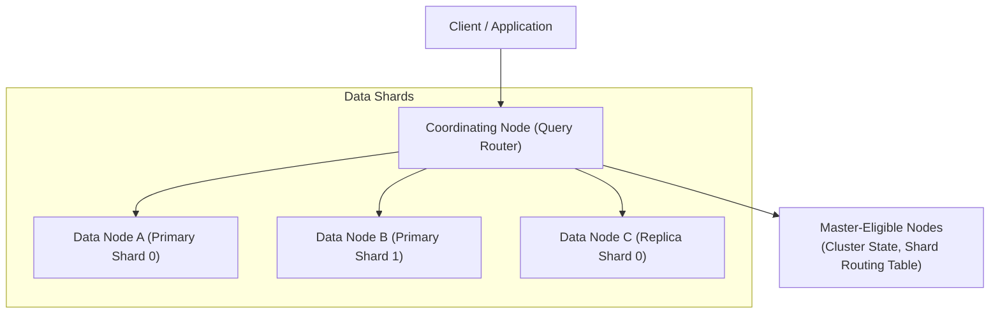

# 04. Distributed Search Engine & Inverted Index (Elasticsearch / Apache Lucene)

Các cơ sở dữ liệu quan hệ (RDBMS) không được thiết kế cho việc tìm kiếm văn bản toàn diện (Full-Text Search). Truy vấn `WHERE content LIKE '%distributed%'` sẽ kích hoạt **Full Table Scan**, làm sụp đổ hiệu năng hệ thống khi bảng đạt hàng chục triệu dòng.

Các công cụ tìm kiếm hiện đại như **Elasticsearch**, **OpenSearch**, và **Apache Solr** giải quyết bài toán này dựa trên nền tảng thư viện lõi **Apache Lucene** và cấu trúc **Chỉ Mục Đảo (Inverted Index)**.

---

## 1. Cấu Trúc Chỉ Mục Đảo (Inverted Index Architecture)

Thay vì ánh xạ: `Document -> Danh sách các từ`, Chỉ mục đảo thực hiện ánh xạ ngược lại:
$$\text{Term (Từ khóa)} \longrightarrow \text{Danh sách các Documents chứa từ đó (Postings List)}$$

```
Văn bản 1: "Distributed systems are resilient"
Văn bản 2: "Resilient systems avoid single points of failure"

Inverted Index Postings List:
+---------------+----------------------------------------------+
| Term          | Postings List [DocID: [Vị trí từ trong doc]] |
+---------------+----------------------------------------------+
| distributed   | [Doc 1: [0]]                                 |
| systems       | [Doc 1: [1], Doc 2: [1]]                     |
| resilient     | [Doc 1: [3], Doc 2: [0]]                     |
| avoid         | [Doc 2: [2]]                                 |
| single        | [Doc 2: [3]]                                 |
| points        | [Doc 2: [4]]                                 |
| failure       | [Doc 2: [6]]                                 |
+---------------+----------------------------------------------+
```

### 1.1 Các Thành Phần Lõi Bên Dưới Lucene
1. **Term Dictionary:** Chứa toàn bộ các từ vựng đã được chuẩn hóa (Tokenized, Lowercased, Stemmed), sắp xếp theo thứ tự bảng chữ cái để hỗ trợ tìm kiếm nhị phân $O(\log N)$.
2. **Term Index (FST - Finite State Transducer):** Một cây tiền tố nén nằm gọn trong RAM đóng vai trò như mục lục cho Term Dictionary. Giúp xác định vị trí của từ vựng trên đĩa mà không cần nạp toàn bộ Term Dictionary vào RAM.
3. **Postings List:** Danh sách các `DocID` nén bằng thuật toán **Frame Of Reference (FOR)** và **Roaring Bitmaps**, hỗ trợ phép toán giao tập hợp (AND) và hợp tập hợp (OR) bằng bitwise cực nhanh.

---

## 2. Tính Bất Biến Của Phân Đoạn (Segment Immutability & Merging)

Lucene không bao giờ cập nhật phân đoạn (Segment) đang có trên đĩa:
- Khi có thao tác ghi mới (`Index`), dữ liệu được ghi vào bộ nhớ đệm **In-memory Index Buffer** đồng thời ghi vào tệp **Translog (Write-Ahead Log)** để chống mất dữ liệu khi crash.
- Định kỳ (mặc định mỗi 1 giây - Refresh Interval), buffer được ghi ra một **Segment mới** trên đĩa (tận dụng File System Cache của OS).
- Khi có thao tác xóa (`Delete`), Lucene không xóa vật lý mà chỉ đánh dấu `DocID` đó vào một tệp `.del` (Tombstone).
- **Segment Merge (Tiến trình hợp nhất):** Trong nền, Lucene liên tục gộp các phân đoạn nhỏ thành phân đoạn lớn hơn và loại bỏ vĩnh viễn các tài liệu đã bị đánh dấu xóa trong tệp `.del`.

```
[Buffer] ---> [New Segment 1] \
              [New Segment 2]  ===> [Background Merge] ===> [Merged Big Segment]
              [New Segment 3] /
```

---

## 3. Kiến Trúc Cụm Phân Tán Của Elasticsearch (Cluster Topology)



### 3.1 Hai Giai Đoạn Thực Thi Truy Vấn (Query-Then-Fetch)
1. **Query Phase:**
   - Client gửi yêu cầu tìm kiếm tới Coordinating Node.
   - Coordinating Node chuyển tiếp truy vấn tới tất cả các Shards (có thể là Primary hoặc Replica) của Index đó.
   - Mỗi Shard tính điểm phù hợp cục bộ và chỉ trả về danh sách `[DocID, Score]` (ví dụ Top 10 của Shard đó), không trả về nội dung `_source`.
2. **Fetch Phase:**
   - Coordinating Node gom kết quả từ tất cả các Shards, sắp xếp lại (Global Sort) để chọn ra Top 10 tài liệu có điểm cao nhất toàn hệ thống.
   - Coordinating Node gửi yêu cầu tới các Shard chứa 10 `DocID` này để lấy nội dung chi tiết (`_source`) và trả về cho Client.

---

## 4. Thuật Toán Chấm Điểm Phù Hợp: TF-IDF vs Okapi BM25

Elasticsearch sử dụng thuật toán **Okapi BM25** làm bộ chấm điểm mặc định (Relevance Scoring):

$$\text{Score}(D, Q) = \sum_{i=1}^{n} \text{IDF}(q_i) \cdot \frac{f(q_i, D) \cdot (k_1 + 1)}{f(q_i, D) + k_1 \cdot \left(1 - b + b \cdot \frac{|D|}{\text{avgdl}}\right)}$$

- **TF (Term Frequency) Saturation:** Khác với TF-IDF truyền thống (tần suất từ càng cao điểm càng tăng tuyến tính), BM25 áp dụng hàm bão hòa: một từ xuất hiện 20 lần trong một bài viết không có nghĩa là bài viết đó quan trọng gấp đôi bài viết chứa từ đó 10 lần.
- **Document Length Normalization ($b$):** Bài viết ngắn mà chứa từ khóa sẽ nhận điểm cao hơn bài viết dài lê thê chứa cùng số lần từ khóa đó.
- **IDF (Inverse Document Frequency):** Từ khóa nào càng hiếm xuất hiện trên toàn bộ các tài liệu (ví dụ: "distributed") thì càng có trọng số cao hơn các từ phổ biến (như "the", "system").
