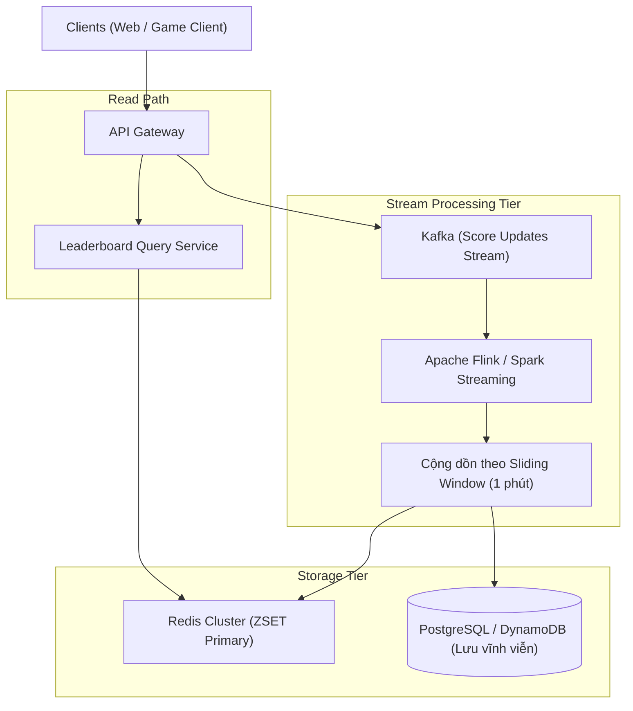

# 05. Real-Time Gaming Leaderboard & Top-K Heavy Hitters

Bảng xếp hạng thời gian thực (Real-Time Leaderboard) và bài toán tìm phần tử phổ biến nhất (Top-K Heavy Hitters / Trending Topics) là các cấu trúc không thể thiếu trong các ứng dụng game trực tuyến (PUBG, League of Legends), mạng xã hội (Twitter Trending, TikTok Hashtags), và sàn thương mại điện tử (Sản phẩm bán chạy nhất theo giờ).

---

## 1. Giải Pháp Redis Sorted Set (`ZSET`)

Redis Sorted Set kết hợp cấu trúc **Bảng Băm (Hash Table)** và **Danh Sách Bỏ Qua (Skip List)**:
- Hash Table ánh xạ `member -> score` với chi phí truy cập $O(1)$.
- Skip List duy trì thứ tự sắp xếp theo `score` với chi phí chèn, cập nhật, và tìm kiếm theo thứ hạng là $O(\log N)$.

```mermaid
graph LR
    subgraph Skip List Structure (O(log N))
        L3["Level 3: Head -------------------------> [User_B: 950] -> Tail"]
        L2["Level 2: Head -------------> [User_C: 800] -> [User_B: 950] -> Tail"]
        L1["Level 1: Head -> [User_A: 500] -> [User_C: 800] -> [User_B: 950] -> Tail"]
    end
```

### Các Lệnh Redis Thao Tác Bảng Xếp Hạng
```bash
# 1. Cập nhật điểm cho người chơi User_101 khi thắng trận (O(log N))
ZINCRBY leaderboard:monthly 50 "User_101"

# 2. Lấy Top 10 người chơi có điểm cao nhất (O(log N + M))
ZREVRANGE leaderboard:monthly 0 9 WITHSCORES

# 3. Lấy thứ hạng chính xác của người chơi (0-indexed -> +1 để ra thứ hạng thực tế)
ZREVRANK leaderboard:monthly "User_101"

# 4. Lấy danh sách bạn bè xung quanh người chơi (Vị trí User_101 ± 2 hạng)
ZREVRANGE leaderboard:monthly (rank - 2) (rank + 2) WITHSCORES
```

### Giới Hạn & Chiến Lược Phân Mảnh (Sharding ZSET)
Khi số lượng người chơi lên đến 50M+ hoặc QPS ghi vượt quá $100{,}000$ ops/giây:
- Một node Redis duy nhất sẽ bị nghẽn CPU (Redis chạy đơn luồng).
- **Phân mảnh theo khoảng điểm (Score Range Partitioning):**
  - Shard 1: Điểm từ 0 - 1000
  - Shard 2: Điểm từ 1001 - 2000
  - Shard 3: Điểm từ 2001 - 3000
  - Shard 4 (Top Tier): Điểm > 3000
- Khi lấy Top 100 toàn cầu, chỉ cần truy vấn Shard 4!

---

## 2. Bài Toán Top-K Heavy Hitters Trên Luồng Dữ Liệu Lớn (Streaming Top-K)

Khi luồng dữ liệu (Clickstream, Search queries, Network packets) đổ về hàng triệu sự kiện mỗi giây, việc lưu toàn bộ các phần tử vào RAM để đếm chính xác là không khả thi về mặt chi phí bộ nhớ ($O(N)$ memory).

### 2.1 Cấu Trúc Đếm Xác Suất: Count-Min Sketch
Count-Min Sketch là cấu trúc dữ liệu xấp xỉ xác suất (Probabilistic Data Structure) sử dụng ma trận 2 chiều kích thước $d \times w$ ($d$ hàm băm, $w$ bộ đếm nguyên tử):

```
       Hash 1 (h1)  --->  [0][1][2]...[j]...[w-1]
       Hash 2 (h2)  --->  [0][1][2]...[k]...[w-1]
       ...
       Hash d (hd)  --->  [0][1][2]...[m]...[w-1]
```

- **Thêm phần tử $x$:** Với mỗi hàm băm $h_i$, tăng giá trị tại ô $[i, h_i(x)]$ lên 1.
- **Ước lượng tần suất của $x$:**
  $$\hat{f}(x) = \min_{1 \le i \le d} \left( \text{Matrix}[i, h_i(x)] \right)$$
- **Đặc tính:** Luôn có $\hat{f}(x) \ge f(x)$ (không bao giờ đếm thiếu, chỉ có thể đếm thừa do va chạm hàm băm).

### 2.2 Thuật Toán HeavyKeeper
Được thiết kế riêng cho việc tìm Top-K trong luồng mạng tốc độ cao (Internet Backbone Router):
- Sử dụng cơ chế suy giảm số mũ (Exponential Decay) đối với các phần tử thưa (Mouse Flows).
- Bảo toàn chính xác các phần tử khổng lồ (Elephant Flows / Heavy Hitters) mà không bị ô nhiễm bởi hàng triệu phần tử rác xuất hiện 1 lần.

---

## 3. Kiến Trúc Bảng Xếp Hạng Hàng Triệu Người Dùng


