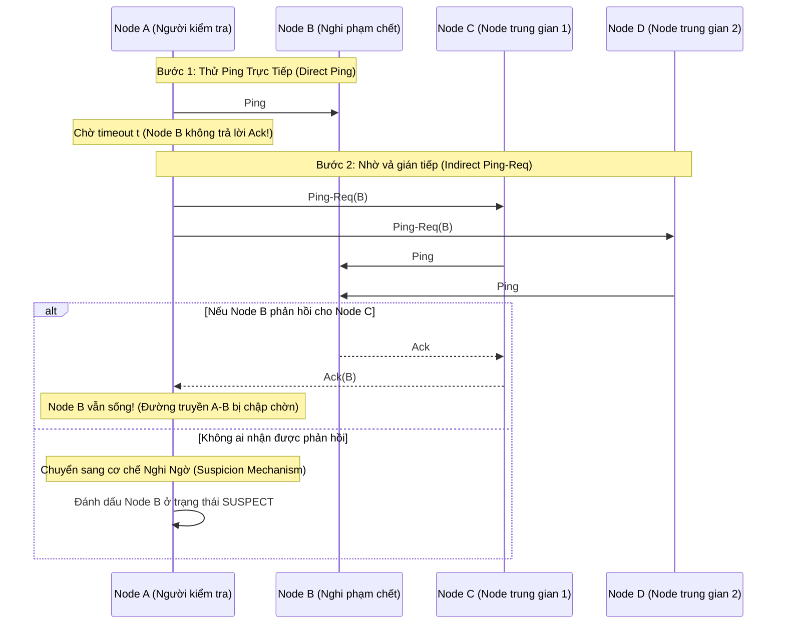

# 01. Failure Detection & Gossip Protocol (SWIM & Heartbeats)

Trong các cụm phân tán quy mô hàng ngàn máy chủ (như Cassandra, Consul, DynamoDB, Kubernetes), các lỗi phần cứng, đứt cáp quang, nghẽn mạng (Network Jitter) và chu kỳ dọn rác (GC Pauses) diễn ra liên tục.

Hệ thống cần phát hiện chính xác khi nào một node thực sự bị chết (Fail) mà không gây ra báo động giả (False Positives), đồng thời thông báo sự cố đó cho toàn bộ các node còn lại mà không làm bùng nổ lưu lượng mạng ($O(N^2)$ network explosion).

---

## 1. Giới Hạn Của Cơ Chế Heartbeat Cổ Điển

```
Mô hình Heartbeat Tập Trung (Centralized Master):
[Node 1] --heartbeat--> [Master Node (SPOF / Bottleneck)]
[Node 2] --heartbeat--> [Master Node]
...
[Node N] --heartbeat--> [Master Node]

Mô hình Tất Cả Quét Tất Cả (All-to-All Heartbeat):
Lưu lượng mạng: O(N^2). Với N = 10,000 nodes -> 100,000,000 tin nhắn mỗi giây!
```

---

## 2. Giao Thức Lây Nhiễm: Gossip Protocol & SWIM

Giao thức Gossip (Tin đồn) truyền bá thông tin giống như sự lây lan của dịch bệnh hoặc tin đồn trong xã hội: Mỗi node định kỳ chọn ngẫu nhiên một số ít node khác ($k$ nodes) để chia sẻ trạng thái thành viên.

**SWIM Protocol (Structured Weakly-Consistent Infection-Style Process Group Membership Protocol)** được xem là chuẩn mực tối ưu:



### 2.1 Cơ Chế Nghi Ngờ (Suspicion Mechanism)
- Thay vì tuyên bố một node là `DEAD` ngay lập tức (dễ gây hiểu lầm khi GC pause 2 giây), SWIM chuyển trạng thái của node thành `SUSPECT` kèm một khoảng thời gian ân hạn (Grace Period $\Delta$).
- Node bị nghi ngờ vẫn được quyền tự minh oan (Refutation): Nếu nó vẫn sống, nó gửi thông điệp `ALIVE` với số hiệu `incarnation_number` cao hơn để hủy trạng thái nghi ngờ.
- Nếu hết thời gian $\Delta$ mà không có minh oan, toàn bộ cụm sẽ chính thức coi node đó là `DEAD`.

---

## 3. Bộ Dò Lỗi Tích Lũy Xác Suất: Phi Accrual Failure Detector

Được phát triển bởi Hayashibara et al. và triển khai trong **Apache Cassandra** và **Akka**:
- Thay vì sử dụng ngưỡng cứng (ví dụ: "quá 5 giây không thấy phản hồi là coi như chết"), bộ dò lỗi duy trì một cửa sổ trượt (Sliding Window) ghi lại lịch sử khoảng thời gian giữa các lần nhận heartbeat ($t_i - t_{i-1}$).
- Ước lượng phân phối xác suất và tính toán chỉ số $\Phi$ (Phi):
  $$\Phi = -\log_{10} \left( P_{\text{later}}(t - t_{\text{last}}) \right)$$
  - $P_{\text{later}}(t)$: Xác suất một heartbeat sẽ đến trễ hơn thời gian hiện tại dựa trên lịch sử mạng.
- **Ý nghĩa:**
  - $\Phi = 1$: Xác suất báo động giả là $10\%$.
  - $\Phi = 2$: Xác suất báo động giả là $1\%$.
  - $\Phi = 8$: Xác suất báo động giả là $10^{-8}$ ($0.000001\%$).
- Kiến trúc sư hệ thống chỉ cần cấu hình ngưỡng $\Phi_{\text{threshold}}$ (ví dụ chọn 8 cho môi trường cloud EC2 có độ trễ dao động lớn).

---

## 4. Hiện Tượng Não Phân Đôi (Split-Brain) & Fencing Tokens

Khi một phân vùng mạng (Network Partition) chia cụm 5 nodes thành 2 nửa (Nhóm A gồm 3 nodes, Nhóm B gồm 2 nodes):
- Nhóm B không thấy Nhóm A $\implies$ tự bầu một Master mới.
- Cả hai Master cùng nhận lệnh ghi từ Client $\implies$ dữ liệu bị phân kỳ, phá hủy tính nhất quán.

```mermaid
graph TD
    Client["Client (Yêu cầu ghi)"] --> LeaderOld["Old Leader (Nhóm thiểu số - Bị cô lập)"]
    Client --> LeaderNew["New Leader (Nhóm đa số - Quorum)"]
    
    LeaderOld --> Storage["Shared Storage / Distributed Lock"]
    LeaderNew --> Storage
    
    subgraph Fencing Token Enforcement
        Storage --> Check{"Kiểm tra Generation Epoch<br/>token_new > token_old ?"}
        Check -->|token = 34 (Old)| Reject["Từ chối ghi (STALE_TOKEN)!"]
        Check -->|token = 35 (New)| Accept["Chấp nhận ghi thành công!"]
    end
```

- **Giải pháp:** Sử dụng **Fencing Token (Mã bảo vệ tuần tự tăng dần)**:
  - Mỗi khi một Master mới được bầu, nó được cấp một Epoch/Token lớn hơn (ví dụ Token 35).
  - Kho lưu trữ chỉ chấp nhận yêu cầu ghi nếu Token đi kèm lớn hơn Token của thao tác trước đó. Yêu cầu từ Master cũ (Token 34) sẽ bị từ chối ngay lập tức.
