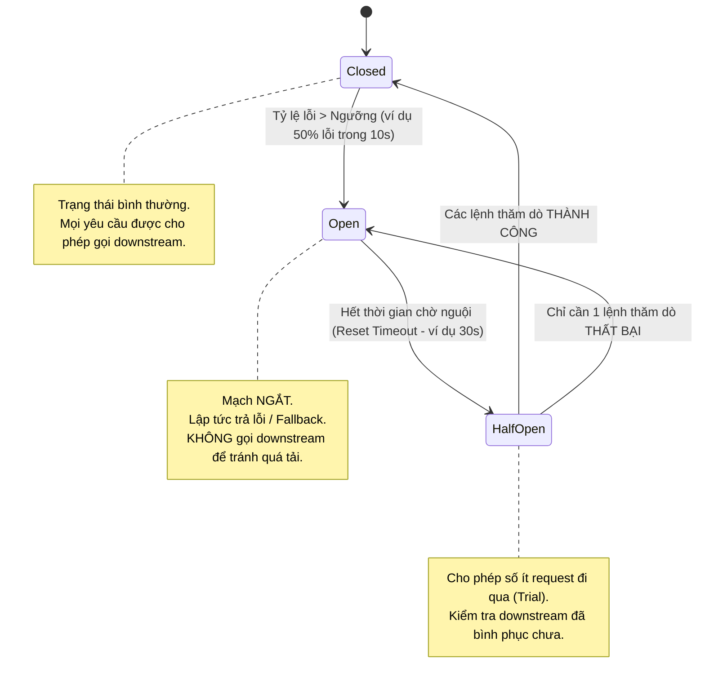
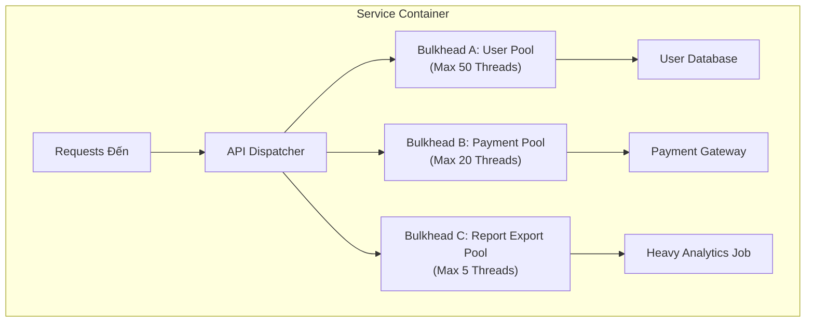

# 02. Resilience & Fault Tolerance Patterns (Circuit Breaker & Bulkhead)

Trong kiến trúc Microservices, lỗi dây chuyền (Cascading Failures) là kẻ thù số một: Nếu một service downstream (ví dụ Payment Gateway) bị phản hồi chậm 10 giây, hàng trăm luồng (Threads) của upstream service (Order Service) sẽ bị nghẽn lại để chờ đợi, dẫn đến cạn kiệt tài nguyên bộ nhớ và đánh sập toàn bộ hệ sinh thái.

---

## 1. Mẫu Thiết Kế Ngắt Mạch: Circuit Breaker Pattern

Mô phỏng cơ chế cầu chì điện trong gia đình: Khi dòng điện quá tải, cầu chì tự động ngắt để bảo vệ toàn bộ mạng lưới thiết bị điện.



### Các Tham Số Cấu Hình Chuẩn (Resilience4j / Netflix Hystrix)
- `slidingWindowSize`: Số lượng request thống kê (ví dụ 100 requests).
- `failureRateThreshold`: Ngưỡng tỷ lệ thất bại (ví dụ 50%).
- `waitDurationInOpenState`: Thời gian mạch mở chờ nguội trước khi sang Half-Open (ví dụ 30s).
- `permittedNumberOfCallsInHalfOpenState`: Số lượng request thử nghiệm trong trạng thái Half-Open (ví dụ 5 requests).

---

## 2. Mẫu Thiết Kế Vách Ngăn: Bulkhead Pattern

Bắt nguồn từ kiến trúc đóng tàu thủy: Thân tàu được chia thành nhiều khoang kín nước độc lập (Bulkheads). Nếu đáy tàu bị thủng một khoang, nước chỉ tràn vào khoang đó mà không làm chìm toàn bộ con tàu.



### Hai Hình Thức Phân Lập Bulkhead
1. **Thread Pool Isolation:** Mỗi dịch vụ hạ tầng sở hữu một nhóm luồng riêng biệt. Khi dịch vụ Analytics bị treo hoặc quá tải, nó chỉ làm đầy 5 luồng của Pool C, 50 luồng của User Pool vẫn phục vụ người dùng bình thường.
2. **Semaphore Isolation:** Giới hạn số lượng request đồng thời bằng bộ đếm Semaphore nguyên tử. Không tốn chi phí hoán đổi ngữ cảnh (Context Switching) của Thread, rất nhanh và nhẹ.

---

## 3. Thử Lại Thông Minh: Exponential Backoff & Full Jitter

Nếu 10.000 máy khách cùng thử lại (Retry) đồng thời ngay sau khi bị lỗi, chúng sẽ tạo ra **Cơn bão thử lại (Retry Storm)** tiếp tục đánh sập hệ thống vừa mới gượng dậy.

AWS Architecture khuyến nghị thuật toán **Full Jitter**:

$$t = \text{random} \left(0, \min \left( \text{MaxSleep}, \text{BaseSleep} \times 2^{\text{attempt}} \right) \right)$$

```
Cố định (No Jitter):
Attempt 1: 100ms   (Tất cả 10,000 clients bắn cùng lúc ở mốc 100ms!)
Attempt 2: 200ms   (Tất cả 10,000 clients bắn cùng lúc ở mốc 200ms!)

Full Jitter:
Client 1: Attempt 1 -> 42ms
Client 2: Attempt 1 -> 89ms
Client 3: Attempt 1 -> 15ms
-> Lưu lượng thử lại được phân tán phẳng (Flattened) trên toàn bộ trục thời gian!
```

---

## 4. Suy Giảm Duyên Dáng & Trút Bỏ Tải (Graceful Degradation & Load Shedding)

- **Fallback Response:** Khi Circuit Breaker ở trạng thái Open:
  - Nếu recommendation engine chết $\rightarrow$ Trả về danh sách phim tĩnh được xem nhiều nhất tuần qua.
  - Nếu comment service chết $\rightarrow$ Vẫn hiển thị nội dung bài báo, chỉ ẩn khung bình luận kèm dòng thông báo: *"Bình luận tạm thời bảo trì"*.
- **Load Shedding:** Khi CPU của API Gateway vượt quá $90\%$, hệ thống chủ động từ chối các request có độ ưu tiên thấp (HTTP 503 Service Unavailable) để bảo vệ các giao dịch quan trọng (như Thanh toán hoặc Đặt hàng).
