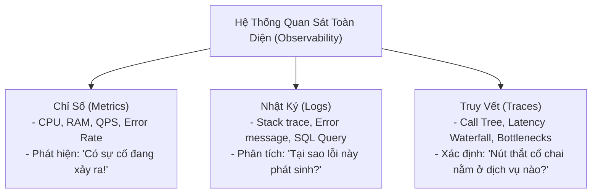

# 03. Distributed Tracing & OpenTelemetry (Tracing Context & Sampling)

Trong một hệ thống phân tán gồm hàng trăm microservices giao tiếp qua HTTP/gRPC và Kafka, một cú click chuột của người dùng có thể kích hoạt chuỗi 50 lời gọi dịch vụ liên tiếp.

Nếu một yêu cầu mất tới 4.2 giây phản hồi, việc đọc log máy chủ truyền thống (File logs đơn lẻ trên từng container) hoàn toàn vô dụng. **Distributed Tracing (Truy vết phân tán)** cung cấp cái nhìn xuyên suốt toàn bộ vòng đời của một yêu cầu xuyên qua ranh giới mạng của các dịch vụ.

---

## 1. Ba Trụ Cột Của Khả Năng Quan Sát (Three Pillars of Observability)



---

## 2. Mô Hình Dữ Liệu Truy Vết: Trace & Spans (Chuẩn Google Dapper)

- **Trace:** Đại diện cho toàn bộ hành trình của một yêu cầu từ khi chạm vào API Gateway cho tới khi trả kết quả về cho client.
- **Span:** Đơn vị công việc nhỏ nhất có định danh thời gian bắt đầu, kết thúc, tên thao tác (`operation_name`), thẻ thuộc tính (`tags / attributes`), và sự kiện (`events / logs`).

```
[Trace: id = "4bf92f3577b34da6a3ce929d0e0e4736"]
|
+-- [Root Span: API Gateway (duration: 350ms)]
    |
    +-- [Child Span: Auth Service - Validate Token (duration: 30ms)]
    |
    +-- [Child Span: Order Service - Place Order (duration: 300ms)]
        |
        +-- [Child Span: Inventory Service - Check Stock (duration: 40ms)]
        |
        +-- [Child Span: Database - INSERT INTO orders (duration: 180ms) *BOTTLENECK*]
        |
        +-- [Child Span: Kafka - Publish order_created (duration: 15ms)]
```

---

## 3. Lan Truyền Ngữ Cảnh: Chuẩn W3C Trace Context

Để kết nối các Span thành một cây truy vết duy nhất xuyên qua các máy chủ khác nhau, các dịch vụ phải chuyển tiếp tiêu đề HTTP chuẩn **W3C Trace Context**:

### Cấu trúc tiêu đề `traceparent`:
```
traceparent: 00-4bf92f3577b34da6a3ce929d0e0e4736-00f067aa0ba902b7-01
              ^                 ^                  ^                ^
           Version           Trace ID           Parent Span ID   Trace Flags
```
1. **Version (2 hex):** Phiên bản giao thức (hiện tại luôn là `00`).
2. **Trace ID (32 hex / 16 bytes):** Định danh toàn cục duy nhất của toàn bộ Trace.
3. **Parent Span ID (16 hex / 8 bytes):** Định danh của Span người gọi trực tiếp trước đó.
4. **Trace Flags (2 hex / 1 byte):** Cờ điều khiển, bit `01` biểu thị Trace này **được chọn để lấy mẫu ghi lại (Sampled)**.

---

## 4. Chiến Lược Lấy Mẫu Truy Vết (Sampling Strategies)

Nếu một hệ thống có 100,000 QPS, việc thu thập $100\%$ các Trace sẽ sinh ra hàng terabyte dữ liệu mỗi ngày, làm nghẽn mạng và tốn kém chi phí lưu trữ APM (Datadog, Dynatrace, Jaeger).

| Chiến lược | Cơ chế hoạt động | Ưu điểm | Bẫy rủi ro (Trade-off) |
| :--- | :--- | :--- | :--- |
| **Head-Based Sampling** | Quyết định lấy mẫu ngay tại **API Gateway** khi request vừa tới (ví dụ chọn ngẫu nhiên $1\%$ hoặc $5\%$). | Rất nhẹ: Tiêu đề `sampled=0` được truyền xuống, các service con không cần gửi span về Collector. | **Bỏ lọt lỗi hiếm:** Nếu một lỗi HTTP 500 nghiêm trọng rơi vào $99\%$ không được lấy mẫu, kỹ sư sẽ hoàn toàn mù tịt về nguyên nhân! |
| **Tail-Based Sampling** | Thu thập $100\%$ các Span vào bộ đệm Collector tạm thời. Chỉ quyết định lưu trữ sau khi Trace hoàn tất: Lưu toàn bộ các Trace bị lỗi (HTTP $\ge 500$) hoặc có độ trễ cao (p99 $> 1$s). | **Bắt trọn 100% sự cố:** Không bao giờ bỏ lọt bất kỳ lỗi hay bất thường hiệu năng nào. | Tốn tài nguyên RAM và băng thông mạng tại tầng OpenTelemetry Collector để duy trì bộ đệm. |
