# 01. The 4-Step System Design Interview Framework (The Golden Blueprint)

Trong một buổi phỏng vấn System Design kéo dài 45 - 60 phút tại các tập đoàn công nghệ lớn (Google, Meta, Amazon, Microsoft, Uber, Shopee), người phỏng vấn không tìm kiếm một "đáp án đúng duy nhất". Họ đang đánh giá: **Khả năng điều phối bài toán không rõ ràng (Ambiguity), tư duy phân tích đánh đổi (Trade-offs), kỹ năng giao tiếp kiến trúc (Communication), và khả năng phòng thủ hệ thống trước các kịch bản hỏng hóc.**

---

## 1. Phân Bổ Thời Gian Chuẩn Cho 45 Phút

```mermaid
gantt
    title Phân Bổ Thời Gian Phỏng Vấn System Design (45 Phút)
    dateFormat  m
    axisFormat %m phút
    
    section Bước 1: Làm Rõ Đề Bài & Giới Hạn
    Đặt câu hỏi, Phạm vi Chức năng & Phi chức năng, Ước lượng quy mô :active, b1, 0, 8
    
    section Bước 2: Thiết Kế Tổng Thể
    API Design, Data Schema cốt lõi, Sơ đồ khối kiến trúc cấp cao :b2, 8, 20
    
    section Bước 3: Đào Sâu Nút Thắt
    Deep-dive 2-3 thành phần trọng yếu, Giải quyết thắt nút cổ chai :b3, 20, 38
    
    section Bước 4: Tổng Kết & Phòng Vệ
    SPOF, Khắc phục lỗi, Giám sát Observability, Mở rộng tương lai :b4, 38, 45
```



---

## 2. Chi Tiết Từng Bước Thực Thi

### Bước 1: Hiểu Rõ Bài Toán & Xác Định Phạm Vi (Scope & Clarification - 5 đến 8 phút)
> [!IMPORTANT]
> **Quy tắc vàng:** Tuyệt đối không bao giờ lao vào vẽ sơ đồ kiến trúc ngay giây đầu tiên! Ứng viên bắt tay vẽ ngay lập tức thường nhận kết quả đánh trượt vì thiết kế sai hoàn toàn mục tiêu của bài toán.

1. **Yêu cầu chức năng (Functional Requirements):**
   - Chọn đúng 3 - 4 tính năng cốt lõi (Core Features).
   - *Ví dụ thiết kế Twitter:* Người dùng có thể đăng tweet, xem timeline trang chủ, tìm kiếm tweet, theo dõi bạn bè. (Bỏ qua tính năng phụ như đổi ảnh đại diện, đổi mật khẩu).
2. **Yêu cầu phi chức năng (Non-Functional Requirements):**
   - Tính sẵn sàng cao (High Availability) hay Nhất quán mạnh (Strong Consistency)?
   - Độ trễ tối đa chấp nhận được (Latency SLA: ví dụ đọc timeline $< 200$ms).
3. **Ước lượng quy mô (Back-of-the-envelope scale):**
   - Số người dùng hoạt động hàng ngày (DAU).
   - Tỷ lệ Đọc / Ghi (Read:Write Ratio - ví dụ Twitter là $100:1$, rất nặng về Đọc).
   - Ước tính nhanh QPS trung bình và Peak QPS.

---

### Bước 2: Đề Xuất Thiết Kế Cấp Cao (High-Level Architecture & API - 10 đến 12 phút)

1. **Thiết kế API cốt lõi (API Endpoints):**
   ```text
   POST /v1/tweets
     Headers: Authorization: Bearer <token>, Idempotency-Key: <uuid>
     Body: { "content": "Hello World", "media_ids": [] }
     Response: 201 Created { "tweet_id": "123456789", "created_at": ... }

   GET /v1/timeline?page_size=20&cursor=abc
     Response: 200 OK { "tweets": [...], "next_cursor": "def" }
   ```
2. **Mô hình dữ liệu (Core Data Models):**
   - Xác định các thực thể chính (`User`, `Tweet`, `Follow`).
   - Quyết định loại cơ sở dữ liệu sơ bộ (RDBMS cho quan hệ bạn bè, NoSQL / Key-Value cho feed timeline).
3. **Sơ đồ khối kiến trúc cấp cao (High-Level Diagram):**
   - Vẽ luồng đi từ Client $\rightarrow$ DNS $\rightarrow$ CDN / API Gateway $\rightarrow$ Stateless App Servers $\rightarrow$ Cache $\rightarrow$ DB $\rightarrow$ Async Workers.

---

### Bước 3: Đào Sâu Các Nút Thắt Trọng Yếu (Deep Dive Bottlenecks - 15 đến 20 phút)

Người phỏng vấn sẽ chỉ vào một vài điểm nghẽn khó nhất để thử thách bạn:
1. **Bài toán Fanout trong News Feed (Kéo vs Đẩy):**
   - **Fanout-on-write (Push):** Khi người nổi tiếng (như Taylor Swift có 100M followers) đăng tweet, hệ thống có nên ghi đồng thời vào 100M hộp thư cá nhân? $\implies$ *Giải pháp lai (Hybrid Model):* Người dùng thường dùng Push, người nổi tiếng dùng Pull.
2. **Chiến lược phân mảnh (Sharding Strategy):**
   - Shard theo `user_id` hay `tweet_id`?
   - Xử lý vấn đề Celebrity Hotspot như thế nào?
3. **Các sự cố bộ nhớ đệm (Cache Stampede, Cache Avalanche):**
   - Sử dụng Mutex Lock, TTL Jitter, và Bloom Filters.

---

### Bước 4: Tổng Kết, Giám Sát & Phòng Thủ (Wrap-Up - 5 phút)

1. **Rà soát điểm lỗi đơn lẻ (Single Point of Failure - SPOF):**
   - Mọi thành phần đều có ít nhất một bản sao dự phòng (Active-Passive hoặc Active-Active).
2. **Khả năng quan sát (Observability):**
   - Thu thập Metrics bằng Prometheus, Trace bằng OpenTelemetry, Log tập trung bằng ELK.
3. **Mở rộng tương lai (Future Evolution):**
   - Multi-Region deployment, Edge Computing, Tối ưu chi phí lưu trữ Cold Data.

---

## 3. Bảng Kiểm Tra Các Lỗi Nguy Hiểm (Red Flags To Avoid)

| Lỗi nguy hiểm (Red Flag) | Dấu hiệu nhận biết | Cách khắc phục chuyên nghiệp |
| :--- | :--- | :--- |
| **Im lặng quá lâu (Radio Silence)** | Ngồi suy nghĩ 3-5 phút không nói câu nào. | Luôn "nói to suy nghĩ của mình" (Think out loud): *"Tôi đang cân nhắc giữa PostgreSQL và Cassandra vì..."* |
| **Cố thủ bảo thủ (Defensiveness)** | Tranh cãi gay gắt khi interviewer gợi ý cách khác. | Cởi mở tiếp thu: *"Đó là một góc nhìn rất hay, nếu đi theo hướng đó thì đánh đổi lớn nhất sẽ là..."* |
| **Hội chứng Buzzword (Over-engineering)** | Vừa vào đã đòi dùng Kubernetes, Kafka, Flink, Blockchain cho ứng dụng chỉ có 1,000 users. | Bắt đầu từ kiến trúc đơn giản nhất chạy được (KISS / Ponytail), chỉ thêm công nghệ khi quy mô đòi hỏi. |
