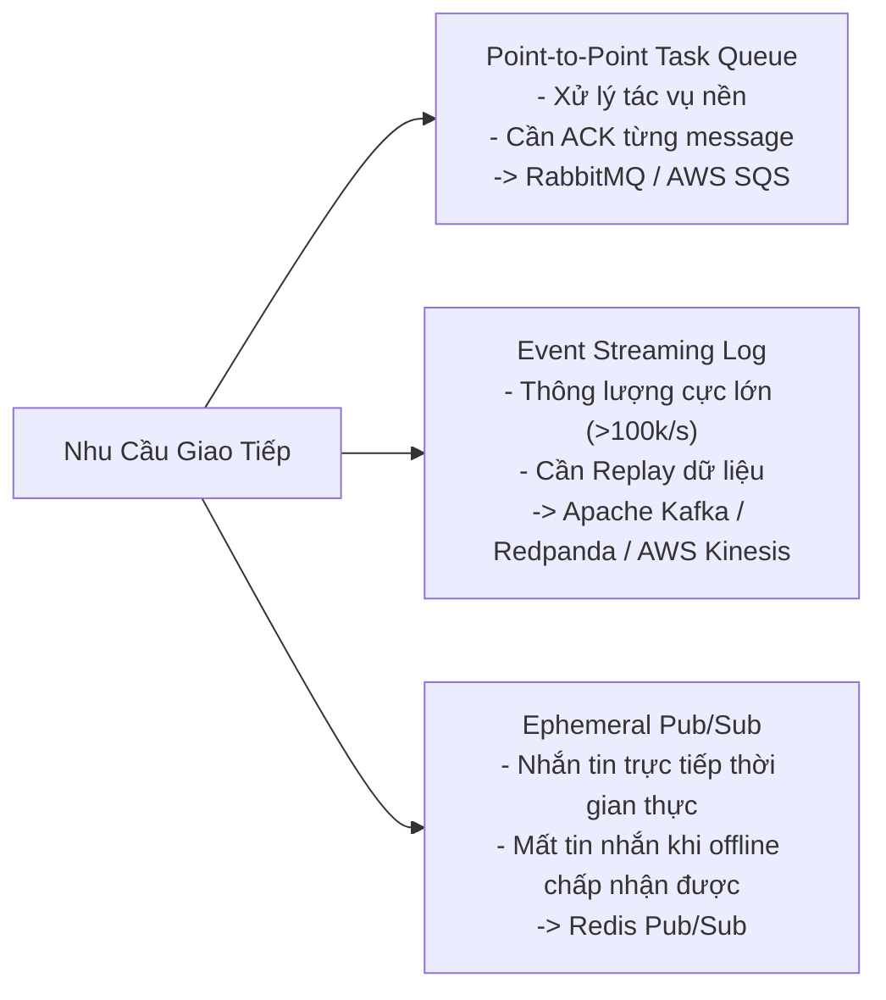

# 03. Architecture Patterns & Decision Matrices Cheat Sheet

Khi thiết kế hệ thống, sai lầm lớn nhất là chọn công nghệ dựa trên xu hướng thị trường thay vì phân tích bản chất bài toán. Bản tóm tắt này cung cấp các cây quyết định (Decision Trees) và ma trận so sánh (Decision Matrices) chuẩn xác nhất.

---

## 1. Cây Quyết Định Chọn Cơ Sở Dữ Liệu (Database Selection Decision Tree)

```mermaid
graph TD
    Start["Yêu cầu lưu trữ dữ liệu"] --> Rel{"Dữ liệu có cấu trúc quan hệ phức tạp<br/>và cần giao dịch ACID nghiêm ngặt?"}
    
    Rel -->|CÓ| ACIDDB["RDBMS (PostgreSQL / MySQL / Amazon Aurora)"]
    Rel -->|KHÔNG| Scale{"Khối lượng dữ liệu cực lớn (hàng chục TB+)<br/>hoặc cần tốc độ ghi cực cao?"}
    
    Scale -->|Key-Value Lookup O(1)| KV["Key-Value Store (Redis / DynamoDB / RocksDB)"]
    Scale -->|Văn bản động / Schema linh hoạt| Doc["Document Store (MongoDB / Couchbase)"]
    Scale -->|Dữ liệu bảng rộng phân tán| Wide["Wide-Column Store (Apache Cassandra / ScyllaDB)"]
    Scale -->|Mạng lưới bạn bè / Gian lận| Graph["Graph Database (Neo4j / Amazon Neptune)"]
    Scale -->|Chỉ số thời gian / Giám sát| TS["Time-Series DB (Prometheus / InfluxDB / TimescaleDB)"]
    Scale -->|Tìm kiếm văn bản / Đa điều kiện| Search["Search Index (Elasticsearch / OpenSearch)"]
```

### Bảng Ma Trận So Sánh Các Họ Cơ Sở Dữ Liệu

| Loại CSDL | Ví dụ công nghệ | Điểm mạnh nhất | Điểm yếu nhất | Trường hợp tối ưu |
| :--- | :--- | :--- | :--- | :--- |
| **Relational (RDBMS)** | PostgreSQL, MySQL | ACID hoàn hảo, JOIN linh hoạt, toàn vẹn dữ liệu | Khó Horizontal Sharding khi dữ liệu vượt vài TB | Giao dịch tài chính, quản lý người dùng, đơn hàng |
| **Key-Value** | Redis, DynamoDB | Độ trễ microsecond, mở rộng quy mô tuyến tính | Không hỗ trợ truy vấn phạm vi phức tạp | Session cache, Shopping cart, Leaderboards |
| **Document** | MongoDB | Mô hình JSON tự nhiên, phát triển tính năng nhanh | Hao phí dung lượng đĩa, rủi ro không toàn vẹn | Danh mục sản phẩm (E-commerce Catalog), Blog CMS |
| **Wide-Column** | Cassandra, ScyllaDB | Tốc độ ghi Append-only khổng lồ, No Single Point of Failure | Không có JOIN, phải thiết kế bảng dựa theo truy vấn | Lịch sử vị trí GPS, Tin nhắn chat, IoT telemetry |
| **Search Engine** | Elasticsearch | Tìm kiếm mờ (Fuzzy), BM25 Ranking, Faceted Filter | Nặng tài nguyên JVM, ghi trễ 1 giây (Refresh Interval) | Tìm kiếm sản phẩm, Phân tích Log (ELK) |

---

## 2. Ma Trận Chọn Công Nghệ Truyền Tin Phân Tán (Messaging Matrix)



---

## 3. Ma Trận Chiến Lược Caching

| Chiến lược | Cơ chế ghi dữ liệu | Tính nhất quán dữ liệu | Khả năng chịu lỗi máy chủ Cache |
| :--- | :--- | :--- | :--- |
| **Cache-Aside (Lazy)** | Ứng dụng ghi trực tiếp vào DB, sau đó Xóa (Evict) hoặc Ghi đè Cache | Cuối cùng nhất quán (Eventually Consistent) | Rất cao: Cache chết thì app vẫn gọi được DB |
| **Write-Through** | Ứng dụng ghi vào Cache; Cache đồng bộ ghi vào DB trước khi trả về | Rất cao (Đồng nhất giữa Cache và DB) | Trung bình: Độ trễ ghi tăng gấp đôi |
| **Write-Behind (Back)** | Ghi vào Cache; Cache gom mẻ bất đồng bộ ghi xuống DB sau | Nguy cơ mất dữ liệu nếu máy chủ Cache mất điện đột ngột | Tối ưu cho hệ thống ghi nặng (High Write TPS) |

---

## 4. Bảng Kiểm Tra Mức Độ Nhất Quán Dữ Liệu (Consistency Hierarchy)

$$\text{Strict Serializability} \longrightarrow \text{Linearizability} \longrightarrow \text{Sequential Consistency} \longrightarrow \text{Causal Consistency} \longrightarrow \text{Eventual Consistency}$$

- **Linearizability (Nhất quán tuyến tính):** Toàn bộ thế giới nhìn thấy các thao tác đọc và ghi như thể chúng diễn ra trên một bản sao duy nhất tại một điểm thời gian tuyệt đối.
- **Eventual Consistency (Nhất quán cuối cùng):** Nếu không có bản ghi mới nào được tạo thêm, toàn bộ các bản sao trên toàn cầu cuối cùng sẽ hội tụ về cùng một giá trị (DNS, Amazon DynamoDB, CDN).
